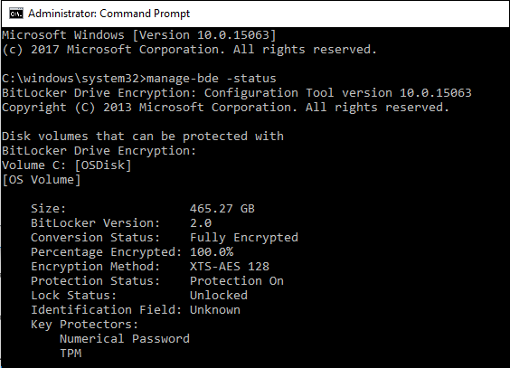

# How to use the BitLocker drive encryption tools to manage BitLocker

BitLocker drive encryption tools include the command-line tools *manage-bde.exe*, *repair-bde.exe*, and the cmdlets for Windows PowerShell.

The tools can be used to perform any tasks that can be accomplished through the BitLocker control panel and are appropriate to use for automated deployments and other scripting scenarios.

## Manage-bde

Manage-bde is a command-line tool that can be used for scripting BitLocker operations. Manage-bde offers additional options not displayed in the BitLocker control panel. For a complete list of the `manage-bde.exe` options, see the [Manage-bde](/previous-versions/windows/it-pro/windows-server-2012-R2-and-2012/ff829849(v=ws.11)) command-line reference.

Manage-bde includes fewer default settings and requires greater customization for configuring BitLocker. For example, using just the `manage-bde.exe -on` command on a data volume will fully encrypt the volume without any authenticating protectors. A volume encrypted in this manner still requires user interaction to turn on BitLocker protection, even though the command successfully completed because an authentication method needs to be added to the volume for it to be fully protected. The following sections provide examples of common usage scenarios for manage-bde.

### Using manage-bde with operating system volumes

Listed below are examples of basic valid commands for operating system volumes. In general, using only the `manage-bde.exe -on <drive letter>` command will encrypt the operating system volume with a TPM-only protector and no recovery key. However, many environments require more secure protectors such as passwords or PIN and expect information recovery with a recovery key. It's recommended to add at least one primary protector plus a recovery protector to an operating system volume.

A good practice when using `manage-bde.exe` is to determine the volume status on the target system. Use the following command to determine volume status:

```cmd
manage-bde.exe -status
```

This command returns the volumes on the target, current encryption status, encryption method, and volume type (operating system or data) for each volume:



The following example illustrates enabling BitLocker on a computer without a TPM chip. Before beginning the encryption process, the startup key needed for BitLocker must be created and saved to a USB drive. When BitLocker is enabled for the operating system volume, BitLocker will need to access the USB flash drive to obtain the encryption key. In this example, the drive letter E represents the USB drive. Once the commands are run, it will prompt to reboot the computer to complete the encryption process.

```cmd
manage-bde.exe -protectors -add C: -startupkey E:
manage-bde.exe -on C:
```

> [!NOTE]
> After the encryption is completed, the USB startup key must be inserted before the operating system can be started.

An alternative to the startup key protector on non-TPM hardware is to use a password and an **ADaccountorgroup** protector to protect the operating system volume. In this scenario, the protectors are added first. To add the protectors, enter the following command:

```cmd
manage-bde.exe -protectors -add C: -pw -sid <user or group>
```

The above command will require the password protector to be entered and confirmed before adding them to the volume. With the protectors enabled on the volume, BitLocker can then be turned on.

On computers with a TPM, it's possible to encrypt the operating system volume without defining any protectors using `manage-bde.exe`. To enable BitLocker on a computer with a TPM without defining any protectors, enter the following command:

```cmd
manage-bde.exe -on C:
```

The above command encrypts the drive using the TPM as the default protector. If verify if a TPM protector is available, the list of protectors available for a volume can be listed by running the following command:

```cmd
 manage-bde.exe -protectors -get <volume>
```

### Using manage-bde with data volumes

Data volumes use the same syntax for encryption as operating system volumes but they don't require protectors for the operation to complete. Encrypting data volumes can be done using the base command:

`manage-bde.exe -on <drive letter>`

or additional protectors can be added to the volume first. It's recommended to add at least one primary protector plus a recovery protector to a data volume.

A common protector for a data volume is the password protector. In the example below, a password protector is added to the volume and then BitLocker is turned on.

```cmd
manage-bde.exe -protectors -add -pw C:
manage-bde.exe -on C:
```

## BitLocker Repair Tool

Hard disk areas on which BitLocker stores critical information could be damaged, for example, when a hard disk fails or if Windows exits unexpectedly.

The BitLocker Repair Tool (*repair-bde.exe*) is useful for disaster recovery scenarios, in which a BitLocker protected drive can't be unlocked normally or using the recovery console.

The Repair Tool can reconstruct critical parts of the drive and salvage recoverable data, as long as a valid recovery password or recovery key is used to decrypt the data. If the BitLocker metadata data on the drive is corrupt, the backup key package in addition to the recovery password or recovery key must be supplied. The key package is backed up in Active Directory Domain Services (AD DS) if the default settings for AD DS backup are used. With the key package and either the recovery password or recovery key, portions of a corrupted BitLocker-protected drive can be decrypted. Each key package works only for a drive that has the corresponding drive identifier. The BitLocker Recovery Password Viewer can be used to obtain this key package from AD DS.

> [!TIP]
> If recovery information is not backed up to AD DS or if key packages need to be saved in an alternative way, use the following command to generate a key package for a volume:
>
> `manage-bde.exe -KeyPackage`

The Repair Tool is intended for use when the operating system doesn't start or when the BitLocker Recovery Console can't be started. Use Repair-bde in the following conditions:

- The drive is encrypted using BitLocker Drive Encryption
- Windows doesn't start, or the BitLocker recovery console can't start
- There isn't a backup copy of the data that is contained on the encrypted drive

> [!NOTE]
> Damage to the drive may not be related to BitLocker. Therefore, it is recommended to try other tools to help diagnose and resolve the problem with the drive before using the BitLocker Repair Tool. The Windows Recovery Environment (Windows RE) provides additional options to repair computers.

The following limitations exist for Repair-bde:

- The Repair-bde command-line tool can't repair a drive that failed during the encryption or decryption process.

- The Repair-bde command-line tool assumes that if the drive has any encryption, then the drive has been fully encrypted.

For more information about using repair-bde, see [Repair-bde](/previous-versions/windows/it-pro/windows-server-2012-R2-and-2012/ff829851(v=ws.11)).

## BitLocker cmdlets for Windows PowerShell

Windows PowerShell cmdlets provide a new way for administrators to use when working with BitLocker. Using Windows PowerShell's scripting capabilities, administrators can integrate BitLocker options into existing scripts with ease. The list below displays the available BitLocker cmdlets.

|Name|Parameters|
|--- |--- |
|**Add-BitLockerKeyProtector**|<li>ADAccountOrGroup<li>ADAccountOrGroupProtector<li>Confirm<li>MountPoint<li>Password<li>PasswordProtector<li>Pin<li>RecoveryKeyPath<li>RecoveryKeyProtector<li>RecoveryPassword<li>RecoveryPasswordProtector<li>Service<li>StartupKeyPath<li>StartupKeyProtector<li>TpmAndPinAndStartupKeyProtector<li>TpmAndPinProtector<li>TpmAndStartupKeyProtector<li>TpmProtector<li>WhatIf|
|**Backup-BitLockerKeyProtector**|<li>Confirm<li>KeyProtectorId<li>MountPoint<li>WhatIf|
|**Disable-BitLocker**|<li>Confirm<li>MountPoint<li>WhatIf|
|**Disable-BitLockerAutoUnlock**|<li>Confirm<li>MountPoint<li>WhatIf|
|**Enable-BitLocker**|<li>AdAccountOrGroup<li>AdAccountOrGroupProtector<li>Confirm<li>EncryptionMethod<li>HardwareEncryption<li>Password<li>PasswordProtector<li>Pin<li>RecoveryKeyPath<li>RecoveryKeyProtector<li>RecoveryPassword<li>RecoveryPasswordProtector<li>Service<li>SkipHardwareTest<li>StartupKeyPath<li>StartupKeyProtector<li>TpmAndPinAndStartupKeyProtector<li>TpmAndPinProtector<li>TpmAndStartupKeyProtector<li>TpmProtector<li>UsedSpaceOnly<li>WhatIf|
|**Enable-BitLockerAutoUnlock**|<li>Confirm<li>MountPoint<li>WhatIf|
|**Get-BitLockerVolume**|<li>MountPoint|
|**Lock-BitLocker**|<li>Confirm<li>ForceDismount<li>MountPoint<li>WhatIf|
|**Remove-BitLockerKeyProtector**|<li>Confirm<li>KeyProtectorId<li>MountPoint<li>WhatIf|
|**Resume-BitLocker**|<li>Confirm<li>MountPoint<li>WhatIf|
|**Suspend-BitLocker**|<li>Confirm<li>MountPoint<li>RebootCount<li>WhatIf|
|**Unlock-BitLocker**|<li>AdAccountOrGroup<li>Confirm<li>MountPoint<li>Password<li>RecoveryKeyPath<li>RecoveryPassword<li>RecoveryPassword<li>WhatIf|

Similar to manage-bde, the Windows PowerShell cmdlets allow configuration beyond the options offered in the control panel. As with manage-bde, users need to consider the specific needs of the volume they're encrypting prior to running Windows PowerShell cmdlets.

A good initial step is to determine the current state of the volume(s) on the computer. Determining the current state of the volume(s) can be done using the `Get-BitLockerVolume` cmdlet.

The `Get-BitLockerVolume` cmdlet output gives information on the volume type, protectors, protection status, and other details.

> [!TIP]
> Occasionally, all protectors may not be shown when using `Get-BitLockerVolume` due to lack of space in the output display. If all of the protectors for a volume are not seen, use the Windows PowerShell pipe command (|) to format a full listing of the protectors:
> 
> `Get-BitLockerVolume C: | fl`

To remove the existing protectors prior to provisioning BitLocker on the volume, use the `Remove-BitLockerKeyProtector` cmdlet. Running this cmdlet requires the GUID associated with the protector to be removed.

A simple script can pipe the values of each Get-BitLockerVolume return out to another variable as seen below:

```powershell
$vol = Get-BitLockerVolume
$keyprotectors = $vol.KeyProtector
```

By using this script, the information in the $keyprotectors variable can be displayed to determine the GUID for each protector.

By using this information, the key protector for a specific volume can be removed using the command:

```powershell
Remove-BitLockerKeyProtector <volume>: -KeyProtectorID "{GUID}"
```

> [!NOTE]
> The BitLocker cmdlet requires the key protector GUID enclosed in quotation marks to execute. Ensure the entire GUID, with braces, is included in the command.

### Using the BitLocker Windows PowerShell cmdlets with operating system volumes

Using the BitLocker Windows PowerShell cmdlets is similar to working with the manage-bde tool for encrypting operating system volumes. Windows PowerShell offers users flexibility. For example, users can add the desired protector as part command for encrypting the volume. Below are examples of common user scenarios and steps to accomplish them in BitLocker Windows PowerShell.

The following example shows how to enable BitLocker on an operating system drive using only the TPM protector:

```powershell
Enable-BitLocker C:
```

In the example below, adds one additional protector, the StartupKey protector and chooses to skip the BitLocker hardware test. In this example, encryption starts immediately without the need for a reboot.

```powershell
Enable-BitLocker C: -StartupKeyProtector -StartupKeyPath <path> -SkipHardwareTest
```

### Using the BitLocker Windows PowerShell cmdlets with data volumes

Data volume encryption using Windows PowerShell is the same as for operating system volumes. Add the desired protectors prior to encrypting the volume. The following example adds a password protector to the E: volume using the variable $pw as the password. The $pw variable is held as a
SecureString value to store the user-defined password.

```powershell
$pw = Read-Host -AsSecureString
<user inputs password>
Enable-BitLockerKeyProtector E: -PasswordProtector -Password $pw
```

### Using an AD Account or Group protector in Windows PowerShell

The **ADAccountOrGroup** protector, introduced in Windows 8 and Windows Server 2012, is an Active Directory SID-based protector. This protector can be added to both operating system and data volumes, although it doesn't unlock operating system volumes in the pre-boot environment. The protector requires the SID for the domain account or group to link with the protector. BitLocker can protect a cluster-aware disk by adding a SID-based protector for the Cluster Name Object (CNO) that lets the disk properly fail over to and become unlocked by any member computer of the cluster.

> [!WARNING]
> The **ADAccountOrGroup** protector requires the use of an additional protector for use (such as TPM, PIN, or recovery key) when used on operating system volumes

To add an **ADAccountOrGroup** protector to a volume, use either the actual domain SID or the group name preceded by the domain and a backslash. In the example below, the CONTOSO\\Administrator account is added as a protector to the data volume G.

```powershell
Enable-BitLocker G: -AdAccountOrGroupProtector -AdAccountOrGroup CONTOSO\Administrator
```

For users who wish to use the SID for the account or group, the first step is to determine the SID associated with the account. To get the specific SID for a user account in Windows PowerShell, use the following command:

> [!NOTE]
> Use of this command requires the RSAT-AD-PowerShell feature.

```powershell
get-aduser -filter {samaccountname -eq "administrator"}
```

> [!TIP]
> In addition to the PowerShell command above, information about the locally logged on user and group membership can be found using: WHOAMI /ALL. This doesn't require the use of additional features.

The following example adds an **ADAccountOrGroup** protector to the previously encrypted operating system volume using the SID of the account:

```powershell
Add-BitLockerKeyProtector C: -ADAccountOrGroupProtector -ADAccountOrGroup S-1-5-21-3651336348-8937238915-291003330-500
```

> [!NOTE]
> Active Directory-based protectors are normally used to unlock Failover Cluster enabled volumes.

## Related articles

- [BitLocker overview](index.md)
- [BitLocker frequently asked questions (FAQ)](faq.yml)
- [Prepare your organization for BitLocker: Planning and policies](prepare-your-organization-for-bitlocker-planning-and-policies.md)
- [BitLocker: How to enable Network Unlock](network-unlock.md)
- [BitLocker: How to deploy on Windows Server 2012](bitlocker-how-to-deploy-on-windows-server.md)
