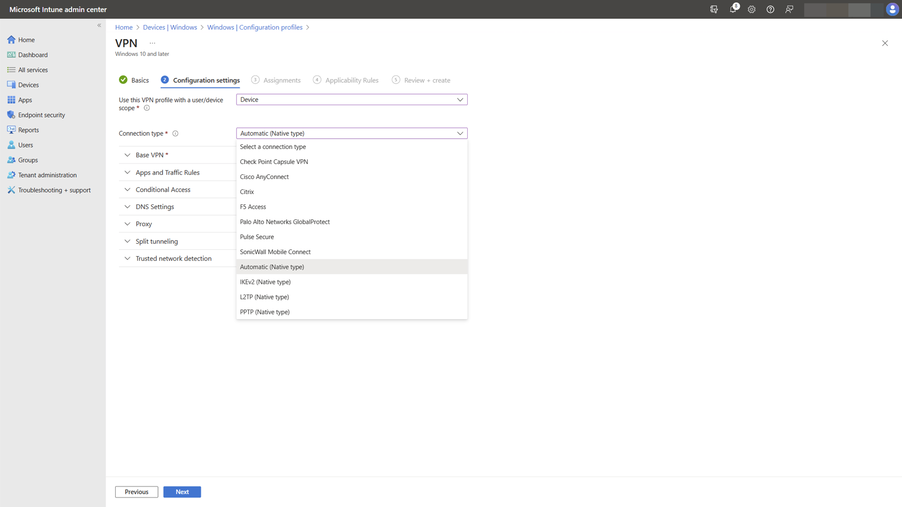
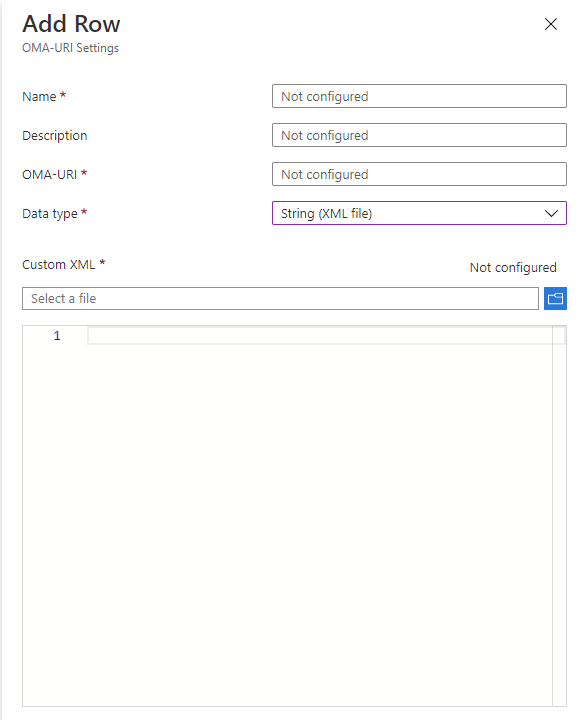

# VPN connection types

VPNs are point-to-point connections across a private or public network, like the Internet. A VPN client uses special TCP/IP or UDP-based protocols, called *tunneling protocols*, to make a virtual call to a virtual port on a VPN server. In a typical VPN deployment, a client initiates a virtual point-to-point connection to a remote access server over the Internet. The remote access server answers the call, authenticates the caller, and transfers data between the VPN client and the organization's private network.

There are many options for VPN clients. In Windows, the built-in plug-in and the Universal Windows Platform (UWP) VPN plug-in platform are built on top of the Windows VPN platform. This article focuses on the Windows VPN platform clients and the features that can be configured.

## Built-in VPN client

Tunneling protocols:

- [Internet Key Exchange version 2 (IKEv2)](/previous-versions/windows/it-pro/windows-server-2008-R2-and-2008/ff687731(v=ws.10)): configure the IPsec/IKE tunnel cryptographic properties using the **Cryptography Suite** setting in the [VPNv2 Configuration Service Provider (CSP)](/windows/client-management/mdm/vpnv2-csp).
- [L2TP](/previous-versions/windows/it-pro/windows-server-2008-R2-and-2008/ff687761(v=ws.10)): L2TP with pre-shared key (PSK) authentication can be configured using the **L2tpPsk** setting in the [VPNv2 CSP](/windows/client-management/mdm/vpnv2-csp).
- [PPTP](/previous-versions/windows/it-pro/windows-server-2008-R2-and-2008/ff687676(v=ws.10))
- [SSTP](/previous-versions/windows/it-pro/windows-server-2008-R2-and-2008/ff687819(v=ws.10)): SSTP can't be configured using MDM, but it's one of the protocols attempted in the **Automatic** option
    > [!NOTE]
    > When a VPN plug-in is used, the adapter will be listed as an SSTP adapter, even though the VPN protocol used is the plug-in's protocol.

- Automatic: the **Automatic** option means that the device tries each of the built-in tunneling protocols until one succeeds. It attempts from most secure to least secure. Configure **Automatic** for the **NativeProtocolType** setting in the [VPNv2 CSP](/windows/client-management/mdm/vpnv2-csp).

## Universal Windows Platform VPN plug-in

Using the UWP platform, non-Microsoft VPN providers can create app-containerized plug-ins using WinRT APIs, eliminating the complexity and problems often associated with writing to system-level drivers.

There are many Universal Windows Platform VPN applications, such as Pulse Secure, Cisco AnyConnect, F5 Access, Sonicwall Mobile Connect, and Check Point Capsule. If you want to use a UWP VPN plug-in, work with your vendor for any custom settings needed to configure your VPN solution.

## Configure connection type

See [VPN profile options](vpn-profile-options.md) and [VPNv2 CSP](/windows/client-management/mdm/vpnv2-csp) for XML configuration.

The following image shows connection options in a VPN Profile configuration policy using Microsoft Intune:

> [!div class="mx-imgBorder"]
> 

In Intune, you can also include custom XML for non-Microsoft plug-in profiles:

> [!div class="mx-imgBorder"]
> 

## Related articles

- [VPN technical guide](vpn-guide.md)
- [VPN routing decisions](vpn-routing.md)
- [VPN authentication options](vpn-authentication.md)
- [VPN and conditional access](vpn-conditional-access.md)
- [VPN name resolution](vpn-name-resolution.md)
- [VPN auto-triggered profile options](vpn-auto-trigger-profile.md)
- [VPN security features](vpn-security-features.md)
- [VPN profile options](vpn-profile-options.md)
