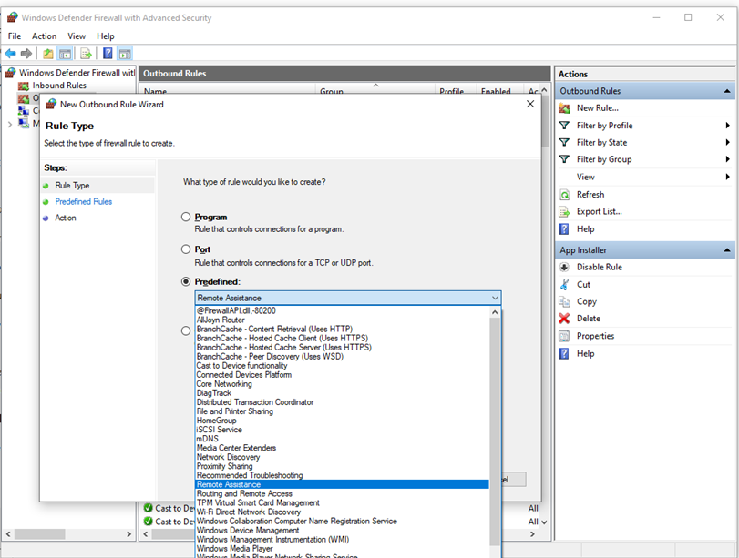

# Best practices for configuring Windows Firewall

Windows Firewall provides host-based, two-way network traffic filtering and blocks unauthorized network traffic flowing into or out of the local device. Configuring your Windows Firewall based on the following best practices can help you optimize protection for devices in your network.

## Access the Windows Firewall with Advanced Security console

If you're configuring devices joined to an Active Directory domain, to complete these procedures you must be a member of the Domain Administrators group, or otherwise have delegated permissions to modify the GPOs in the domain. To access the *Windows Firewall with Advanced Security* console, [create or edit](/previous-versions/windows/it-pro/windows-server-2008-r2-and-2008/cc754740(v=ws.11)) a group policy object (GPO) and expand the nodes **Computer Configuration** > **Policies** > **Windows Settings** > **Security Settings** > **Windows Firewall with Advanced Security**.

If you are configuring a single device, you must have administrative rights on the device. In which case, to access the *Windows Firewall with Advanced Security* console, select <kbd>START</kbd>, type `wf.msc`, and press <kbd>ENTER</kbd>.

## Keep default settings

The *Overview* panel of the *Windows Firewall with Advanced Security* console displays security settings for each type of network to which the device can connect.

1. **Domain profile**: Used for networks where there's a system of account authentication against an Active Directory domain controller
1. **Private profile**: Designed for and best used in private networks such as a home network
1. **Public profile**: Designed with higher security in mind for public networks, like Wi-Fi hotspots, coffee shops, airports, hotels, or stores

To view detailed settings for each profile, right-click the top-level **Windows Defender Firewall with Advanced Security** node in the left pane and then select **Properties**.

> [!TIP]
> Maintain the default settings in Windows Firewall whenever possible. These settings have been designed to secure your device for use in most network scenarios. One key example is the default Block behavior for Inbound connections.

:::image type="content" source="images/fw03-defaults.png" alt-text="Screenshot of the default inbound/outbound Firewall settings.":::

> [!IMPORTANT]
> To maintain maximum security, don't change the default Block setting for inbound connections.

For more on configuring basic firewall settings, see [Turn on Windows Firewall and Configure Default Behavior](turn-on-windows-firewall-and-configure-default-behavior.md) and [Checklist: Configuring Basic Firewall Settings](checklist-configuring-basic-firewall-settings.md).

## Rule precedence for inbound rules

In many cases, a next step for administrators is to customize the firewall profiles using *rules* (sometimes called *filters*), so that they can work with applications or other types of software. For example, an administrator or user may choose to add a rule to accommodate a program, open a port or protocol, or allow a predefined type of traffic.

The rule-adding task can be accomplished by right-clicking either **Inbound Rules** or **Outbound Rules**, and selecting **New Rule**. The interface for adding a new rule looks like this:

> [!NOTE]
>This article doesn't cover step-by-step rule configuration. See the [Windows Firewall with Advanced Security Deployment Guide](windows-firewall-with-advanced-security-deployment-guide.md) for general guidance on policy creation.

In many cases, allowing specific types of inbound traffic is required for applications to function in the network. Administrators should keep the following rule precedence behaviors in mind when allowing these inbound exceptions:

1. Explicitly defined allow rules take precedence over the default block setting
1. Explicit block rules take precedence over any conflicting allow rules
1. More specific rules take precedence over less specific rules, except if there are explicit block rules as mentioned in 2. For example, if the parameters of rule 1 include an IP address range, while the parameters of rule 2 include a single IP host address, rule 2 takes precedence.

> [!TIP]
> Because of 1 and 2, when designing a set of policies you should make sure that there are no other explicit block rules that could inadvertently overlap, thus preventing the traffic flow you wish to allow.

A general security recommended practice when creating inbound rules is to be as specific as possible. However, when new rules must be made that use ports or IP addresses, consider using consecutive ranges or subnets instead of individual addresses or ports where possible. This approach avoids creation of multiple filters under the hood, reduces complexity, and helps to avoid performance degradation.

> [!NOTE]
> Windows Firewall doesn't support weighted, administrator-assigned rule ordering. An effective policy set with expected behaviors can be created by keeping in mind the few, consistent, and logical rule behaviors as described.

## Create rules for new applications before first launch

### Inbound allow rules

When first installed, networked applications and services issue a listen call specifying the protocol/port information required for them to function properly. As there's a default block action in Windows Firewall, it's necessary to create inbound exception rules to allow this traffic. It's common for the app or the app installer itself to add this firewall rule. Otherwise, the user (or firewall admin on behalf of the user) needs to manually create a rule.

If there's no active application or administrator-defined allow rule(s), a dialog box prompts the user to either allow or block an application's packets the first time the app is launched or tries to communicate in the network.

- If the user has admin permissions, they're prompted. If they respond *No* or cancel the prompt, block rules are created. Two rules are typically created, one each for TCP and UDP traffic.
- If the user isn't a local admin, they won't be prompted. In most cases, block rules are created.

In either of these scenarios, once the rules are added, they must be deleted to generate the prompt again. If not, the traffic continues to be blocked.

> [!NOTE]
> The firewall's default settings are designed for security. Allowing all inbound connections by default introduces the network to various threats. Therefore, creating exceptions for inbound connections from third-party software should be determined by trusted app developers, the user, or the admin on behalf of the user.

### Known issues with automatic rule creation

When designing a set of firewall policies for your network, it's a recommended practice to configure *allow rules* for any networked applications deployed on the host. Having the rules in place before the user first launches the application helps to ensure a seamless experience.

The absence of these staged rules doesn't necessarily mean that in the end an application will be unable to communicate on the network. However, the behaviors involved in the automatic creation of application rules at runtime require user interaction and administrative privilege. If the device is expected to be used by non-administrative users, you should follow best practices and provide these rules before the application's first launch to avoid unexpected networking issues.

To determine why some applications are blocked from communicating in the network, check for the following instances:

1. A user with sufficient privileges receives a query notification advising them that the application needs to make a change to the firewall policy. Not fully understanding the prompt, the user cancels or dismisses the prompt
1. A user lacks sufficient privileges and is therefore not prompted to allow the application to make the appropriate policy changes
1. Local Policy Merge is disabled, preventing the application or network service from creating local rules

Creation of application rules at runtime can also be prohibited by administrators using the Settings app or Group Policy.

:::image type="content" alt-text="Windows Firewall prompt." source="images/fw04-userquery.png":::

See also [Checklist: Creating Inbound Firewall Rules](checklist-creating-inbound-firewall-rules.md).

## Establish local policy merge and application rules

Firewall rules can be deployed:

1. Locally using the Firewall snap-in (**wf.msc**)
1. Locally using PowerShell
1. Remotely using Group Policy if the device is a member of an Active Directory Name or managed by Configuration Manager
1. Remotely, using a mobile device management (MDM) solution like Microsoft Intune

Rule merging settings control how rules from different policy sources can be combined. Administrators can configure different merge behaviors for *Domain*, *Private*, and *Public profiles*.

The rule-merging settings either allow or prevent local administrators from creating their own firewall rules in addition to those rules obtained from Group Policy.

> [!TIP]
> In the firewall [configuration service provider](/windows/client-management/mdm/firewall-csp), the equivalent setting is *AllowLocalPolicyMerge*. This setting can be found under each respective profile node, *DomainProfile*, *PrivateProfile*, and *PublicProfile*.

If merging of local policies is disabled, centralized deployment of rules is required for any app that needs inbound connectivity.

Administrators may disable *LocalPolicyMerge* in high-security environments to maintain tighter control over endpoints. This setting can impact some applications and services that automatically generate a local firewall policy upon installation as discussed above. For these types of apps and services to work, admins should push rules centrally via group policy (GP), Mobile Device
Management (MDM), or both (for hybrid or co-management environments).

[Firewall CSP](/windows/client-management/mdm/firewall-csp) and [Policy CSP](/windows/client-management/mdm/policy-configuration-service-provider) also have settings that can affect rule merging.

As a best practice, it's important to list and log such apps, including the network ports used for communications. Typically, you can find what ports must be open for a given service on the app's website. For more complex or customer application deployments, a more thorough analysis may be needed using network packet capture tools.

In general, to maintain maximum security, admins should only deploy firewall exceptions for apps and services determined to serve legitimate purposes.

> [!NOTE]
> The use of wildcard patterns, such as *C:\*\\teams.exe* is not supported in application rules. You can only create rules using the full path to the application(s).

## Understand group policy processing  

The Windows Firewall settings configured via group policy or CSP are stored in the registry. By default, group policies are refreshed in the background every 90 minutes, with a random offset of 0 to 30 minutes.

Windows Firewall monitors the registry for changes, and if something is written to the registry it notifies the *Windows Filtering Platform (WFP)*, which performs the following actions:

- Reads all firewall rules and settings
- Applies any new filters
- Removes the old filters

> [!NOTE]
> The actions are triggered whenever something is written to, or deleted from the registry location the GPO settings are stored, regardless if there's really a configuration change. During the process, IPsec connections are disconnected.

Many policy implementations specify that they're updated only when changed. However, you might want to update unchanged policies, such as reapplying a desired policy setting in case a user has changed it. To control the behavior of the registry group policy processing, you can use the policy `Computer Configuration > Administrative Templates > System > Group Policy > Configure registry policy processing`. The *Process even if the Group Policy objects haven't changed* option updates and reapplies the policies even if the policies haven't changed. This option is disabled by default.

If you enable the option *Process even if the Group Policy objects haven't changed*, the WFP filters get reapplied during **every** background refresh. In case you have 10 group policies, the WFP filters get reapplied 10 times during the refresh interval. If an error happens during policy processing, the applied settings might be incomplete, resulting in issues like:

- Windows Firewall blocks inbound or outbound traffic allowed by group policies
- Local Firewall settings are applied instead of group policy settings
- IPsec connections can't establish

The temporary solution is to refresh the group policy settings, using the command `gpupdate.exe /force`, which requires connectivity to a domain controller.

To avoid the issue, leave the policy `Computer Configuration > Administrative Templates > System > Group Policy > Configure registry policy processing` to the default value of *Not Configured* or, if already configured, configure it *Disabled*.

> [!IMPORTANT]
> The checkbox next to **Process even if the Group Policy objects have not changed** must be unchecked. If you leave it unchecked, WFP filters are written only in case there's a configuration change.
>
> If there's a requirement to force registry deletion and rewrite, then disable background processing by checking the checkbox next to **Do not apply during periodic background processing**.

## Know how to use *shields up* mode for active attacks

An important firewall feature you can use to mitigate damage during an active attack is the "shields up" mode. It's an informal term referring to an easy method a firewall administrator can use to temporarily increase security in the face of an active attack.

Shields up can be achieved by checking **Block all
incoming connections, including those in the list of allowed apps** setting found in either the Windows Settings app or the legacy file *firewall.cpl*.

*Figure 6: Windows settings App/Windows Security/Firewall Protection/Network Type*

:::image type="content" alt-text="Firewall cpl." source="images/fw07-legacy.png":::

*Figure 7: Legacy firewall.cpl*

By default, the Windows Firewall blocks everything unless there's an exception rule created. This setting overrides the exceptions.

For example, the Remote Desktop feature automatically creates firewall rules when enabled. However, if there's an active exploit using multiple ports and services on a host, you can, instead of disabling individual rules, use the shields up mode to block all inbound connections, overriding previous exceptions, including the rules for Remote Desktop. The Remote Desktop rules remain intact but remote access won't work as long as shields up is activated.

Once the emergency is over, uncheck the setting to restore regular network traffic.

## Create outbound rules

What follows are a few general guidelines for configuring outbound rules.

- The default configuration of Blocked for Outbound rules can be considered for certain highly secure environments. However, the Inbound rule configuration should never be changed in a way that Allows traffic by default
- It's recommended to Allow Outbound by default for most deployments for the sake of simplification around app deployments, unless the enterprise prefers tight security controls over ease-of-use
- In high security environments, an inventory of all enterprise-spanning apps must be taken and logged by the administrator or administrators. Records must include whether an app used requires network connectivity. Administrators need to create new rules specific to each app that needs network connectivity and push those rules centrally, via group policy (GP), Mobile Device Management (MDM), or both (for hybrid or co-management environments)

For tasks related to creating outbound rules, see [Checklist: Creating Outbound Firewall Rules](checklist-creating-outbound-firewall-rules.md).

## Document your changes

When creating an inbound or outbound rule, you should specify details about the app itself, the port range used, and important notes like creation date. Rules must be well-documented for ease of review both by you and other admins. We highly encourage taking the time to make the work of reviewing your firewall rules at a later date easier. And *never* create unnecessary holes in your firewall.

## Configure Windows Firewall rules with WDAC tagging policies

Windows Firewall now supports the use of Windows Defender Application Control (WDAC) Application ID (AppID) tags in firewall rules. With this capability, Windows Firewall rules can now be scoped to an application or a group of applications by referencing process tags, without using absolute path or sacrificing security. There are two steps for this configuration:

### Step 1: Deploy WDAC AppId Tagging Policies

A Windows Defender Application Control (WDAC) policy needs to be deployed which specifies individual applications or groups of applications to apply a PolicyAppId tag to the process token(s). Then, the admin can define firewall rules that are scoped to all processes tagged with the matching PolicyAppId.

Follow the detailed [WDAC Application ID (AppId) Tagging Guide](/windows/security/threat-protection/windows-defender-application-control/appidtagging/windows-defender-application-control-appid-tagging-guide) to create, deploy, and test an AppID (Application ID) policy to tag applications.

### Step 2: Configure Firewall Rules using PolicyAppId Tags

- **Deploy firewall rules with Intune:** When creating firewall rules with Intune Microsoft Defender Firewall Rules, provide the AppId tag in the Policy App ID setting. The properties come directly from the [Firewall configuration service provider](/windows/client-management/mdm/firewall-csp)(CSP) and apply to the Windows platform.
You can do this through the Intune admin center under Endpoint security > Firewall. Policy templates can be found via Create policy > Windows 10, Windows 11, and Windows Server > Microsoft Defender Firewall or Microsoft Defender Firewall Rules.

OR

- **Create local firewall rules with PowerShell**: You can use PowerShell to configure by adding a Firewall rule using [New-NetFirewallRule](/powershell/module/netsecurity/new-netfirewallrule) and specify the `-PolicyAppId` tag. You can specify one tag at a time while creating firewall rules. Multiple User Ids are supported.
