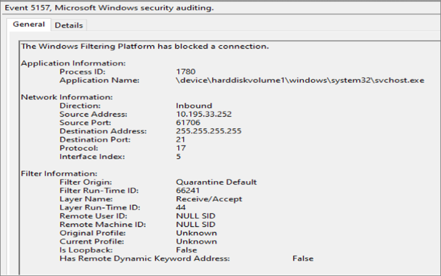

# Quarantine behavior

One of the security challenges that network admins face is configuring a device properly after a network change.

Network changes can happen frequently. The operations required to recategorize the network after a change, and apply the correct security policies on a device, are nontrivial and might require considerable CPU time. This requirement by operations is especially true for devices that are part of a domain. The delay in applying security policies during network recategorization can be exploited for vulnerabilities.

To counter the potential exploitation, Windows Firewall quarantines an interface until the system successfully recategorizes the network, and Windows Filtering Platform (WFP) has the correct filters applied for the updated interface configuration. During quarantine, all new inbound connections without exceptions are blocked.

This document describes the quarantine feature and explains why the application traffic could be blocked by quarantine.

## Quarantine filters

The quarantine feature creates filters that can be split into three categories:

- Quarantine default inbound block filter
- Quarantine default exception filters
- Interface unquarantine filters

These filters are added in the `FWPM_SUBLAYER_MPSSVC_QUARANTINE` sublayer and these layers are:

1. `FWPM_LAYER_ALE_AUTH_CONNECT_V4`
1. `FWPM_LAYER_ALE_AUTH_CONNECT_V6`
1. `FWPM_LAYER_ALE_AUTH_RECV_ACCEPT_V4`
1. `FWPM_LAYER_ALE_AUTH_RECV_ACCEPT_V6`

>[!NOTE]
> Any firewall rules added by policy settings don't affect the filters in the quarantine sublayer. Filters from firewall rules are added in the `FWPM_SUBLAYER_MPSSVC_WF` sublayer. In other words, you can't add your own exception filters to prevent packets from being evaluated by quarantine filters.

For more information about WFP layers and sublayers, see [WFP Operation](/windows/win32/fwp/basic-operation).

### Quarantine default inbound block filter

The *quarantine default inbound block filter* blocks any new nonloopback inbound connections, unless the packet isn't explicitly permitted by another filter in the quarantine sublayer.

### Quarantine default exception filters

When the interface is in quarantine state, the quarantine default exception filters permit new inbound connections given that they meet the conditions of an exception filter. One example of the exception filters is the quarantine default inbound loopback exception filter. This exception filter allows all loopback packets when the interface is in quarantine state.

### Interface unquarantine filter

The interface unquarantine filters allow all nonloopback packets if the interface is successfully categorized.

## Quarantine flow

The following events describe the general flow of quarantine:

1. There's some change on the current network interface
1. The interface unquarantine filters don't permit new inbound connections. The interface is now in quarantine state
1. All nonloopback inbound connections are either permitted by quarantine default exception filters or dropped by the quarantine default inbound block filter
1. The WFP filters applicable to the old interface state are removed
1. The WFP filters applicable to the new interface state are added, which include the unquarantine filters for this interface. These filters are updated to match the interface's current state
1. The interface has now exited quarantine state as the interface unquarantine filters permit any new nonloopback packets

## Quarantine diagnostics

There are two methods of identifying packet drops from the quarantine default inbound block filter.

Given that the network connectivity issue is reproducible, diagnostic traces can be collected by running the following in an administrative command prompt:

```cmd
Netsh wfp cap start
<Reproduce network connectivity issue>
Netsh wfp cap stop
```

These commands generate a wfpdiag.cab. Inside the .cab exists a wfpdiag.xml, which contains drop `netEvents` and filters that existed during that reproduction.

Inside the wfpdiag.xml, search for `netEvents` that have `FWPM_NET_EVENT_TYPE_CLASSIFY_DROP` as the `netEvent` type. To find the relevant drop events, search for the drop events with matching destination IP address, package SID, or application ID name.

The characters in the application ID name are separated by periods:

```XML
 <asString>         \\.d.e.v.i.c.e.\\.h.a.r.d.d.i.s.k.v.o.l.u.m.e.1.\\.w.i.n.d.o.w.s.\\.s.y.s.t.e.m.3.2.\\.s.v.c.h.o.s.t...e.x.e... </asString>
```

The `netEvent` contains more information about the dropped packet, including information about its capabilities, the filter that dropped the packet, and much more.

If the filter that dropped that packet was by the quarantine default inbound block filter, then the drop `netEvent` contains `filterOrigin` as `Quarantine Default`.

The following code is a sample `netEvent` with `filterOrigin` as `Quarantine Default`.

```XML
<netEvent>
    <header>
        <timeStamp>2020-10-07T01:03:56.281Z</timeStamp>
        <flags numItems="9">
            <item>FWPM_NET_EVENT_FLAG_IP_PROTOCOL_SET</item>
            <item>FWPM_NET_EVENT_FLAG_LOCAL_ADDR_SET</item>
            <item>FWPM_NET_EVENT_FLAG_REMOTE_ADDR_SET</item>
            <item>FWPM_NET_EVENT_FLAG_LOCAL_PORT_SET</item>
            <item>FWPM_NET_EVENT_FLAG_REMOTE_PORT_SET</item>
            <item>FWPM_NET_EVENT_FLAG_APP_ID_SET</item>
            <item>FWPM_NET_EVENT_FLAG_USER_ID_SET</item>
            <item>FWPM_NET_EVENT_FLAG_IP_VERSION_SET</item>
            <item>FWPM_NET_EVENT_FLAG_PACKAGE_ID_SET</item>
        </flags>
        <ipVersion>FWP_IP_VERSION_V4</ipVersion>
        <ipProtocol>17</ipProtocol>
        <localAddrV4>255.255.255.255</localAddrV4>
        <remoteAddrV4>10.195.33.252</remoteAddrV4>
        <localPort>21</localPort>
        <remotePort>61706</remotePort>
        <scopeId>0</scopeId>
        <appId>
            <data>5c00640065006d00330032005c0073007600630068006f00730074002e006500780065000000</data>
            <asString>\.d.e.v.i.c.e.\.h.a.r.d.d.i.s.k.v.o.l.u.m.e.1.\.w.i.n.d.o.w.s.\.s.y.s.t.e.m.3.2.\.s.v.c.h.o.s.t...e.x.e...</asString>
        </appId>
        <userId>S-1-5-19</userId>
        <addressFamily>FWP_AF_INET</addressFamily>
        <packageSid>S-1-0-0</packageSid>
        <enterpriseId/>
        <policyFlags>0</policyFlags>
        <effectiveName/>
    </header>
    <type>FWPM_NET_EVENT_TYPE_CLASSIFY_DROP</type>
    <classifyDrop>
        <filterId>66241</filterId>
        <layerId>44</layerId>
        <reauthReason>0</reauthReason>
        <originalProfile>0</originalProfile>
        <currentProfile>0</currentProfile>
        <msFwpDirection>MS_FWP_DIRECTION_OUT</msFwpDirection>
        <isLoopback>false</isLoopback>
        <vSwitchId/>
        <vSwitchSourcePort>0</vSwitchSourcePort>
        <vSwitchDestinationPort>0</vSwitchDestinationPort>
    </classifyDrop>
    <internalFields>
        <internalFlags numItems="1">
            <item>FWPM_NET_EVENT_INTERNAL_FLAG_FILTER_ORIGIN_SET</item>
        </internalFlags>
        <capabilities/>
        <fqbnVersion>0</fqbnVersion>
        <fqbnName/>
        <terminatingFiltersInfo numItems="3">
            <item>
                <filterId>66241</filterId>
                <subLayer>FWPP_SUBLAYER_INTERNAL_FIREWALL_QUARANTINE</subLayer>
                <actionType>FWP_ACTION_BLOCK</actionType>
            </item>
            <item>
                <filterId>74045</filterId>
                <subLayer>FWPP_SUBLAYER_INTERNAL_FIREWALL_WSH</subLayer>
                <actionType>FWP_ACTION_BLOCK</actionType>
            </item>
            <item>
                <filterId>73602</filterId>
                <subLayer>FWPP_SUBLAYER_INTERNAL_FIREWALL_WF</subLayer>
                <actionType>FWP_ACTION_BLOCK</actionType>
            </item>
        </terminatingFiltersInfo>
        <filterOrigin>Quarantine Default</filterOrigin>
         <interfaceIndex>5</interfaceIndex>
    </internalFields>
</netEvent>
```

Alternatively, If the Filtering Platform Connection failure auditing is enabled, the drop event is logged in Windows Event Viewer.

To enable Filtering Platform Connection audits, run the following command in an administrative command prompt:

```cmd
Auditpol /set /category:"System" /SubCategory:"Filtering Platform Connection" /success:enable /failure:enable
```

Sample drop audit with `filterOrigin` as `Quarantine Default`.



Once the drop's filter origin has been identified as the quarantine default inbound block filter, the interface should be further investigated. To find the relevant interface, use the `InterfaceIndex` value from the `netEvent` or event audit in the following PowerShell command to generate more information about the interface:

```Powershell
Get-NetIPInterface -InterfaceIndex <Interface Index>
Get-NetIPInterface -InterfaceIndex 5
```

With the help of the interface name, event viewer can be searched for any interface related changes.

To enable more networking audit events, see [Enable IPsec and Windows Firewall Audit Events](/previous-versions/windows/it-pro/windows-server-2008-R2-and-2008/cc754714(v=ws.10)).

Packet drops from the quarantine default inbound block filter are often transient and don't signify anything more than a network change on the interface.
