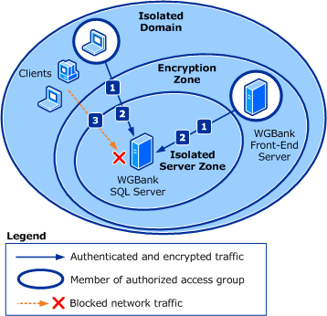

# Server Isolation Policy Design Example

This design example continues to use the fictitious company *Woodgrove Bank*, as described in the [Firewall Policy Design Example](firewall-policy-design-example.md) section and the [Domain Isolation Policy Design Example](domain-isolation-policy-design-example.md) section.

In addition to the protections provided by the firewall and domain isolation, *Woodgrove Bank* wants to provide extra protection to the devices that are running Microsoft SQL Server for the WGBank program. They contain personal data, including each customer's financial history. Government and industry rules and regulations specify that access to this information must be restricted to only those users who have a legitimate business need. These rules and regulations include a requirement to prevent interception of and access to the information when it is in transit over the network.

The information presented by the WGBank front-end servers to the client devices, and the information presented by the WGPartner servers to the remote partner devices, aren't considered sensitive for the purposes of the government regulations, because they're processed to remove sensitive elements before transmitting the data to the client devices.

In this guide, the examples show server isolation layered on top of a domain isolation design. If you have an isolated domain, the client devices are already equipped with GPOs that require authentication. You only have to add settings to the isolated server(s) to require authentication on inbound connections, and to check for membership in the NAG. The connection attempt succeeds only if NAG membership is confirmed.

## Server isolation without domain isolation

Server isolation can also be deployed by itself, to only the devices that must participate. The GPO on the server is no different from the one discussed in the previous paragraph for a server in an existing isolated domain. The difference is that you must also deploy a GPO with supporting connection security rules to the clients that must be able to communicate with the isolated server. Because those devices must be members of the NAG, that group can also be used in a security group filter on the client GPO. That GPO must contain rules that support the authentication requirements of the isolated server.

In short, instead of applying the client GPO to all clients in the domain, you apply the GPO to only the members of the NAG.

If you don't have an Active Directory domain, you can manually apply the connection security rules, use a netsh command-line script, or use a Windows PowerShell script to help automate the configuration of the rules on larger numbers of devices. If you don't have an Active Directory domain, you can't use the Kerberos V5 protocol, but instead must provide the clients and the isolated servers with certificates that are referenced in the connection security rules.

## Design requirements

In addition to the protection provided by the firewall rules and domain isolation described in the previous design examples, the network administrators want to implement server isolation to help protect the sensitive data stored on the devices that run SQL Server.

The following illustration shows the traffic protection needs for this design example.

1. Access to the SQL Server devices must be restricted to only those computer or user accounts that have a business requirement to access the data. These accounts include the service accounts that are used by the WGBank front-end servers, and administrators of the SQL Server devices. In addition, access is only granted when it's sent from an authorized computer. Authorization is determined by membership in a network access group (NAG)
1. All network traffic to and from the SQL Server devices must be encrypted
1. Client devices or users whose accounts aren't members of the NAG can't access the isolated servers

### Other traffic notes

- All of the design requirements shown in the [Firewall Policy Design Example](firewall-policy-design-example.md) section are still enforced
- All of the design requirements shown in the [Domain Isolation Policy Design Example](domain-isolation-policy-design-example.md) section are still enforced

## Design details

*Woodgrove Bank* uses Active Directory groups and GPOs to deploy the server isolation settings and rules to the devices on its network.

As in the previously described policy design examples, GPOs to implement the domain isolation environment are linked to the domain container in Active Directory, and then WMI filters and security group filters are attached to GPOs to ensure that the correct GPO is applied to each computer. The following groups were created by using the Active Directory Users and Computers snap-in, and all devices that run Windows were added to the correct groups.

- **CG_SRVISO_WGBANK_SQL**. This group contains the computer accounts for the devices that run SQL Server. Members of this group receive a GPO with firewall and connections security rules that require that only users who are members of the group CG_NAG_SQL_USERS can access the server, and only when they're using a computer that is a member of the group CG_NAG_SQL_COMPUTERS.

    > [!NOTE]
    > You can design your GPOs in nested groups. For example, you can make the boundary group a member of the isolated domain group, so that it receives the firewall and basic isolated domain settings through that nested membership, with only the changes supplied by the boundary zone GPO. However, devices that are running older versions of Windows can only support a single IPsec policy being active at a time. The policies for each GPO must be complete (and to a great extent redundant with each other), because you cannot layer them as you can in the newer versions of Windows. For simplicity, this guide describes the techniques used to create the independent, non-layered policies. We recommend that you create and periodically run a script that compares the memberships of the groups that must be mutually exclusive and reports any devices that are incorrectly assigned to more than one group.

    Network access groups (NAGs) aren't used to determine which GPOs are applied to a computer. Instead, these groups determine which users and devices can access the services on the isolated server.

- **CG_NAG_SQL_COMPUTERS**. This network access group contains the computer accounts that are able to access the devices running SQL Server hosting the WGBank data. Members of this group include the WGBank front-end servers, and some client devices from which SQL Server administrators are permitted to work on the servers.
- **CG_NAG_SQL_USERS**. This network access group contains the user accounts of users who are permitted to access the SQL Server devices that host the WGBank data. Members of this group include the service account that the WGBank front-end program uses to run on its devices, and the user accounts for the SQL Server administration team members.

> [!NOTE]
> You can use a single group for both user and computer accounts. Woodgrove Bank chose to keep them separate for clarity.

If Woodgrove Bank wants to implement server isolation without domain isolation, the *CG_NAG_SQL_COMPUTERS* group can also be attached as a security group filter on the GPOs that apply connection security rules to the client devices. By doing this task, all the devices that are authorized to access the isolated server also have the required connection security rules.

You don't have to include the encryption-capable rules on all devices. Instead, you can create GPOs that are applied only to members of the NAG, in addition to the standard domain isolation GPO, that contains connection security rules to support encryption.

> [!div class="nextstepaction"]
>
> [Certificate-based Isolation Policy Design Example >](certificate-based-isolation-policy-design-example.md)
