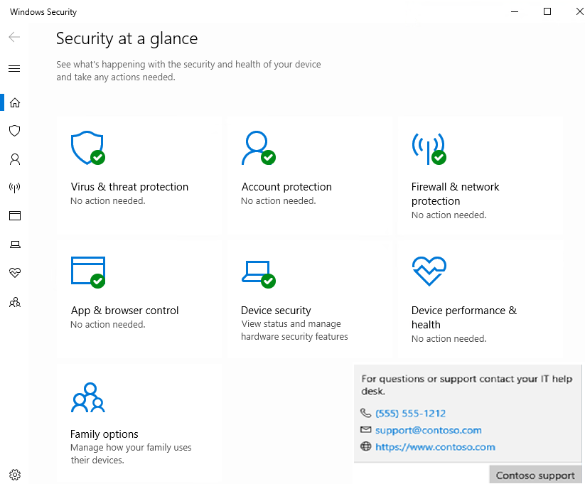

# Customize the Windows Security settings for your organization

You can add information about your organization in a contact card in **Windows Security**. You can include a link to a support site, a phone number for a help desk, and an email address for email-based support.

This information is shown in some enterprise-specific notifications (including notifications for the [Block at first sight feature](/microsoft-365/security/defender-endpoint/configure-block-at-first-sight-microsoft-defender-antivirus), and [potentially unwanted applications](/microsoft-365/security/defender-endpoint/detect-block-potentially-unwanted-apps-microsoft-defender-antivirus)).

Users can select the displayed information to initiate a support request:

- Select **Call** or the phone number to open Skype to start a call to the displayed number.
- Select **Email** or the email address to create a new email in the machine's default email app addressed to the displayed email.
- Select **Help portal** or the website URL to open the machine's default web browser and go to the displayed address.

## Requirements

You must have Windows 10, version 1709 or later. The ADMX/ADML template files for earlier versions of Windows don't include these Group Policy settings.

## Use Group Policy to enable and customize contact information

There are two stages to using the contact card and customized notifications. First, you have to enable the contact card or custom notifications (or both), and then you must specify at least a name for your organization and one piece of contact information.

1. On your Group Policy management machine, open the [Group Policy Management Console](/previous-versions/windows/it-pro/windows-server-2008-R2-and-2008/cc731212(v=ws.11)). Right-click the Group Policy Object you want to configure and select **Edit**.
1. In the **Group Policy Management Editor**, go to **Computer configuration** and select **Administrative templates**.
1. Expand the tree to **Windows components > Windows Security > Enterprise Customization**.
1. Enable the contact card and the customized notifications by configuring two separate Group Policy settings. They both use the same source of information (explained in Steps 5 and 6). You can enable both, or select one or the other:

    1. To enable the contact card, open the **Configure customized contact information** setting and set it to **Enabled**. Select **OK**.

        > [!NOTE]
        > This can only be done in Group Policy.

    1. To enable the customized notifications, open the **Configure customized notifications** setting and set it to **Enabled**. Select **OK**.

1. After you enable the contact card or the customized notifications (or both), you must configure the **Specify contact company name** to **Enabled**. Enter your company or organization's name in the field in the **Options** section. Select **OK**.
1. To ensure the custom notifications or contact card appear, you must also configure at least one of the following settings. Open the setting, select **Enabled**, and then add the contact information in the field under **Options**:

    1. **Specify contact email address or Email ID**
    2. **Specify contact phone number or Skype ID**
    3. **Specify contact website**

    > [!NOTE]
    > If you enable **Configure customized notifications** and **Specify contact website** policies, the contact website must begin with `http:` or `https:` (for example, `https://contoso.com/help`) to allow the user to interact with the notification and navigate to the specified URL.

1. Select **OK** after you configure each setting to save your changes.

To enable the customized notifications and add the contact information in Intune, see these articles:

- [Manage device security with endpoint security policies in Microsoft Intune](/mem/intune/protect/endpoint-security-policy).
- [Settings for the Windows Security experience profile in Microsoft Intune](/mem/intune/protect/antivirus-security-experience-windows-settings).

> [!IMPORTANT]
> You must specify the contact company name and at least one contact method - email, phone number, or website URL. If you do not specify the contact name and a contact method the customization will not apply, the contact card will not show, and notifications will not be customized.
