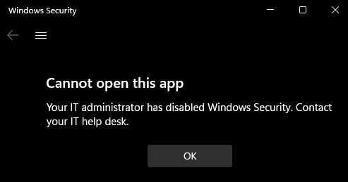

# Firewall and network protection

The **Firewall & network protection** section contains information about the firewalls and network connections used by the machine, including the status of Windows Defender Firewall and any other third-party firewalls. IT administrators and IT pros can get configuration guidance from the [Windows Defender Firewall with Advanced Security documentation library](../../network-security/windows-firewall/windows-firewall-with-advanced-security.md).

In Windows 10, version 1709 and later, the section can be hidden from users of the machine. This information is useful if you don't want employees in your organization to see or have access to user-configured options for the features shown in the section.

## Hide the Firewall & network protection section

You can choose to hide the entire section by using Group Policy. The section won't appear on the home page of the Windows Security app, and its icon won't be shown on the navigation bar on the side of the app.

This section can be hidden only by using Group Policy.

> [!IMPORTANT]
> You must have Windows 10, version 1709 or later. The ADMX/ADML template files for earlier versions of Windows do not include these Group Policy settings.

1. On your Group Policy management machine, open the Group Policy Management Console, right-click the Group Policy Object you want to configure and click **Edit**.
1. In **Group Policy Management Editor**, go to **Computer configuration** and click **Administrative templates**.
1. Expand the tree to **Windows components > Windows Security > Firewall and network protection**.
1. Open the **Hide the Firewall and network protection area** setting and set it to **Enabled**. Click **OK**.
1. Deploy the updated GPO as you normally do.

> [!NOTE]
> If you hide all sections then the app will show a restricted interface, as in the following screenshot:
>
> 
