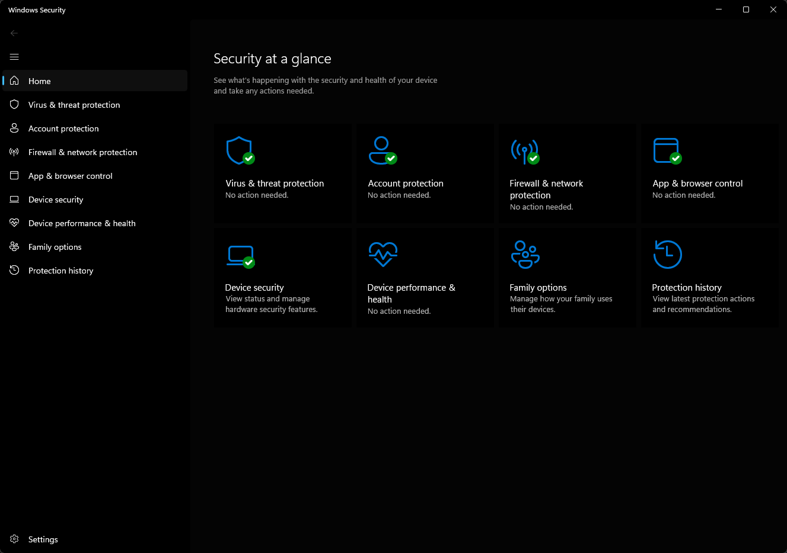
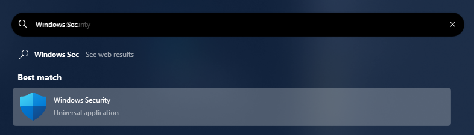
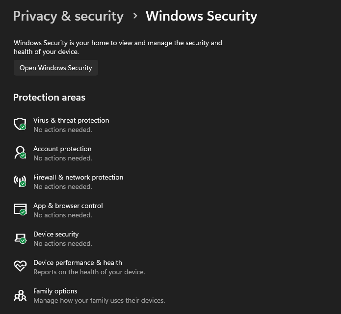

# Windows Security

This article describes **Windows Security** settings, and provides information on configuring certain features, including:

- [Showing and customizing contact information](wdsc-customize-contact-information.md)
- [Hiding notifications](wdsc-hide-notifications.md)

> [!NOTE]
> **Windows Security** is a client interface on Windows 10, version 1703 and later. It is not the Microsoft Defender Security Center web portal console that is used to review and manage [Microsoft Defender for Endpoint](/microsoft-365/security/defender-endpoint/).

You can't uninstall **Windows Security**, but you can do one of the following actions:

- Disable the interface on Windows Server 2016.
- Hide all of the sections on client computers.
- Disable Microsoft Defender Antivirus, if needed. For more information, see [Enable and configure Microsoft Defender Antivirus always-on protection in group policy](/microsoft-365/security/defender-endpoint/configure-real-time-protection-microsoft-defender-antivirus).

For more information about each section, options for configuring the sections, and how to hide each of them, see the following articles:

- [Virus & threat protection](wdsc-virus-threat-protection.md), which has information and access to antivirus ransomware protection settings and notifications, including Controlled folder access, and sign-in to Microsoft OneDrive.
- [Account protection](wdsc-account-protection.md), which has information and access to sign-in and account protection settings.
- [Firewall & network protection](wdsc-firewall-network-protection.md), which has information and access to firewall settings, including Windows Firewall.
- [App & browser control](wdsc-app-browser-control.md), covering Windows Defender SmartScreen settings and Exploit protection mitigations.
- [Device security](wdsc-device-security.md), which provides access to built-in device security settings.
- [Device performance & health](wdsc-device-performance-health.md), which has information about drivers, storage space, and general Windows Update issues.
- [Family options](wdsc-family-options.md), which include access to parental controls along with tips and information for keeping kids safe online.

> [!NOTE]
> If you hide all sections then **Windows Security** will show a restricted interface, as in the following screenshot:
>
> 

## Open Windows Security

- Select the icon in the notification area on the taskbar.

    

- Search the Start menu for **Windows Security**.

    

- Open an area from Windows **Settings** > **Privacy & security** > **Windows Security**.

    

> [!NOTE]
> Settings configured with management tools, such as group policy, Microsoft Intune, or Microsoft Configuration Manager, will generally take precedence over the settings in the Windows Security.

## How Windows Security works with Windows security features

> [!IMPORTANT]
> **Microsoft Defender Antivirus** and **Windows Security** use similarly named services for specific purposes.
>
> The **Windows Security** uses the Windows Security Service (*SecurityHealthService* or *Windows Security Health Service*), which in turn utilizes the Windows Security Center Service (*wscsvc*). This service makes sure that **Windows Security** provides the most up-to-date information about the protection status on the endpoint. This information includes protection offered by third-party antivirus products, Windows Defender Firewall, third-party firewalls, and other security protection.
>
> These services don't affect the state of Microsoft Defender Antivirus. Disabling or modifying these services won't disable Microsoft Defender Antivirus. It will lead to a lowered protection state on the endpoint, even if you're using a third-party antivirus product.
>
> Microsoft Defender Antivirus will be [disabled automatically when a third-party antivirus product is installed and kept up to date](/microsoft-365/security/defender-endpoint/microsoft-defender-antivirus-compatibility).
>
> Disabling the Windows Security Center Service won't disable Microsoft Defender Antivirus or [Windows Defender Firewall](../../network-security/windows-firewall/index.md).

> [!WARNING]
> If you disable the Windows Security Center Service, or configure its associated group policy settings to prevent it from starting or running, **Windows Security** may display stale or inaccurate information about any antivirus or firewall products you have installed on the device.
>
> It may also prevent Microsoft Defender Antivirus from enabling itself if you have an old or outdated third-party antivirus, or if you uninstall any third-party antivirus products you may have previously installed.
>
> This will significantly lower the protection of your device and could lead to malware infection.

**Windows Security** operates as a separate app or process from each of the individual features, and displays notifications through the Action Center.

It acts as a collector or single place to see the status and perform some configuration for each of the features.

If you disable any of the individual features, it prevents that feature from reporting its status in **Windows Security**. For example, if you disable a feature through group policy or other management tools, such as Microsoft Configuration Manager, **Windows Security** itself still runs and shows status for the other security features.

> [!IMPORTANT]
> If you individually disable any of the services, it won't disable the other services or **Windows Security** itself.

For example, [using a third-party antivirus disables Microsoft Defender Antivirus](/microsoft-365/security/defender-endpoint/microsoft-defender-antivirus-compatibility). However, **Windows Security** still runs, shows its icon in the taskbar, and displays information about the other features, such as Windows Defender SmartScreen and Windows Firewall.
