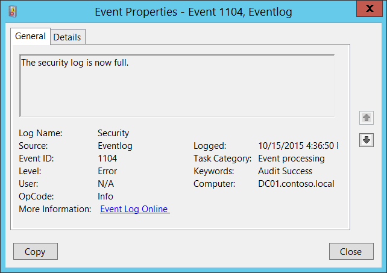

# 1104(S): The security log is now full.




***Subcategory:***&nbsp;[Other Events](other-events.md)

***Event Description:***

This event generates every time Windows security log becomes full.

This event generates, for example, if the maximum size of Security Event Log file was reached and event log retention method is: “[Do not overwrite events (Clear logs manually)](/previous-versions/windows/it-pro/windows-server-2003/cc778402(v=ws.10))”.

> **Note**&nbsp;&nbsp;For recommendations, see [Security Monitoring Recommendations](#security-monitoring-recommendations) for this event.

<br clear="all">

***Event XML:***
```
- <Event xmlns="http://schemas.microsoft.com/win/2004/08/events/event">
- <System>
 <Provider Name="Microsoft-Windows-Eventlog" Guid="{fc65ddd8-d6ef-4962-83d5-6e5cfe9ce148}" /> 
 <EventID>1104</EventID> 
 <Version>0</Version> 
 <Level>2</Level> 
 <Task>101</Task> 
 <Opcode>0</Opcode> 
 <Keywords>0x4020000000000000</Keywords> 
 <TimeCreated SystemTime="2015-10-15T23:36:50.479431200Z" /> 
 <EventRecordID>1087728</EventRecordID> 
 <Correlation /> 
 <Execution ProcessID="820" ThreadID="4224" /> 
 <Channel>Security</Channel> 
 <Computer>DC01.contoso.local</Computer> 
 <Security /> 
 </System>
- <UserData>
 <FileIsFull xmlns="http://manifests.microsoft.com/win/2004/08/windows/eventlog" /> 
 </UserData>
 </Event>

```

***Required Server Roles:*** None.

***Minimum OS Version:*** Windows Server 2008, Windows Vista.

***Event Versions:*** 0.

## Security Monitoring Recommendations

-   If the Security event log retention method is set to “[Do not overwrite events (Clear logs manually)](/previous-versions/windows/it-pro/windows-server-2003/cc778402(v=ws.10))”, then this event will indicate that log file is full and you need to perform immediate actions, for example, archive the log or clear it.