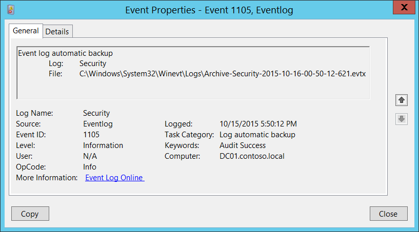

# 1105(S): Event log automatic backup




***Subcategory:***&nbsp;[Other Events](other-events.md)

***Event Description:***

This event generates every time Windows security log becomes full and new event log file was created.

This event generates, for example, if the maximum size of Security Event Log file was reached and event log retention method is: “[Archive the log when full, do not overwrite events](/previous-versions/windows/it-pro/windows-server-2008-R2-and-2008/cc721981(v=ws.11))”.

> **Note**&nbsp;&nbsp;For recommendations, see [Security Monitoring Recommendations](#security-monitoring-recommendations) for this event.

<br clear="all">

***Event XML:***
```
- <Event xmlns="http://schemas.microsoft.com/win/2004/08/events/event">
- <System>
 <Provider Name="Microsoft-Windows-Eventlog" Guid="{fc65ddd8-d6ef-4962-83d5-6e5cfe9ce148}" /> 
 <EventID>1105</EventID> 
 <Version>0</Version> 
 <Level>4</Level> 
 <Task>105</Task> 
 <Opcode>0</Opcode> 
 <Keywords>0x4020000000000000</Keywords> 
 <TimeCreated SystemTime="2015-10-16T00:50:12.715302700Z" /> 
 <EventRecordID>1128551</EventRecordID> 
 <Correlation /> 
 <Execution ProcessID="820" ThreadID="3660" /> 
 <Channel>Security</Channel> 
 <Computer>DC01.contoso.local</Computer> 
 <Security /> 
 </System>
- <UserData>
- <AutoBackup xmlns="http://manifests.microsoft.com/win/2004/08/windows/eventlog">
 <Channel>Security</Channel> 
 <BackupPath>C:\\Windows\\System32\\Winevt\\Logs\\Archive-Security-2015-10-16-00-50-12-621.evtx</BackupPath> 
 </AutoBackup>
 </UserData>
 </Event>

```

***Required Server Roles:*** None.

***Minimum OS Version:*** Windows Server 2008, Windows Vista.

***Event Versions:*** 0.

***Field Descriptions:***

**Log** \[Type = UnicodeString\]: the name of the log that was archived (new event log file was created and previous event log was archived). Always “**Security”** for Security Event Logs.

**File**: \[Type = FILETIME\]: full path and filename of archived log file.

The format of archived log file name is: “Archive-LOG\_FILE\_NAME-YYYY-MM-DD-hh-mm-ss-nnn.evtx”. Where:

-   LOG\_FILE\_NAME – the name of archived file.

-   Y – years.

-   M – months.

-   D – days.

-   h – hours.

-   m – minutes.

-   s – seconds.

-   n – fractional seconds.

The time in this event is always in ***GMT+0/UTC+0*** time zone.

## Security Monitoring Recommendations

For 1105(S): Event log automatic backup.

-   Typically it’s an informational event and no actions are needed. But if your baseline settings are not set to [Archive the log when full, do not overwrite events](/previous-versions/windows/it-pro/windows-server-2008-R2-and-2008/cc721981(v=ws.11)), then this event will be a sign that some settings are not set to baseline settings or were changed.