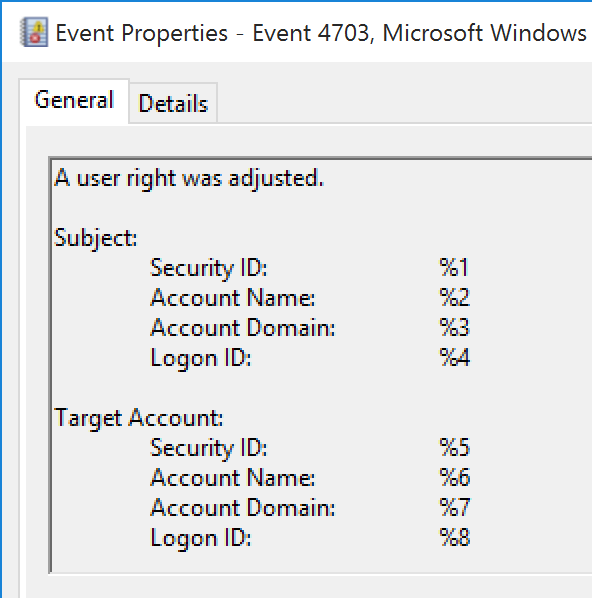

# 1108(S): The event logging service encountered an error while processing an incoming event published from %1.


***Subcategory:***&nbsp;[Other Events](other-events.md)

***Event Description:***

This event generates when event logging service encountered an error while processing an incoming event.

It typically generates when logging service will not be able to correctly write the event to the event log or some parameters were not passed to logging service to log the event correctly. You will typically see a defective or incorrect event before 1108.

For example, event 1108 might be generated after an incorrect [4703](event-4703.md) event:



> **Note**&nbsp;&nbsp;For recommendations, see [Security Monitoring Recommendations](#security-monitoring-recommendations) for this event.

<br clear="all">

***Event XML:***
```
- <Event xmlns="http://schemas.microsoft.com/win/2004/08/events/event">
- <System>
 <Provider Name="Microsoft-Windows-Eventlog" Guid="{fc65ddd8-d6ef-4962-83d5-6e5cfe9ce148}" /> 
 <EventID>1108</EventID> 
 <Version>0</Version> 
 <Level>2</Level> 
 <Task>101</Task> 
 <Opcode>0</Opcode> 
 <Keywords>0x4020000000000000</Keywords> 
 <TimeCreated SystemTime="2015-11-12T20:59:47.431979300Z" /> 
 <EventRecordID>5599</EventRecordID> 
 <Correlation /> 
 <Execution ProcessID="972" ThreadID="1320" /> 
 <Channel>Security</Channel> 
 <Computer>WIN-GG82ULGC9GO.contoso.local</Computer> 
 <Security /> 
 </System>
- <UserData>
- <EventProcessingFailure xmlns="http://manifests.microsoft.com/win/2004/08/windows/eventlog">
 <Error Code="15005" /> 
 <EventID>0</EventID> 
 <PublisherID>Microsoft-Windows-Security-Auditing</PublisherID> 
 </EventProcessingFailure>
 </UserData>
</Event>

```

***Required Server Roles:*** None.

***Minimum OS Version:*** Windows Server 2008 R2, Windows 7.

***Event Versions:*** 0.

***Field Descriptions:***

**%1** \[Type = UnicodeString\]: the name of [security event source](/windows/win32/eventlog/event-sources) from which event was received for processing. You can see all registered security event source names in this registry path: “HKEY\_LOCAL\_MACHINE\\SYSTEM\\CurrentControlSet\\Services\\EventLog\\Security”. Here is an example:


## Security Monitoring Recommendations

For 1108(S): The event logging service encountered an error while processing an incoming event published from %1.

-   We recommend monitoring for all events of this type and checking what the cause of the error was.