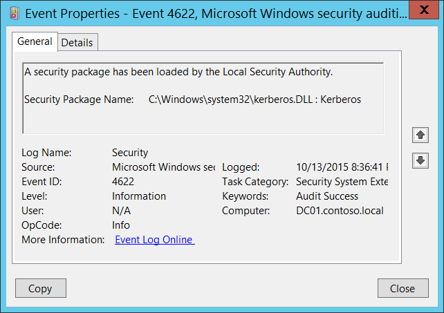

# 4622(S): A security package has been loaded by the Local Security Authority.

**Applies to**
-   Windows 10
-   Windows Server 2016




***Subcategory:***&nbsp;[Audit Security System Extension](audit-security-system-extension.md)

***Event Description:***

This event generates every time [Security Package](https://msdn.microsoft.com/library/windows/desktop/aa380501(v=vs.85).aspx) has been loaded by the Local Security Authority ([LSA](https://msdn.microsoft.com/library/windows/desktop/aa378326(v=vs.85).aspx)).

Security Package is the software implementation of a security protocol (Kerberos, NTLM, for example). Security packages are contained in security support provider DLLs or security support provider/authentication package DLLs.

Each time the system starts, the LSA loads the Security Package DLLs from **HKEY\_LOCAL\_MACHINE\\SYSTEM\\CurrentControlSet\\Control\\Lsa\\OSConfig\\Security Packages** registry value and performs the initialization sequence for every package located in these DLLs.

It is also possible to add security package dynamically using [AddSecurityPackage](https://msdn.microsoft.com/library/windows/desktop/dd401506(v=vs.85).aspx) function, not only during system startup process.

> **Note**&nbsp;&nbsp;For recommendations, see [Security Monitoring Recommendations](#security-monitoring-recommendations) for this event.

<br clear="all">

***Event XML:***
```
- <Event xmlns="http://schemas.microsoft.com/win/2004/08/events/event">
- <System>
 <Provider Name="Microsoft-Windows-Security-Auditing" Guid="{54849625-5478-4994-A5BA-3E3B0328C30D}" /> 
 <EventID>4622</EventID> 
 <Version>0</Version> 
 <Level>0</Level> 
 <Task>12289</Task> 
 <Opcode>0</Opcode> 
 <Keywords>0x8020000000000000</Keywords> 
 <TimeCreated SystemTime="2015-10-14T03:36:41.359331100Z" /> 
 <EventRecordID>1048131</EventRecordID> 
 <Correlation /> 
 <Execution ProcessID="516" ThreadID="520" /> 
 <Channel>Security</Channel> 
 <Computer>DC01.contoso.local</Computer> 
 <Security /> 
 </System>
- <EventData>
 <Data Name="SecurityPackageName">C:\\Windows\\system32\\kerberos.DLL : Kerberos</Data> 
 </EventData>
 </Event>

```

***Required Server Roles:*** None.

***Minimum OS Version:*** Windows Server 2008, Windows Vista.

***Event Versions:*** 0.

***Field Descriptions:***

**Security Package Name** \[Type = UnicodeString\]**:** the name of loaded Security Package. The format is: DLL\_PATH\_AND\_NAME: SECURITY\_PACKAGE\_NAME.

These are some Security Package DLLs loaded by default in Windows 10:

-   C:\\Windows\\system32\\schannel.DLL : Microsoft Unified Security Protocol Provider

-   C:\\Windows\\system32\\schannel.DLL : Schannel

-   C:\\Windows\\system32\\cloudAP.DLL : CloudAP

-   C:\\Windows\\system32\\wdigest.DLL : WDigest

-   C:\\Windows\\system32\\pku2u.DLL : pku2u

-   C:\\Windows\\system32\\tspkg.DLL : TSSSP

-   C:\\Windows\\system32\\msv1\_0.DLL : NTLM

-   C:\\Windows\\system32\\kerberos.DLL : Kerberos

-   C:\\Windows\\system32\\negoexts.DLL : NegoExtender

-   C:\\Windows\\system32\\lsasrv.dll : Negotiate

## Security Monitoring Recommendations

For 4622(S): A security package has been loaded by the Local Security Authority.

-   Typically this event has an informational purpose. If you defined the list of allowed Security Packages in the system, then you can check is “**Security Package Name”** field value in the whitelist or not.

