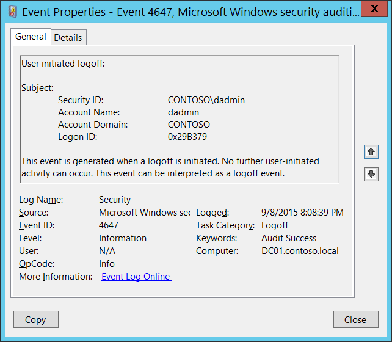

# 4647(S): User initiated logoff.




***Subcategory:***&nbsp;[Audit Logoff](audit-logoff.md)

***Event Description:***

This event is generated when a logoff is initiated. No further user-initiated activity can occur. This event can be interpreted as a logoff event.

The main difference with “[4634](event-4634.md)(S): An account was logged off.” event is that 4647 event is generated when logoff procedure was initiated by specific account using logoff function, and 4634 event shows that session was terminated and no longer exists.

4647 is more typical for **Interactive** and **RemoteInteractive** logon types when user was logged off using standard methods. You will typically see both 4647 and 4634 events when logoff procedure was initiated by user.

It may be positively correlated with a “[4624](event-4624.md): An account was successfully logged on.” event using the **Logon ID** value. Logon IDs are only unique between reboots on the same computer.

> **Note**&nbsp;&nbsp;For recommendations, see [Security Monitoring Recommendations](#security-monitoring-recommendations) for this event.

<br clear="all">

***Event XML:***
```
- <Event xmlns="http://schemas.microsoft.com/win/2004/08/events/event">
- <System>
 <Provider Name="Microsoft-Windows-Security-Auditing" Guid="{54849625-5478-4994-A5BA-3E3B0328C30D}" /> 
 <EventID>4647</EventID> 
 <Version>0</Version> 
 <Level>0</Level> 
 <Task>12545</Task> 
 <Opcode>0</Opcode> 
 <Keywords>0x8020000000000000</Keywords> 
 <TimeCreated SystemTime="2015-09-09T03:08:39.126890800Z" /> 
 <EventRecordID>230200</EventRecordID> 
 <Correlation /> 
 <Execution ProcessID="516" ThreadID="3864" /> 
 <Channel>Security</Channel> 
 <Computer>DC01.contoso.local</Computer> 
 <Security /> 
 </System>
- <EventData>
 <Data Name="TargetUserSid">S-1-5-21-3457937927-2839227994-823803824-1104</Data> 
 <Data Name="TargetUserName">dadmin</Data> 
 <Data Name="TargetDomainName">CONTOSO</Data> 
 <Data Name="TargetLogonId">0x29b379</Data> 
 </EventData>
 </Event>

```

***Required Server Roles:*** None.

***Minimum OS Version:*** Windows Server 2008, Windows Vista.

***Event Versions:*** 0.

***Field Descriptions:***

**Subject:**

-   **Security ID** \[Type = SID\]**:** SID of account that requested the “logoff” operation. Event Viewer automatically tries to resolve SIDs and show the account name. If the SID cannot be resolved, you will see the source data in the event.

> **Note**&nbsp;&nbsp;A **security identifier (SID)** is a unique value of variable length used to identify a trustee (security principal). Each account has a unique SID that is issued by an authority, such as an Active Directory domain controller, and stored in a security database. Each time a user logs on, the system retrieves the SID for that user from the database and places it in the access token for that user. The system uses the SID in the access token to identify the user in all subsequent interactions with Windows security. When a SID has been used as the unique identifier for a user or group, it cannot ever be used again to identify another user or group. For more information about SIDs, see [Security identifiers](/windows/access-protection/access-control/security-identifiers).

-   **Account Name** \[Type = UnicodeString\]**:** the name of the account that requested the “logoff” operation.

-   **Account Domain** \[Type = UnicodeString\]**:** subject’s domain or computer name. Formats vary, and include the following:

    -   Domain NETBIOS name example: CONTOSO

    -   Lowercase full domain name: contoso.local

    -   Uppercase full domain name: CONTOSO.LOCAL

    -   For some [well-known security principals](/windows/security/identity-protection/access-control/security-identifiers), such as LOCAL SERVICE or ANONYMOUS LOGON, the value of this field is “NT AUTHORITY”.

    -   For local user accounts, this field will contain the name of the computer or device that this account belongs to, for example: “Win81”.

-   **Logon ID** \[Type = HexInt64\]**:** hexadecimal value that can help you correlate this event with recent events that might contain the same Logon ID, for example, “[4624](event-4624.md): An account was successfully logged on.”

## Security Monitoring Recommendations

For 4647(S): User initiated logoff.

> **Important**&nbsp;&nbsp;For this event, also see [Appendix A: Security monitoring recommendations for many audit events](appendix-a-security-monitoring-recommendations-for-many-audit-events.md).

