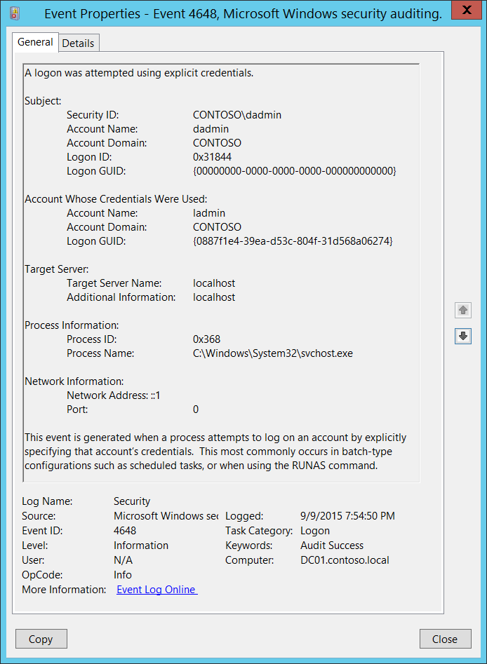

# 4648(S): A logon was attempted using explicit credentials.




***Subcategory:***&nbsp;[Audit Logon](audit-logon.md)

***Event Description:***

This event is generated when a process attempts an account logon by explicitly specifying that account’s credentials.

This most commonly occurs in batch-type configurations such as scheduled tasks, or when using the “RUNAS” command.

It is also a routine event which periodically occurs during normal operating system activity.

> **Note**&nbsp;&nbsp;For recommendations, see [Security Monitoring Recommendations](#security-monitoring-recommendations) for this event.

<br clear="all">

***Event XML:***
```
- <Event xmlns="http://schemas.microsoft.com/win/2004/08/events/event">
- <System>
 <Provider Name="Microsoft-Windows-Security-Auditing" Guid="{54849625-5478-4994-A5BA-3E3B0328C30D}" /> 
 <EventID>4648</EventID> 
 <Version>0</Version> 
 <Level>0</Level> 
 <Task>12544</Task> 
 <Opcode>0</Opcode> 
 <Keywords>0x8020000000000000</Keywords> 
 <TimeCreated SystemTime="2015-09-10T02:54:50.771459000Z" /> 
 <EventRecordID>233200</EventRecordID> 
 <Correlation /> 
 <Execution ProcessID="516" ThreadID="1116" /> 
 <Channel>Security</Channel> 
 <Computer>DC01.contoso.local</Computer> 
 <Security /> 
 </System>
- <EventData>
 <Data Name="SubjectUserSid">S-1-5-21-3457937927-2839227994-823803824-1104</Data> 
 <Data Name="SubjectUserName">dadmin</Data> 
 <Data Name="SubjectDomainName">CONTOSO</Data> 
 <Data Name="SubjectLogonId">0x31844</Data> 
 <Data Name="LogonGuid">{00000000-0000-0000-0000-000000000000}</Data> 
 <Data Name="TargetUserName">ladmin</Data> 
 <Data Name="TargetDomainName">CONTOSO</Data> 
 <Data Name="TargetLogonGuid">{0887F1E4-39EA-D53C-804F-31D568A06274}</Data> 
 <Data Name="TargetServerName">localhost</Data> 
 <Data Name="TargetInfo">localhost</Data> 
 <Data Name="ProcessId">0x368</Data> 
 <Data Name="ProcessName">C:\\Windows\\System32\\svchost.exe</Data> 
 <Data Name="IpAddress">::1</Data> 
 <Data Name="IpPort">0</Data> 
 </EventData>
 </Event>

```

***Required Server Roles:*** None.

***Minimum OS Version:*** Windows Server 2008, Windows Vista.

***Event Versions:*** 0.

***Field Descriptions:***

**Subject:**

-   **Security ID** \[Type = SID\]**:** SID of account that requested the new logon session with explicit credentials. Event Viewer automatically tries to resolve SIDs and show the account name. If the SID cannot be resolved, you will see the source data in the event.

> **Note**&nbsp;&nbsp;A **security identifier (SID)** is a unique value of variable length used to identify a trustee (security principal). Each account has a unique SID that is issued by an authority, such as an Active Directory domain controller, and stored in a security database. Each time a user logs on, the system retrieves the SID for that user from the database and places it in the access token for that user. The system uses the SID in the access token to identify the user in all subsequent interactions with Windows security. When a SID has been used as the unique identifier for a user or group, it cannot ever be used again to identify another user or group. For more information about SIDs, see [Security identifiers](/windows/access-protection/access-control/security-identifiers).

-   **Account Name** \[Type = UnicodeString\]**:** the name of the account that requested the new logon session with explicit credentials.

-   **Account Domain** \[Type = UnicodeString\]**:** subject’s domain or computer name. Formats vary, and include the following:

    -   Domain NETBIOS name example: CONTOSO

    -   Lowercase full domain name: contoso.local

    -   Uppercase full domain name: CONTOSO.LOCAL

    -   For some [well-known security principals](/windows/security/identity-protection/access-control/security-identifiers), such as LOCAL SERVICE or ANONYMOUS LOGON, the value of this field is “NT AUTHORITY”.

    -   For local user accounts, this field will contain the name of the computer or device that this account belongs to, for example: “Win81”.

-   **Logon ID** \[Type = HexInt64\]**:** hexadecimal value that can help you correlate this event with recent events that might contain the same Logon ID, for example, “[4624](event-4624.md): An account was successfully logged on.”

-   **Logon GUID** \[Type = GUID\]: a GUID that can help you correlate this event with another event that can contain the same **Logon GUID**, “[4769](event-4769.md)(S, F): A Kerberos service ticket was requested event on a domain controller.

    It also can be used for correlation between a 4648 event and several other events (on the same computer) that can contain the same **Logon GUID**, “[4624](event-4624.md)(S): An account was successfully logged on” and “[4964](event-4964.md)(S): Special groups have been assigned to a new logon.”

    This parameter might not be captured in the event, and in that case appears as “{00000000-0000-0000-0000-000000000000}”.

> **Note**&nbsp;&nbsp;**GUID** is an acronym for 'Globally Unique Identifier'. It is a 128-bit integer number used to identify resources, activities or instances.

**Account Whose Credentials Were Used:**

-   **Account Name** \[Type = UnicodeString\]**:** the name of the account whose credentials were used.

-   **Account Domain** \[Type = UnicodeString\]**:** subject’s domain or computer name. Formats vary, and include the following:

    -   Domain NETBIOS name example: CONTOSO

    -   Lowercase full domain name: contoso.local

    -   Uppercase full domain name: CONTOSO.LOCAL

    -   For some [well-known security principals](/windows/security/identity-protection/access-control/security-identifiers), such as LOCAL SERVICE or ANONYMOUS LOGON, the value of this field is “NT AUTHORITY”.

    -   For local user accounts, this field will contain the name of the computer or device that this account belongs to, for example: “Win81”.

-   **Logon GUID** \[Type = GUID\]: a GUID that can help you correlate this event with another event that can contain the same **Logon GUID**, “[4769](event-4769.md)(S, F): A Kerberos service ticket was requested event on a domain controller.

    It also can be used for correlation between a 4648 event and several other events (on the same computer) that can contain the same **Logon GUID**, “[4624](event-4624.md)(S): An account was successfully logged on” and “[4964](event-4964.md)(S): Special groups have been assigned to a new logon.”

    This parameter might not be captured in the event, and in that case appears as “{00000000-0000-0000-0000-000000000000}”.

> **Note**&nbsp;&nbsp;**GUID** is an acronym for 'Globally Unique Identifier'. It is a 128-bit integer number used to identify resources, activities or instances.

**Target Server:**

-   **Target Server Name** \[Type = UnicodeString\]**:** the name of the server on which the new process was run. Has “**localhost**” value if the process was run locally.

-   **Additional Information** \[Type = UnicodeString\]**:** there is no detailed information about this field in this document.

**Process Information:**

-   **Process ID** \[Type = Pointer\]: hexadecimal Process ID of the process which was run using explicit credentials. Process ID (PID) is a number used by the operating system to uniquely identify an active process. To see the PID for a specific process you can, for example, use Task Manager (Details tab, PID column):

    

    If you convert the hexadecimal value to decimal, you can compare it to the values in Task Manager.

    You can also correlate this process ID with a process ID in other events, for example, “[4688](event-4688.md): A new process has been created” **Process Information\\New Process ID**.

-   **Process Name** \[Type = UnicodeString\]**:** full path and the name of the executable for the process.

**Network Information:**

-   **Network Address** \[Type = UnicodeString\]**:** IP address of machine from which logon attempt was performed.

    -   IPv6 address or ::ffff:IPv4 address of a client.

    -   ::1 or 127.0.0.1 means localhost.

-   **Port** \[Type = UnicodeString\]: source port which was used for logon attempt from remote machine.

    -   0 for interactive logons.

## Security Monitoring Recommendations

For 4648(S): A logon was attempted using explicit credentials.

The following table is similar to the table in [Appendix A: Security monitoring recommendations for many audit events](appendix-a-security-monitoring-recommendations-for-many-audit-events.md), but also describes ways of monitoring that use “**Account Whose Credentials Were Used\\Security ID.**”

| **Type of monitoring required**                                                                                                                                                                                                                                                                                   | **Recommendation**                                                                                                                                                                                                                                                                                                                                                   |
|-------------------------------------------------------------------------------------------------------------------------------------------------------------------------------------------------------------------------------------------------------------------------------------------------------------------|----------------------------------------------------------------------------------------------------------------------------------------------------------------------------------------------------------------------------------------------------------------------------------------------------------------------------------------------------------------------|
| **High-value accounts**: You might have high value domain or local accounts for which you need to monitor each action.<br>Examples of high value accounts are database administrators, built-in local administrator account, domain administrators, service accounts, domain controller accounts and so on. | Monitor this event with the **“Subject\\Security ID”** or “**Account Whose Credentials Were Used\\Security ID**” that correspond to the high value account or accounts.                                                                                                                                                                                              |
| **Anomalies or malicious actions**: You might have specific requirements for detecting anomalies or monitoring potential malicious actions. For example, you might need to monitor for use of an account outside of working hours.                                                                                | When you monitor for anomalies or malicious actions, use the **“Subject\\Security ID”** and “**Account Whose Credentials Were Used\\Security ID**” (with other information) to monitor how or when a particular account is being used.                                                                                                                               |
| **Non-active accounts**: You might have non-active, disabled, or guest accounts, or other accounts that should never be used.                                                                                                                                                                                     | Monitor this event with the **“Subject\\Security ID”** or “**Account Whose Credentials Were Used\\Security ID**” that correspond to the accounts that should never be used.                                                                                                                                                                                          |
| **Account allow list**: You might have a specific allow list of accounts that are allowed to perform actions corresponding to particular events.                                                                                                                                                                    | If this event corresponds to a “allow list-only” action, review the **“Subject\\Security ID”** and “**Account Whose Credentials Were Used\\Security ID**” for accounts that are outside the allow list.                                                                                                                                                                |
| **External accounts**: You might be monitoring accounts from another domain, or “external” accounts that are not allowed to perform the action corresponding to this event.                                                                                                                                       | Monitor for the **“Subject\\Account Domain”** or “**Account Whose Credentials Were Used\\Security ID**” corresponding to accounts from another domain or “external” accounts.                                                                                                                                                                                        |
| **Restricted-use computers or devices**: You might have certain computers, machines, or devices on which certain people (accounts) should not typically perform any actions.                                                                                                                                      | Monitor the target **Computer:** (or other target device) for actions performed by the **“Subject\\Security ID”** or “**Account Whose Credentials Were Used\\Security ID**” that you are concerned about.<br>For example, you might monitor to ensure that “**Account Whose Credentials Were Used\\Security ID**” is not used to log on to a certain computer. |
| **Account naming conventions**: Your organization might have specific naming conventions for account names.                                                                                                                                                                                                       | Monitor “**Subject\\Account Name”** and “**Account Whose Credentials Were Used\\Security ID**” for names that don’t comply with naming conventions.                                                                                                                                                                                                                  |

-   If you have a pre-defined “**Process Name**” for the process reported in this event, monitor all events with “**Process Name**” not equal to your defined value.

-   You can monitor to see if “**Process Name**” is not in a standard folder (for example, not in **System32** or **Program Files**) or is in a restricted folder (for example, **Temporary Internet Files**).

<!-- -->

-   If you have a pre-defined list of restricted substrings or words in process names (for example, “**mimikatz**” or “**cain.exe**”), check for these substrings in “**Process Name**.”

-   If **Subject\\Security ID** should not know or use credentials for **Account Whose Credentials Were Used\\Account Name**, monitor this event.

-   If credentials for **Account Whose Credentials Were Used\\Account Name** should not be used from **Network Information\\Network Address**, monitor this event.

-   Check that **Network Information\\Network Address** is from internal IP address list. For example, if you know that a specific account (for example, a service account) should be used only from specific IP addresses, you can monitor for all events where **Network Information\\Network Address** is not one of the allowed IP addresses.

