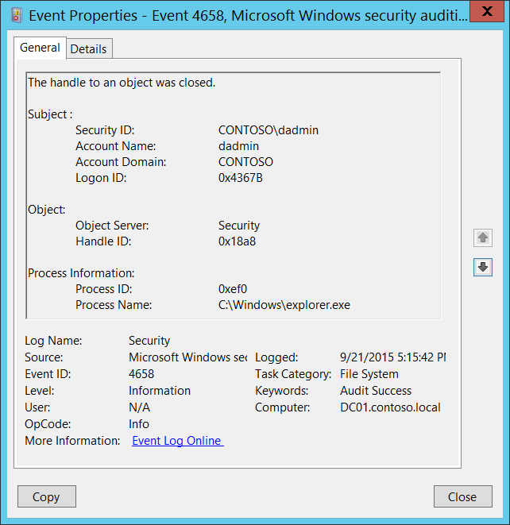

# 4658(S): The handle to an object was closed.

**Applies to**
-   Windows 10
-   Windows Server 2016




***Subcategories:***&nbsp;[Audit File System](audit-file-system.md), [Audit Handle Manipulation](audit-handle-manipulation.md), [Audit Kernel Object](audit-kernel-object.md), [Audit Registry](audit-registry.md), and [Audit Removable Storage](audit-removable-storage.md)

***Event Description:***

This event generates when the handle to an object is closed. The object could be a file system, kernel, or registry object, or a file system object on removable storage or a device.

This event generates only if Success auditing is enabled for [Audit Handle Manipulation](audit-handle-manipulation.md) subcategory.

Typically this event is needed if you need to know how long the handle to the object was open. Otherwise, it might not have any security relevance.

> **Note**&nbsp;&nbsp;For recommendations, see [Security Monitoring Recommendations](#security-monitoring-recommendations) for this event.

<br clear="all">

***Event XML:***
```
- <Event xmlns="http://schemas.microsoft.com/win/2004/08/events/event">
- <System>
 <Provider Name="Microsoft-Windows-Security-Auditing" Guid="{54849625-5478-4994-A5BA-3E3B0328C30D}" /> 
 <EventID>4658</EventID> 
 <Version>0</Version> 
 <Level>0</Level> 
 <Task>12800</Task> 
 <Opcode>0</Opcode> 
 <Keywords>0x8020000000000000</Keywords> 
 <TimeCreated SystemTime="2015-09-22T00:15:42.910428100Z" /> 
 <EventRecordID>276724</EventRecordID> 
 <Correlation /> 
 <Execution ProcessID="4" ThreadID="5056" /> 
 <Channel>Security</Channel> 
 <Computer>DC01.contoso.local</Computer> 
 <Security /> 
 </System>
- <EventData>
 <Data Name="SubjectUserSid">S-1-5-21-3457937927-2839227994-823803824-1104</Data> 
 <Data Name="SubjectUserName">dadmin</Data> 
 <Data Name="SubjectDomainName">CONTOSO</Data> 
 <Data Name="SubjectLogonId">0x4367b</Data> 
 <Data Name="ObjectServer">Security</Data> 
 <Data Name="HandleId">0x18a8</Data> 
 <Data Name="ProcessId">0xef0</Data> 
 <Data Name="ProcessName">C:\\Windows\\explorer.exe</Data> 
 </EventData>
 </Event>

```

***Required Server Roles:*** None.

***Minimum OS Version:*** Windows Server 2008, Windows Vista.

***Event Versions:*** 0.

***Field Descriptions:***

**Subject:**

-   **Security ID** \[Type = SID\]**:** SID of account that requested the “close object’s handle” operation. Event Viewer automatically tries to resolve SIDs and show the account name. If the SID cannot be resolved, you will see the source data in the event.

> **Note**&nbsp;&nbsp;A **security identifier (SID)** is a unique value of variable length used to identify a trustee (security principal). Each account has a unique SID that is issued by an authority, such as an Active Directory domain controller, and stored in a security database. Each time a user logs on, the system retrieves the SID for that user from the database and places it in the access token for that user. The system uses the SID in the access token to identify the user in all subsequent interactions with Windows security. When a SID has been used as the unique identifier for a user or group, it cannot ever be used again to identify another user or group. For more information about SIDs, see [Security identifiers](/windows/access-protection/access-control/security-identifiers).

-   **Account Name** \[Type = UnicodeString\]**:** the name of the account that requested the “close object’s handle” operation.

-   **Account Domain** \[Type = UnicodeString\]**:** subject’s domain or computer name. Formats vary, and include the following:

    -   Domain NETBIOS name example: CONTOSO

    -   Lowercase full domain name: contoso.local

    -   Uppercase full domain name: CONTOSO.LOCAL

    -   For some [well-known security principals](https://support.microsoft.com/kb/243330), such as LOCAL SERVICE or ANONYMOUS LOGON, the value of this field is “NT AUTHORITY”.

    -   For local user accounts, this field will contain the name of the computer or device that this account belongs to, for example: “Win81”.

-   **Logon ID** \[Type = HexInt64\]**:** hexadecimal value that can help you correlate this event with recent events that might contain the same Logon ID, for example, “[4624](event-4624.md): An account was successfully logged on.”

**Object**:

-   **Object Server** \[Type = UnicodeString\]: has “**Security**” value for this event.

-   **Handle ID** \[Type = Pointer\]: hexadecimal value of a handle to **Object Name**. This field can help you correlate this event with other events that might contain the same Handle ID, for example, “[4663](event-4663.md)(S): An attempt was made to access an object.” This parameter might not be captured in the event, and in that case appears as “0x0”.

**Process Information:**

-   **Process ID** \[Type = Pointer\]: hexadecimal Process ID of the process that requested that the handle be closed. Process ID (PID) is a number used by the operating system to uniquely identify an active process. To see the PID for a specific process you can, for example, use Task Manager (Details tab, PID column):

    

    If you convert the hexadecimal value to decimal, you can compare it to the values in Task Manager.

    You can also correlate this process ID with a process ID in other events, for example, “[4688](event-4688.md): A new process has been created” **Process Information\\New Process ID**.

-   **Process Name** \[Type = UnicodeString\]**:** full path and the name of the executable for the process.

## Security Monitoring Recommendations

For 4658(S): The handle to an object was closed.

> **Important**&nbsp;&nbsp;For this event, also see [Appendix A: Security monitoring recommendations for many audit events](appendix-a-security-monitoring-recommendations-for-many-audit-events.md).

-   Typically this event has little to no security relevance and is hard to parse or analyze. There is no recommendation for this event, unless you know exactly what you need to monitor with it.

-   This event can be used to track all actions or operations related to a specific object handle.

-   If you have a pre-defined “**Process Name**” for the process reported in this event, monitor all events with “**Process Name**” not equal to your defined value.

-   You can monitor to see if “**Process Name**” is not in a standard folder (for example, not in **System32** or **Program Files**) or is in a restricted folder (for example, **Temporary Internet Files**).

<!-- -->

-   If you have a pre-defined list of restricted substrings or words in process names (for example, “**mimikatz**” or “**cain.exe**”), check for these substrings in “**Process Name**.”

