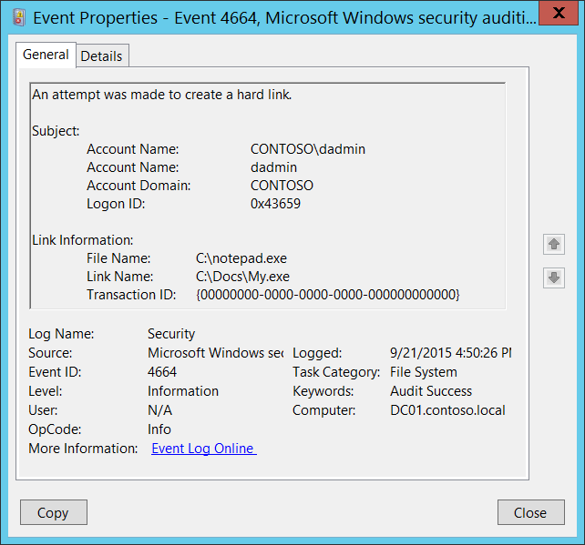

# 4664(S): An attempt was made to create a hard link.




***Subcategory:***&nbsp;[Audit File System](audit-file-system.md)

***Event Description:***

This event generates when an NTFS hard link was successfully created.

> **Note**&nbsp;&nbsp;For recommendations, see [Security Monitoring Recommendations](#security-monitoring-recommendations) for this event.

<br clear="all">

***Event XML:***
```
- <Event xmlns="http://schemas.microsoft.com/win/2004/08/events/event">
- <System>
 <Provider Name="Microsoft-Windows-Security-Auditing" Guid="{54849625-5478-4994-A5BA-3E3B0328C30D}" /> 
 <EventID>4664</EventID> 
 <Version>0</Version> 
 <Level>0</Level> 
 <Task>12800</Task> 
 <Opcode>0</Opcode> 
 <Keywords>0x8020000000000000</Keywords> 
 <TimeCreated SystemTime="2015-09-21T23:50:26.871375900Z" /> 
 <EventRecordID>276680</EventRecordID> 
 <Correlation /> 
 <Execution ProcessID="4" ThreadID="2624" /> 
 <Channel>Security</Channel> 
 <Computer>DC01.contoso.local</Computer> 
 <Security /> 
 </System>
- <EventData>
 <Data Name="SubjectUserSid">S-1-5-21-3457937927-2839227994-823803824-1104</Data> 
 <Data Name="SubjectUserName">dadmin</Data> 
 <Data Name="SubjectDomainName">CONTOSO</Data> 
 <Data Name="SubjectLogonId">0x43659</Data> 
 <Data Name="FileName">C:\\notepad.exe</Data> 
 <Data Name="LinkName">C:\\Docs\\My.exe</Data> 
 <Data Name="TransactionId">{00000000-0000-0000-0000-000000000000}</Data> 
 </EventData>
 </Event>

```

***Required Server Roles:*** None.

***Minimum OS Version:*** Windows Server 2008, Windows Vista.

***Event Versions:*** 0.

***Field Descriptions:***

**Subject:**

-   **Security ID** \[Type = SID\]**:** SID of account that made an attempt to create the hard link. Event Viewer automatically tries to resolve SIDs and show the account name. If the SID cannot be resolved, you will see the source data in the event.

> **Note**&nbsp;&nbsp;A **security identifier (SID)** is a unique value of variable length used to identify a trustee (security principal). Each account has a unique SID that is issued by an authority, such as an Active Directory domain controller, and stored in a security database. Each time a user logs on, the system retrieves the SID for that user from the database and places it in the access token for that user. The system uses the SID in the access token to identify the user in all subsequent interactions with Windows security. When a SID has been used as the unique identifier for a user or group, it cannot ever be used again to identify another user or group. For more information about SIDs, see [Security identifiers](/windows/access-protection/access-control/security-identifiers).

-   **Account Name** \[Type = UnicodeString\]**:** the name of the account that made an attempt to create the hard link.

-   **Account Domain** \[Type = UnicodeString\]**:** subject’s domain or computer name. Formats vary, and include the following:

    -   Domain NETBIOS name example: CONTOSO

    -   Lowercase full domain name: contoso.local

    -   Uppercase full domain name: CONTOSO.LOCAL

    -   For some [well-known security principals](/windows/security/identity-protection/access-control/security-identifiers), such as LOCAL SERVICE or ANONYMOUS LOGON, the value of this field is “NT AUTHORITY”.

    -   For local user accounts, this field will contain the name of the computer or device that this account belongs to, for example: “Win81”.

-   **Logon ID** \[Type = HexInt64\]**:** hexadecimal value that can help you correlate this event with recent events that might contain the same Logon ID, for example, “[4624](event-4624.md): An account was successfully logged on.”

**Link Information:**

-   **File Name** \[Type = UnicodeString\]**:** the name of a file or folder that new hard link refers to.

-   **Link Name** \[Type = UnicodeString\]**:** full path name with new hard link file name.

-   **Transaction ID** \[Type = GUID\]: unique GUID of the transaction. This field can help you correlate this event with other events that might contain the same **Transaction ID**, such as “[4660](event-4660.md)(S): An object was deleted.”

    This parameter might not be captured in the event, and in that case appears as “{00000000-0000-0000-0000-000000000000}”.

> **Note**&nbsp;&nbsp;**GUID** is an acronym for 'Globally Unique Identifier'. It is a 128-bit integer number used to identify resources, activities or instances.

## Security Monitoring Recommendations

For 4664(S): An attempt was made to create a hard link.

-   We recommend monitoring for any [4664](event-4664.md) event, because this action is not typical for normal operating system behavior and can be a sign of malicious activity.

