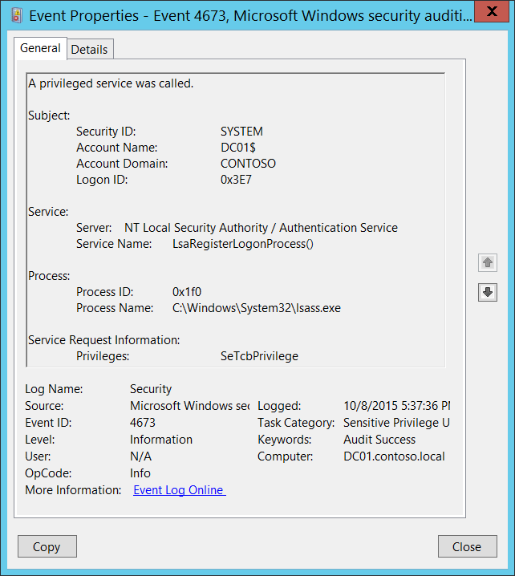

# 4673(S, F): A privileged service was called.

**Applies to**
-   Windows 10
-   Windows Server 2016




***Subcategories:***&nbsp;[Audit Sensitive Privilege Use](audit-sensitive-privilege-use.md) and [Audit Non Sensitive Privilege Use](audit-non-sensitive-privilege-use.md)

***Event Description:***

This event generates when an attempt was made to perform privileged system service operations.

This event generates, for example, when **SeSystemtimePrivilege**, **SeCreateGlobalPrivilege**, or **SeTcbPrivilege** privilege was used.

Failure event generates when service call attempt fails.

> **Note**&nbsp;&nbsp;For recommendations, see [Security Monitoring Recommendations](#security-monitoring-recommendations) for this event.

<br clear="all">

***Event XML:***
```
- <Event xmlns="http://schemas.microsoft.com/win/2004/08/events/event">
- <System>
 <Provider Name="Microsoft-Windows-Security-Auditing" Guid="{54849625-5478-4994-A5BA-3E3B0328C30D}" /> 
 <EventID>4673</EventID> 
 <Version>0</Version> 
 <Level>0</Level> 
 <Task>13056</Task> 
 <Opcode>0</Opcode> 
 <Keywords>0x8020000000000000</Keywords> 
 <TimeCreated SystemTime="2015-10-09T00:37:36.434836600Z" /> 
 <EventRecordID>1099777</EventRecordID> 
 <Correlation /> 
 <Execution ProcessID="496" ThreadID="504" /> 
 <Channel>Security</Channel> 
 <Computer>DC01.contoso.local</Computer> 
 <Security /> 
 </System>
- <EventData>
 <Data Name="SubjectUserSid">S-1-5-18</Data> 
 <Data Name="SubjectUserName">DC01$</Data> 
 <Data Name="SubjectDomainName">CONTOSO</Data> 
 <Data Name="SubjectLogonId">0x3e7</Data> 
 <Data Name="ObjectServer">NT Local Security Authority / Authentication Service</Data> 
 <Data Name="Service">LsaRegisterLogonProcess()</Data> 
 <Data Name="PrivilegeList">SeTcbPrivilege</Data> 
 <Data Name="ProcessId">0x1f0</Data> 
 <Data Name="ProcessName">C:\\Windows\\System32\\lsass.exe</Data> 
 </EventData>
 </Event>
```

***Required Server Roles:*** None.

***Minimum OS Version:*** Windows Server 2008, Windows Vista.

***Event Versions:*** 0.

***Field Descriptions:***

**Subject:**

-   **Security ID** \[Type = SID\]**:** SID of account that requested privileged operation. Event Viewer automatically tries to resolve SIDs and show the account name. If the SID cannot be resolved, you will see the source data in the event.

> **Note**&nbsp;&nbsp;A **security identifier (SID)** is a unique value of variable length used to identify a trustee (security principal). Each account has a unique SID that is issued by an authority, such as an Active Directory domain controller, and stored in a security database. Each time a user logs on, the system retrieves the SID for that user from the database and places it in the access token for that user. The system uses the SID in the access token to identify the user in all subsequent interactions with Windows security. When a SID has been used as the unique identifier for a user or group, it cannot ever be used again to identify another user or group. For more information about SIDs, see [Security identifiers](/windows/access-protection/access-control/security-identifiers).

-   **Account Name** \[Type = UnicodeString\]**:** the name of the account that requested privileged operation.

-   **Account Domain** \[Type = UnicodeString\]**:** subject’s domain or computer name. Formats vary, and include the following:

    -   Domain NETBIOS name example: CONTOSO

    -   Lowercase full domain name: contoso.local

    -   Uppercase full domain name: CONTOSO.LOCAL

    -   For some [well-known security principals](https://support.microsoft.com/kb/243330), such as LOCAL SERVICE or ANONYMOUS LOGON, the value of this field is “NT AUTHORITY”.

    -   For local user accounts, this field will contain the name of the computer or device that this account belongs to, for example: “Win81”.

-   **Logon ID** \[Type = HexInt64\]**:** hexadecimal value that can help you correlate this event with recent events that might contain the same Logon ID, for example, “[4624](event-4624.md): An account was successfully logged on.”

**Service**:

-   **Server** \[Type = UnicodeString\]: contains the name of the Windows subsystem calling the routine. Subsystems examples are:

    -   Security

    -   Security Account Manager

    -   NT Local Security Authority / Authentication Service

    -   SC Manager

    -   Win32 SystemShutdown module

    -   LSA

-   **Service Name** \[Type = UnicodeString\] \[Optional\]: supplies a name of the privileged subsystem service or function. For example, "RESET RUNTIME LOCAL SECURITY" might be specified by a **Local Security Authority** service used to update the local security policy database or **LsaRegisterLogonProcess()** might be specified by a **NT Local Security Authority / Authentication Service** used to register new logon process.

**Process:**

-   **Process ID** \[Type = Pointer\]: hexadecimal Process ID of the process that attempted to call the privileged service. Process ID (PID) is a number used by the operating system to uniquely identify an active process. To see the PID for a specific process you can, for example, use Task Manager (Details tab, PID column):

    

    If you convert the hexadecimal value to decimal, you can compare it to the values in Task Manager.

    You can also correlate this process ID with a process ID in other events, for example, “[4688](event-4688.md): A new process has been created” **Process Information\\New Process ID**.

-   **Process Name** \[Type = UnicodeString\]**:** full path and the name of the executable for the process.

**Service Request Information**:

-   **Privileges** \[Type = UnicodeString\]: the list of user privileges which were requested. The possible privileges depend on the subcategory, either **Audit Non Sensitive Privilege Use** or **Audit Sensitive Privilege Use**, as shown in the following two tables:

|     **Subcategory of event**      |                        **Privilege Name: <br>User Right Group Policy Name**                         |                                                                                                                                                                                           **Description**                                                                                                                                                                                           |
|-----------------------------------|-----------------------------------------------------------------------------------------------------|-----------------------------------------------------------------------------------------------------------------------------------------------------------------------------------------------------------------------------------------------------------------------------------------------------------------------------------------------------------------------------------------------------|
| Audit Non Sensitive Privilege Use |               <strong>SeChangeNotifyPrivilege: <br></strong>Bypass traverse checking                | Required to receive notifications of changes to files or directories. This privilege also causes the system to skip all traversal access checks. <br>With this privilege, the user can traverse directory trees even though the user may not have permissions on the traversed directory. This privilege does not allow the user to list the contents of a directory, only to traverse directories. |
| Audit Non Sensitive Privilege Use |                 <strong>SeCreateGlobalPrivilege: <br></strong>Create global objects                 |                                                                                                                                              Required to create named file mapping objects in the global namespace during Terminal Services sessions.                                                                                                                                               |
| Audit Non Sensitive Privilege Use |                  <strong>SeCreatePagefilePrivilege: <br></strong>Create a pagefile                  |                                                                                                                                                             With this privilege, the user can create and change the size of a pagefile.                                                                                                                                                             |
| Audit Non Sensitive Privilege Use |          <strong>SeCreatePermanentPrivilege: <br></strong>Create permanent shared objects           |                                                                Required to create a permanent object. <br>This privilege is useful to kernel-mode components that extend the object namespace. Components that are running in kernel mode already have this privilege inherently; it is not necessary to assign them the privilege.                                                                 |
| Audit Non Sensitive Privilege Use |              <strong>SeCreateSymbolicLinkPrivilege: <br></strong>Create symbolic links              |                                                                                                                                                                                 Required to create a symbolic link.                                                                                                                                                                                 |
| Audit Non Sensitive Privilege Use |         <strong>SeIncreaseBasePriorityPrivilege: <br></strong>Increase scheduling priority          |                            Required to increase the base priority of a process. <br>With this privilege, the user can use a process with Write property access to another process to increase the execution priority assigned to the other process. A user with this privilege can change the scheduling priority of a process through the Task Manager user interface.                             |
| Audit Non Sensitive Privilege Use |          <strong>SeIncreaseQuotaPrivilege: <br></strong>Adjust memory quotas for a process          |                                                                                                                      Required to increase the quota assigned to a process. <br>With this privilege, the user can change the maximum memory that can be consumed by a process.                                                                                                                       |
| Audit Non Sensitive Privilege Use |         <strong>SeIncreaseWorkingSetPrivilege: <br></strong>Increase a process working set          |                                                                                                                                                         Required to allocate more memory for applications that run in the context of users.                                                                                                                                                         |
| Audit Non Sensitive Privilege Use |                  <strong>SeLockMemoryPrivilege: <br></strong>Lock pages in memory                   |                         Required to lock physical pages in memory. <br>With this privilege, the user can use a process to keep data in physical memory, which prevents the system from paging the data to virtual memory on disk. Exercising this privilege could significantly affect system performance by decreasing the amount of available random access memory (RAM).                         |
| Audit Non Sensitive Privilege Use |             <strong>SeMachineAccountPrivilege: <br></strong>Add workstations to domain              |                                                                                                                                        With this privilege, the user can create a computer account. <br>This privilege is valid only on domain controllers.                                                                                                                                         |
| Audit Non Sensitive Privilege Use |           <strong>SeManageVolumePrivilege: <br></strong>Perform volume maintenance tasks            |                                                                                                                                                           Required to run maintenance tasks on a volume, such as remote defragmentation.                                                                                                                                                            |
| Audit Non Sensitive Privilege Use |            <strong>SeProfileSingleProcessPrivilege: <br></strong>Profile single process             |                                                                                                      Required to gather profiling information for a single process. <br>With this privilege, the user can use performance monitoring tools to monitor the performance of non-system processes.                                                                                                      |
| Audit Non Sensitive Privilege Use |                   <strong>SeRelabelPrivilege: <br></strong>Modify an object label                   |                                                                                                                                                                   Required to modify the mandatory integrity level of an object.                                                                                                                                                                    |
| Audit Non Sensitive Privilege Use |         <strong>SeRemoteShutdownPrivilege: <br></strong>Force shutdown from a remote system         |                                                                                                                                                                       Required to shut down a system using a network request.                                                                                                                                                                       |
| Audit Non Sensitive Privilege Use |                   <strong>SeShutdownPrivilege: <br></strong>Shut down the system                    |                                                                                                                                                                                Required to shut down a local system.                                                                                                                                                                                |
| Audit Non Sensitive Privilege Use |            <strong>SeSyncAgentPrivilege: <br></strong>Synchronize directory service data            |      This privilege enables the holder to read all objects and properties in the directory, regardless of the protection on the objects and properties. By default, it is assigned to the Administrator and LocalSystem accounts on domain controllers. <br>With this privilege, the user can synchronize all directory service data. This is also known as Active Directory synchronization.       |
| Audit Non Sensitive Privilege Use |              <strong>SeSystemProfilePrivilege: <br></strong>Profile system performance              |                                                                                                       Required to gather profiling information for the entire system. <br>With this privilege, the user can use performance monitoring tools to monitor the performance of system processes.                                                                                                        |
| Audit Non Sensitive Privilege Use |                 <strong>SeSystemtimePrivilege: <br></strong>Change the system time                  |                     Required to modify the system time. With this privilege, the user can change the time and date on the internal clock of the computer. Users that are assigned this user right can affect the appearance of event logs. <br>If the system time is changed, events that are logged will reflect this new time, not the actual time that the events occurred.                      |
| Audit Non Sensitive Privilege Use |                   <strong>SeTimeZonePrivilege: <br></strong>Change the time zone                    |                                                                                                                                                           Required to adjust the time zone associated with the computer's internal clock.                                                                                                                                                           |
| Audit Non Sensitive Privilege Use | <strong>SeTrustedCredManAccessPrivilege: <br></strong>Access Credential Manager as a trusted caller |                                                                                                                                                                     Required to access Credential Manager as a trusted caller.                                                                                                                                                                      |
| Audit Non Sensitive Privilege Use |            <strong>SeUndockPrivilege: <br></strong>Remove computer from docking station             |                                                                                                                             Required to undock a laptop. <br>With this privilege, the user can undock a portable computer from its docking station without logging on.                                                                                                                              |

|   **Subcategory of event**    |                               **Privilege Name: <br>User Right Group Policy Name**                               |                                                                                                                                                                                                                                                                                                        **Description**                                                                                                                                                                                                                                                                                                         |
|-------------------------------|------------------------------------------------------------------------------------------------------------------|--------------------------------------------------------------------------------------------------------------------------------------------------------------------------------------------------------------------------------------------------------------------------------------------------------------------------------------------------------------------------------------------------------------------------------------------------------------------------------------------------------------------------------------------------------------------------------------------------------------------------------|
| Audit Sensitive Privilege Use |                <strong>SeAssignPrimaryTokenPrivilege: <br></strong>Replace a process-level token                 |                                                                                                                                                                     Required to assign the [*primary token*](https://msdn.microsoft.com/library/windows/desktop/ms721603(v=vs.85).aspx#_security_primary_token_gly) of a process. With this privilege, the user can initiate a process to replace the default token associated with a started subprocess.                                                                                                                                                                      |
| Audit Sensitive Privilege Use |                         <strong>SeAuditPrivilege: <br></strong>Generate security audits                          |                                                                                                                                                                                                                                                                               With this privilege, the user can add entries to the security log.                                                                                                                                                                                                                                                                               |
| Audit Sensitive Privilege Use |                        <strong>SeCreateTokenPrivilege: <br></strong>Create a token object                        |                                                                                                                         Allows a process to create a token which it can then use to get access to any local resources when the process uses NtCreateToken() or other token-creation APIs. When a process requires this privilege, we recommend using the LocalSystem account (which already includes the privilege), rather than creating a separate user account and assigning this privilege to it.                                                                                                                          |
| Audit Sensitive Privilege Use |                              <strong>SeDebugPrivilege: <br></strong>Debug programs                               |                                                                                                 Required to debug and adjust the memory of a process owned by another account. With this privilege, the user can attach a debugger to any process or to the kernel. Developers who are debugging their own applications do not need this user right. Developers who are debugging new system components need this user right. This user right provides complete access to sensitive and critical operating system components.                                                                                                  |
| Audit Sensitive Privilege Use |              <strong>SeImpersonatePrivilege: <br></strong>Impersonate a client after authentication              |                                                                                                                                                                                                                                                                                 With this privilege, the user can impersonate other accounts.                                                                                                                                                                                                                                                                                  |
| Audit Sensitive Privilege Use |                    <strong>SeLoadDriverPrivilege: <br></strong>Load and unload device drivers                    |                                                                                                                                                                                                   Required to load or unload a device driver. With this privilege, the user can dynamically load and unload device drivers or other code in to kernel mode. This user right does not apply to Plug and Play device drivers.                                                                                                                                                                                                    |
| Audit Sensitive Privilege Use |                         <strong>SeLockMemoryPrivilege: <br></strong>Lock pages in memory                         |                                                                                                                                        Required to lock physical pages in memory. With this privilege, the user can use a process to keep data in physical memory, which prevents the system from paging the data to virtual memory on disk. Exercising this privilege could significantly affect system performance by decreasing the amount of available random access memory (RAM).                                                                                                                                         |
| Audit Sensitive Privilege Use |              <strong>SeSystemEnvironmentPrivilege: <br></strong>Modify firmware environment values               |                                                                                                                                                                                                                                                       Required to modify the nonvolatile RAM of systems that use this type of memory to store configuration information.                                                                                                                                                                                                                                                       |
| Audit Sensitive Privilege Use |                     <strong>SeTcbPrivilege: <br></strong>Act as part of the operating system                     |                                                                                                                                                                                          This privilege identifies its holder as part of the trusted computer base. This user right allows a process to impersonate any user without authentication. The process can therefore gain access to the same local resources as that user.                                                                                                                                                                                           |
| Audit Sensitive Privilege Use | <strong>SeEnableDelegationPrivilege: <br></strong>Enable computer and user accounts to be trusted for delegation | Required to mark user and computer accounts as trusted for delegation. With this privilege, the user can set the **Trusted for Deleg**ation setting on a user or computer object. The user or object that is granted this privilege must have write access to the account control flags on the user or computer object. A server process running on a computer (or under a user context) that is trusted for delegation can access resources on another computer using the delegated credentials of a client, as long as the account of the client does not have the **Account cannot be delegated** account control flag set. |

## Security Monitoring Recommendations

For 4673(S, F): A privileged service was called.

> **Important**&nbsp;&nbsp;For this event, also see [Appendix A: Security monitoring recommendations for many audit events](appendix-a-security-monitoring-recommendations-for-many-audit-events.md).

-   Monitor for this event where “**Subject\\Security ID**” is *not* one of these well-known security principals: LOCAL SYSTEM, NETWORK SERVICE, LOCAL SERVICE, and where “**Subject\\Security ID**” is not an administrative account that is expected to have the listed **Privileges**. Especially monitor Failure events.

-   If you need to monitor events related to specific Windows subsystems (“**Service\\Server**”), for example **NT Local Security Authority / Authentication Service** or **Security Account Manager**, monitor this event for the corresponding “**Service\\Server**.”

-   If you need to monitor events related to specific Windows security services or functions (“**Service\\Service Name**”), for example **LsaRegisterLogonProcess()**, monitor this event for the corresponding “**Service\\Service Name**.”

<!-- -->

-   If you have a pre-defined “**Process Name**” for the process reported in this event, monitor all events with “**Process Name**” not equal to your defined value.

-   You can monitor to see if “**Process Name**” is not in a standard folder (for example, not in **System32** or **Program Files**) or is in a restricted folder (for example, **Temporary Internet Files**).

<!-- -->

-   If you have a pre-defined list of restricted substrings or words in process names (for example, “**mimikatz**” or “**cain.exe**”), check for these substrings in “**Process Name**.”

-   For a specific “**Subject\\Security ID**,” if there is a defined list of allowed privileges, monitor for “**Privileges**” that it should not be able to use.

-   If you have a list of specific user rights which should never be used, or used only by a few accounts (for example, SeDebugPrivilege), trigger an alert for those “**Privileges**.”

-   If you have a list of specific user rights for which every use must be reported or monitored (for example, SeRemoteShutdownPrivilege), trigger an alert for those “**Privileges**.”

