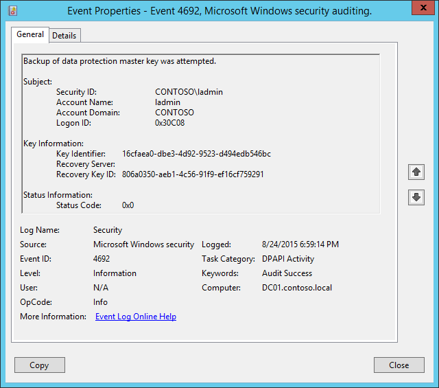

# 4692(S, F): Backup of data protection master key was attempted.

**Applies to**
-   Windows 10
-   Windows Server 2016




***Subcategory:***&nbsp;[Audit DPAPI Activity](audit-dpapi-activity.md)

***Event Description:***

This event generates every time that a backup is attempted for the [DPAPI](https://msdn.microsoft.com/library/ms995355.aspx) Master Key.

When a computer is a member of a domain, DPAPI has a backup mechanism to allow unprotection of the data. When a Master Key is generated, DPAPI communicates with a domain controller. Domain controllers have a domain-wide public/private key pair, associated solely with DPAPI. The local DPAPI client gets the domain controller public key from a domain controller by using a mutually authenticated and privacy protected RPC call. The client encrypts the Master Key with the domain controller public key. It then stores this backup Master Key along with the Master Key protected by the user's password.

Periodically, a domain-joined machine will try to send an RPC request to a domain controller to back up the user’s master key so that the user can recover secrets in case his or her password has to be reset. Although the user's keys are stored in the user profile, a domain controller must be contacted to encrypt the master key with a domain recovery key.

This event also generates every time a new DPAPI Master Key is generated, for example.

This event generates on domain controllers, member servers, and workstations.

Failure event generates when a Master Key backup operation fails for some reason.

> **Note**&nbsp;&nbsp;For recommendations, see [Security Monitoring Recommendations](#security-monitoring-recommendations) for this event.

<br clear="all">

***Event XML:***
```
- <Event xmlns="http://schemas.microsoft.com/win/2004/08/events/event">
- <System>
 <Provider Name="Microsoft-Windows-Security-Auditing" Guid="{54849625-5478-4994-A5BA-3E3B0328C30D}" /> 
 <EventID>4692</EventID> 
 <Version>0</Version> 
 <Level>0</Level> 
 <Task>13314</Task> 
 <Opcode>0</Opcode> 
 <Keywords>0x8020000000000000</Keywords> 
 <TimeCreated SystemTime="2015-08-25T01:59:14.573672700Z" /> 
 <EventRecordID>176964</EventRecordID> 
 <Correlation /> 
 <Execution ProcessID="520" ThreadID="540" /> 
 <Channel>Security</Channel> 
 <Computer>DC01.contoso.local</Computer> 
 <Security /> 
 </System>
- <EventData>
 <Data Name="SubjectUserSid">S-1-5-21-3457937927-2839227994-823803824-500</Data> 
 <Data Name="SubjectUserName">ladmin</Data> 
 <Data Name="SubjectDomainName">CONTOSO</Data> 
 <Data Name="SubjectLogonId">0x30c08</Data> 
 <Data Name="MasterKeyId">16cfaea0-dbe3-4d92-9523-d494edb546bc</Data> 
 <Data Name="RecoveryServer" /> 
 <Data Name="RecoveryKeyId">806a0350-aeb1-4c56-91f9-ef16cf759291</Data> 
 <Data Name="FailureReason">0x0</Data> 
 </EventData>
 </Event>

```

***Required Server Roles:*** None.

***Minimum OS Version:*** Windows Server 2008, Windows Vista.

***Event Versions:*** 0.

***Field Descriptions:***

**Subject:**

-   **Security ID** \[Type = SID\]**:** SID of account that requested backup operation. Event Viewer automatically tries to resolve SIDs and show the account name. If the SID cannot be resolved, you will see the source data in the event.

> **Note**&nbsp;&nbsp;A **security identifier (SID)** is a unique value of variable length used to identify a trustee (security principal). Each account has a unique SID that is issued by an authority, such as an Active Directory domain controller, and stored in a security database. Each time a user logs on, the system retrieves the SID for that user from the database and places it in the access token for that user. The system uses the SID in the access token to identify the user in all subsequent interactions with Windows security. When a SID has been used as the unique identifier for a user or group, it cannot ever be used again to identify another user or group. For more information about SIDs, see [Security identifiers](/windows/access-protection/access-control/security-identifiers).

-   **Account Name** \[Type = UnicodeString\]**:** the name of the account that requested backup operation.

-   **Account Domain** \[Type = UnicodeString\]**:** subject’s domain or computer name. Formats vary, and include the following:

    -   Domain NETBIOS name example: CONTOSO

    -   Lowercase full domain name: contoso.local

    -   Uppercase full domain name: CONTOSO.LOCAL

    -   For some [well-known security principals](https://support.microsoft.com/kb/243330), such as LOCAL SERVICE or ANONYMOUS LOGON, the value of this field is “NT AUTHORITY”.

    -   For local user accounts, this field will contain the name of the computer or device that this account belongs to, for example: “Win81”.

-   **Logon ID** \[Type = HexInt64\]**:** hexadecimal value that can help you correlate this event with recent events that might contain the same Logon ID, for example, “[4624](event-4624.md): An account was successfully logged on.”

**Key Information:**

-   **Key Identifier** \[Type = UnicodeString\]: unique identifier of a master key which backup was created. The Master Key is used, with some additional data, to generate an actual symmetric session key to encrypt\\decrypt the data using DPAPI. All of user's Master Keys are located in user profile -&gt; %APPDATA%\\Roaming\\Microsoft\\Windows\\Protect\\%SID% folder. The name of every Master Key file is it’s ID.

-   **Recovery Server** \[Type = UnicodeString\]: the name (typically – DNS name) of the computer that you contacted to back up your Master Key. For domain joined machines, it’s typically a name of a domain controller. This parameter might not be captured in the event, and in that case will be empty.

-   **Recovery Key ID** \[Type = UnicodeString\]**:** unique identifier of a recovery key. The recovery key is generated when a user chooses to create a Password Reset Disk (PRD) from the user's Control Panel or when first Master Key is generated. First, DPAPI generates a RSA public/private key pair, which is the recovery key. In this field you will see unique Recovery key ID which was used for Master key backup operation.

    For Failure events this field is typically empty.

**Status Information:**

-   **Status Code** \[Type = HexInt32\]**:** hexadecimal unique status code of performed operation. For Success events this field is typically “**0x0**”. To see the meaning of status code you need to convert it to decimal value and us “**net helpmsg STATUS\_CODE**” command to see the description for specific STATUS\_CODE. Here is an example of “net helpmsg” command output for status code 0x3A:

> \[Net helpmsg 58 illustration](..images/net-helpmsg-58.png)

## Security Monitoring Recommendations

For 4692(S, F): Backup of data protection master key was attempted.

-   This event is typically an informational event and it is difficult to detect any malicious activity using this event. It’s mainly used for DPAPI troubleshooting.

> **Important**&nbsp;&nbsp;For this event, also see [Appendix A: Security monitoring recommendations for many audit events](appendix-a-security-monitoring-recommendations-for-many-audit-events.md).

