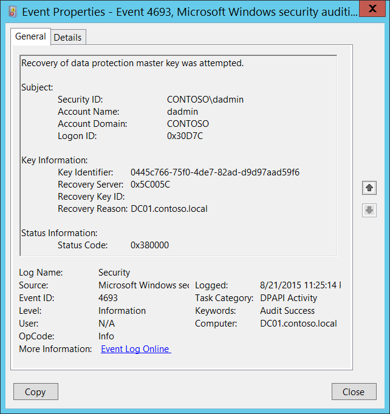

# 4693(S, F): Recovery of data protection master key was attempted.




***Subcategory:***&nbsp;[Audit DPAPI Activity](audit-dpapi-activity.md)

***Event Description:***

This event generates every time that recovery is attempted for a [DPAPI](/previous-versions/ms995355(v=msdn.10)) Master Key.

While unprotecting data, if DPAPI can't use the Master Key protected by the user's password, it sends the backup Master Key to a domain controller by using a mutually authenticated and privacy protected RPC call. The domain controller then decrypts the Master Key with its private key and sends it back to the client by using the same protected RPC call. This protected RPC call is used to ensure that no one listening on the network can get the Master Key.

This event generates on domain controllers, member servers, and workstations.

Failure event generates when a Master Key restore operation fails for some reason.

> **Note**&nbsp;&nbsp;For recommendations, see [Security Monitoring Recommendations](#security-monitoring-recommendations) for this event.

<br clear="all">

***Event XML:***
```
- <Event xmlns="http://schemas.microsoft.com/win/2004/08/events/event">
- <System>
 <Provider Name="Microsoft-Windows-Security-Auditing" Guid="{54849625-5478-4994-A5BA-3E3B0328C30D}" /> 
 <EventID>4693</EventID> 
 <Version>0</Version> 
 <Level>0</Level> 
 <Task>13314</Task> 
 <Opcode>0</Opcode> 
 <Keywords>0x8020000000000000</Keywords> 
 <TimeCreated SystemTime="2015-08-22T06:25:14.589407700Z" /> 
 <EventRecordID>175809</EventRecordID> 
 <Correlation /> 
 <Execution ProcessID="520" ThreadID="1340" /> 
 <Channel>Security</Channel> 
 <Computer>DC01.contoso.local</Computer> 
 <Security /> 
 </System>
- <EventData>
 <Data Name="SubjectUserSid">S-1-5-21-3457937927-2839227994-823803824-1104</Data> 
 <Data Name="SubjectUserName">dadmin</Data> 
 <Data Name="SubjectDomainName">CONTOSO</Data> 
 <Data Name="SubjectLogonId">0x30d7c</Data> 
 <Data Name="MasterKeyId">0445c766-75f0-4de7-82ad-d9d97aad59f6</Data> 
 <Data Name="RecoveryReason">0x5c005c</Data> 
 <Data Name="RecoveryServer">DC01.contoso.local</Data> 
 <Data Name="RecoveryKeyId" /> 
 <Data Name="FailureId">0x380000</Data> 
 </EventData>
 </Event>

```

***Required Server Roles:*** None.

***Minimum OS Version:*** Windows Server 2008, Windows Vista.

***Event Versions:*** 0.

***Field Descriptions:***

**Subject:**

-   **Security ID** \[Type = SID\]**:** SID of account that requested the “recover” operation. Event Viewer automatically tries to resolve SIDs and show the account name. If the SID can't be resolved, you'll see the source data in the event.

> **Note**&nbsp;&nbsp;A **security identifier (SID)** is a unique value of variable length used to identify a trustee (security principal). Each account has a unique SID that is issued by an authority, such as an Active Directory domain controller, and stored in a security database. Each time a user logs on, the system retrieves the SID for that user from the database and places it in the access token for that user. The system uses the SID in the access token to identify the user in all subsequent interactions with Windows security. When a SID has been used as the unique identifier for a user or group, it can't ever be used again to identify another user or group. For more information about SIDs, see [Security identifiers](/windows/access-protection/access-control/security-identifiers).

-   **Account Name** \[Type = UnicodeString\]**:** the name of the account that requested the “recover” operation.

-   **Account Domain** \[Type = UnicodeString\]**:** subject’s domain or computer name. Formats vary, and include the following:

    -   Domain NETBIOS name example: CONTOSO

    -   Lowercase full domain name: contoso.local

    -   Uppercase full domain name: CONTOSO.LOCAL

    -   For some [well-known security principals](/windows/security/identity-protection/access-control/security-identifiers), such as LOCAL SERVICE or ANONYMOUS LOGON, the value of this field is “NT AUTHORITY”.

    -   For local user accounts, this field will contain the name of the computer or device that this account belongs to, for example: “Win81”.

-   **Logon ID** \[Type = HexInt64\]**:** hexadecimal value that can help you correlate this event with recent events that might contain the same Logon ID, for example, “[4624](event-4624.md): An account was successfully logged on.”

**Key Information:**

-   **Key Identifier** \[Type = UnicodeString\]**:** unique identifier of a master key which was recovered. The Master Key is used, with some additional data, to generate an actual symmetric session key to encrypt\\decrypt the data using DPAPI. All of user's Master Keys are located in user profile -&gt; %APPDATA%\\Roaming\\Microsoft\\Windows\\Protect\\%SID% folder. The name of every Master Key file is its ID.

-   **Recovery Server** \[Type = UnicodeString\]: the name (typically – DNS name) of the computer that you contacted to recover your Master Key. For domain joined machines, it’s typically a name of a domain controller.

> **Note**&nbsp;&nbsp;In this event Recovery Server field contains information from Recovery Reason field.

-   **Recovery Key ID** \[Type = UnicodeString\]**:** unique identifier of a recovery key. The recovery key is generated when a user chooses to create a Password Reset Disk (PRD) from the user's Control Panel or when first Master Key is generated. First, DPAPI generates an RSA public/private key pair, which is the recovery key. In this field you'll see unique Recovery key ID which was used for Master key recovery operation. This parameter might not be captured in the event, and in that case will be empty.

-   **Recovery Reason** \[Type = HexInt32\]: hexadecimal code of recovery reason.

> **Note**&nbsp;&nbsp;In this event Recovery Reason field contains information from Recovery Server field.

**Status Information:**

-   **Status Code** \[Type = HexInt32\]**:** hexadecimal unique status code. For Success events this field is typically “**0x380000**”.

## Security Monitoring Recommendations

For 4693(S, F): Recovery of data protection master key was attempted.

-   This event is typically an informational event and it's difficult to detect any malicious activity using this event. It’s mainly used for DPAPI troubleshooting.

-   For domain joined computers, **Recovery Reason** should typically be a domain controller DNS name.

> **Important**&nbsp;&nbsp;For this event, also see [Appendix A: Security monitoring recommendations for many audit events](appendix-a-security-monitoring-recommendations-for-many-audit-events.md).
