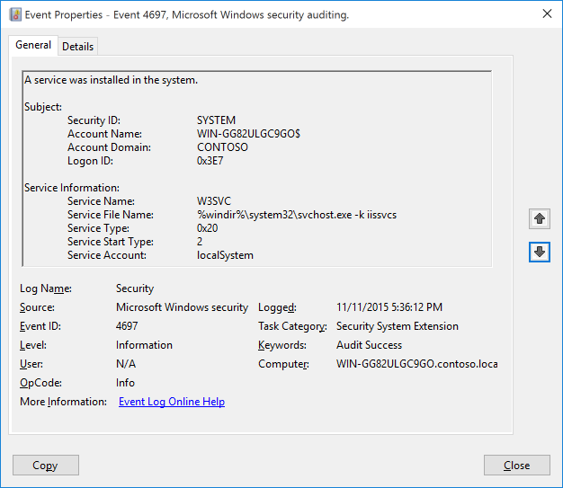

# 4697(S): A service was installed in the system.




***Subcategory:***&nbsp;[Audit Security System Extension](audit-security-system-extension.md)

***Event Description:***

This event generates when new service was installed in the system.

> **Note**&nbsp;&nbsp;For recommendations, see [Security Monitoring Recommendations](#security-monitoring-recommendations) for this event.

<br clear="all">

***Event XML:***
```
- <Event xmlns="http://schemas.microsoft.com/win/2004/08/events/event">
- <System>
 <Provider Name="Microsoft-Windows-Security-Auditing" Guid="{54849625-5478-4994-A5BA-3E3B0328C30D}" /> 
 <EventID>4697</EventID> 
 <Version>0</Version> 
 <Level>0</Level> 
 <Task>12289</Task> 
 <Opcode>0</Opcode> 
 <Keywords>0x8020000000000000</Keywords> 
 <TimeCreated SystemTime="2015-11-12T01:36:11.991070500Z" /> 
 <EventRecordID>2778</EventRecordID> 
 <Correlation ActivityID="{913FBE70-1CE6-0000-67BF-3F91E61CD101}" /> 
 <Execution ProcessID="736" ThreadID="2800" /> 
 <Channel>Security</Channel> 
 <Computer>WIN-GG82ULGC9GO.contoso.local</Computer> 
 <Security /> 
 </System>
- <EventData>
 <Data Name="SubjectUserSid">S-1-5-18</Data> 
 <Data Name="SubjectUserName">WIN-GG82ULGC9GO$</Data> 
 <Data Name="SubjectDomainName">CONTOSO</Data> 
 <Data Name="SubjectLogonId">0x3e7</Data> 
 <Data Name="ServiceName">AppHostSvc</Data> 
 <Data Name="ServiceFileName">%windir%\\system32\\svchost.exe -k apphost</Data> 
 <Data Name="ServiceType">0x20</Data> 
 <Data Name="ServiceStartType">2</Data> 
 <Data Name="ServiceAccount">localSystem</Data> 
 </EventData>
</Event>

```

***Required Server Roles:*** None.

***Minimum OS Version:*** Windows Server 2016, Windows 10.

***Event Versions:*** 0.

***Field Descriptions:***

**Subject:**

-   **Security ID** \[Type = SID\]**:** SID of account that was used to install the service. Event Viewer automatically tries to resolve SIDs and show the account name. If the SID cannot be resolved, you will see the source data in the event.

> **Note**&nbsp;&nbsp;A **security identifier (SID)** is a unique value of variable length used to identify a trustee (security principal). Each account has a unique SID that is issued by an authority, such as an Active Directory domain controller, and stored in a security database. Each time a user logs on, the system retrieves the SID for that user from the database and places it in the access token for that user. The system uses the SID in the access token to identify the user in all subsequent interactions with Windows security. When a SID has been used as the unique identifier for a user or group, it cannot ever be used again to identify another user or group. For more information about SIDs, see [Security identifiers](/windows/access-protection/access-control/security-identifiers).

-   **Account Name** \[Type = UnicodeString\]**:** the name of the account that was used to install the service.

-   **Account Domain** \[Type = UnicodeString\]**:** subject’s domain or computer name. Formats vary, and include the following:

    -   Domain NETBIOS name example: CONTOSO

    -   Lowercase full domain name: contoso.local

    -   Uppercase full domain name: CONTOSO.LOCAL

    -   For some [well-known security principals](/windows/security/identity-protection/access-control/security-identifiers), such as LOCAL SERVICE or ANONYMOUS LOGON, the value of this field is “NT AUTHORITY”.

    -   For local user accounts, this field will contain the name of the computer or device that this account belongs to, for example: “Win81”.

-   **Logon ID** \[Type = HexInt64\]**:** hexadecimal value that can help you correlate this event with recent events that might contain the same Logon ID, for example, “[4624](event-4624.md): An account was successfully logged on.”

**Service Information:**

-   **Service Name** \[Type = UnicodeString\]: the name of installed service.


-   **Service File Name** \[Type = UnicodeString\]: This is the fully rooted path to the file that the Service Control Manager will execute to start the service. If command-line parameters are specified as part of the image path, those are logged.

    Note that this is the path to the file when the service is created. If the path is changed afterwards, the change is not logged. This would have to be tracked via Process Create events.

-   **Service Type** \[Type = HexInt32\]: Indicates the [type](/dotnet/api/system.serviceprocess.servicetype?cs-lang=csharp&cs-save-lang=1#code-snippet-1) of service that was registered with the Service Control Manager. It can be one of the following:

| Value | Service Type              | Description                                                                                                                                                                                   |
|-------|---------------------------|-----------------------------------------------------------------------------------------------------------------------------------------------------------------------------------------------|
| 0x1   | ​Kernel Driver            | ​A Kernel device driver such as a hard disk or other low-level hardware device driver.                                                                                                        |
| 0x2   | ​File System Driver       | ​A file system driver, which is also a Kernel device driver.                                                                                                                                  |
| 0x8   | ​Recognizer Driver        | ​A file system driver used during startup to determine the file systems present on the system.                                                                                                |
| 0x10  | ​Win32 Own Process        | ​A Win32 program that can be started by the Service Controller and that obeys the service control protocol. This type of Win32 service runs in a process by itself (this is the most common). |
| 0x20  | ​Win32 Share Process      | ​A Win32 service that can share a process with other Win32 services.<br>(see: <https://msdn.microsoft.com/library/windows/desktop/ms685967(v=vs.85).aspx>                          |
| 0x110 | ​Interactive Own Process  | ​A service that should be run as a standalone process and can communicate with the desktop.<br>(see: <https://msdn.microsoft.com/library/windows/desktop/ms683502(v=vs.85).aspx>)  |
| 0x120 | Interactive Share Process | A service that can share address space with other services of the same type and can communicate with the desktop.                                                                             |

-   **Service Start Type** \[Type = HexInt32\]: The service start type can have one of the following values (see: <https://msdn.microsoft.com/library/windows/desktop/ms682450(v=vs.85).aspx)>:

| Value | Service Type        | Description                                                                                                                                             |
|-------|---------------------|---------------------------------------------------------------------------------------------------------------------------------------------------------|
| 0     | ​ Boot              | ​A device driver started by the system loader. This value is valid only for driver services.                                                            |
| 1     | ​ System            | ​A device driver started by the IoInitSystem() function. This value is valid only for driver services.                                                  |
| 2     | ​ Automatic         | ​A service started automatically by the service control manager during system startup.                                                                  |
| 2     | ​ Automatic Delayed | ​A service started after all auto-start services have started, plus a delay. Delayed Auto Start services are started one at a time in a serial fashion. |
| 3     | ​ Manual            | ​Manual start. A service started by the service control manager when a process calls the StartService function.                                         |
| 4     | ​ Disabled          | ​A service that cannot be started. Attempts to start the service result in the error code ERROR\_SERVICE\_DISABLED.                                     |

Most services installed are configured to **Auto Load**, so that they start automatically after Services.exe process is started.

-   **Service Account** \[Type = UnicodeString\]: The security context that the service will run as when started. Note that this is what was configured when the service was installed, if the account is changed later that is not logged.

    The service account parameter is only populated if the service type is a "Win32 Own Process" or "Win32 Share Process" (displayed as "User Mode Service."). Kernel drivers do not have a service account name logged.

    If a service (Win32 Own/Share process) is installed but no account is supplied, then LocalSystem is used.

    The token performing the logon is inspected, and if it has a SID then that SID value is populated in the event (in the System/Security node), if not, then it is blank.

## Security Monitoring Recommendations

For 4697(S): A service was installed in the system.

> **Important**&nbsp;&nbsp;For this event, also see [Appendix A: Security monitoring recommendations for many audit events](appendix-a-security-monitoring-recommendations-for-many-audit-events.md).

-   We recommend monitoring for this event, especially on high value assets or computers, because a new service installation should be planned and expected. Unexpected service installation should trigger an alert.

-   Monitor for all events where **“Service File Name”** is not located in **%windir%** or **“Program Files/Program Files (x86)”** folders. Typically new services are located in these folders.

<!-- -->

-   Report all “**Service Type**” equals “**0x1**”, “**0x2**” or “**0x8**”. These service types start first and have almost unlimited access to the operating system from the beginning of operating system startup. These types are very rarely installed.

-   Report all “**Service Start Type**” equals “**0**” or “**1**”. These service start types are used by drivers, which have unlimited access to the operating system.

-   Report all “**Service Start Type**” equals “**4**”. It is not common to install a new service in the **Disabled** state.

-   Report all “**Service Account**” not equals “**localSystem**”, “**localService**” or “**networkService**” to identify services which are running under a user account.