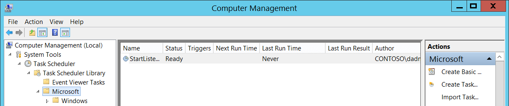

# 4702(S): A scheduled task was updated.


***Subcategory:***&nbsp;[Audit Other Object Access Events](audit-other-object-access-events.md)

***Event Description:***

This event generates every time scheduled task was updated/changed.

> **Note**&nbsp;&nbsp;For recommendations, see [Security Monitoring Recommendations](#security-monitoring-recommendations) for this event.

<br clear="all">

***Event XML:***
```
- <Event xmlns="http://schemas.microsoft.com/win/2004/08/events/event">
- <System>
 <Provider Name="Microsoft-Windows-Security-Auditing" Guid="{54849625-5478-4994-A5BA-3E3B0328C30D}" /> 
 <EventID>4702</EventID> 
 <Version>0</Version> 
 <Level>0</Level> 
 <Task>12804</Task> 
 <Opcode>0</Opcode> 
 <Keywords>0x8020000000000000</Keywords> 
 <TimeCreated SystemTime="2015-09-23T03:00:59.343820000Z" /> 
 <EventRecordID>344863</EventRecordID> 
 <Correlation /> 
 <Execution ProcessID="516" ThreadID="596" /> 
 <Channel>Security</Channel> 
 <Computer>DC01.contoso.local</Computer> 
 <Security /> 
 </System>
- <EventData>
 <Data Name="SubjectUserSid">S-1-5-21-3457937927-2839227994-823803824-1104</Data> 
 <Data Name="SubjectUserName">dadmin</Data> 
 <Data Name="SubjectDomainName">CONTOSO</Data> 
 <Data Name="SubjectLogonId">0x364eb</Data> 
 <Data Name="TaskName">\\Microsoft\\StartListener</Data> 
 <Data Name="TaskContentNew"><?xml version="1.0" encoding="UTF-16"?> <Task version="1.2" xmlns="http://schemas.microsoft.com/windows/2004/02/mit/task"> <RegistrationInfo> <Date>2015-09-22T19:03:06.9258653</Date> <Author>CONTOSO\\dadmin</Author> </RegistrationInfo> <Triggers /> <Principals> <Principal id="Author"> <RunLevel>HighestAvailable</RunLevel> <UserId>CONTOSO\\dadmin</UserId> <LogonType>InteractiveToken</LogonType> </Principal> </Principals> <Settings> <MultipleInstancesPolicy>IgnoreNew</MultipleInstancesPolicy> <DisallowStartIfOnBatteries>true</DisallowStartIfOnBatteries> <StopIfGoingOnBatteries>true</StopIfGoingOnBatteries> <AllowHardTerminate>true</AllowHardTerminate> <StartWhenAvailable>false</StartWhenAvailable> <RunOnlyIfNetworkAvailable>false</RunOnlyIfNetworkAvailable> <IdleSettings> <StopOnIdleEnd>true</StopOnIdleEnd> <RestartOnIdle>false</RestartOnIdle> </IdleSettings> <AllowStartOnDemand>true</AllowStartOnDemand> <Enabled>true</Enabled> <Hidden>false</Hidden> <RunOnlyIfIdle>false</RunOnlyIfIdle> <WakeToRun>false</WakeToRun> <ExecutionTimeLimit>P3D</ExecutionTimeLimit> <Priority>7</Priority> </Settings> <Actions Context="Author"> <Exec> <Command>C:\\Documents\\listener.exe</Command> </Exec> </Actions> </Task></Data> 
 </EventData>
 </Event>

```
>[!NOTE]
> Windows 10 Versions 1903 and above augments the event with these additional properties:
> Event Version 1.
>  ***Event XML:***
>```
>  <Data Name="ClientProcessStartKey">5066549580796854</Data> 
>  <Data Name="ClientProcessId">3932</Data> 
>  <Data Name="ParentProcessId">5304</Data> 
>  <Data Name="RpcCallClientLocality">0</Data> 
>  <Data Name="FQDN">DESKTOP-Name</Data> 


***Required Server Roles:*** None.

***Minimum OS Version:*** Windows Server 2008, Windows Vista.

***Event Versions:*** 0.

***Field Descriptions:***

**Subject:**

-   **Security ID** \[Type = SID\]**:** SID of account that requested the “change/update scheduled task” operation. Event Viewer automatically tries to resolve SIDs and show the account name. If the SID cannot be resolved, you will see the source data in the event.

> **Note**&nbsp;&nbsp;A **security identifier (SID)** is a unique value of variable length used to identify a trustee (security principal). Each account has a unique SID that is issued by an authority, such as an Active Directory domain controller, and stored in a security database. Each time a user logs on, the system retrieves the SID for that user from the database and places it in the access token for that user. The system uses the SID in the access token to identify the user in all subsequent interactions with Windows security. When a SID has been used as the unique identifier for a user or group, it cannot ever be used again to identify another user or group. For more information about SIDs, see [Security identifiers](/windows/access-protection/access-control/security-identifiers).

-   **Account Name** \[Type = UnicodeString\]**:** the name of the account that requested the “change/update scheduled task” operation.

-   **Account Domain** \[Type = UnicodeString\]**:** subject’s domain or computer name. Formats vary, and include the following:

    -   Domain NETBIOS name example: CONTOSO

    -   Lowercase full domain name: contoso.local

    -   Uppercase full domain name: CONTOSO.LOCAL

    -   For some [well-known security principals](/windows/security/identity-protection/access-control/security-identifiers), such as LOCAL SERVICE or ANONYMOUS LOGON, the value of this field is “NT AUTHORITY”.

    -   For local user accounts, this field will contain the name of the computer or device that this account belongs to, for example: “Win81”.

-   **Logon ID** \[Type = HexInt64\]**:** hexadecimal value that can help you correlate this event with recent events that might contain the same Logon ID, for example, “[4624](event-4624.md): An account was successfully logged on.”

**Task Information**:

-   **Task Name** \[Type = UnicodeString\]**:** updated/changed scheduled task name. The format of this value is “\\task\_path\\task\_name”, where task\_path is a path in Microsoft **Task Scheduler** tree starting from “**Task Scheduler Library**” node:



-   **Task New Content** \[Type = UnicodeString\]: the new [XML](/previous-versions/aa286548(v=msdn.10)) for the updated task. Here “[XML Task Definition Format](/openspecs/windows_protocols/ms-tsch/0d6383e4-de92-43e7-b0bb-a60cfa36379f)” you can read more about the XML format for scheduled tasks.

## Security Monitoring Recommendations

For 4702(S): A scheduled task was updated.

> **Important**&nbsp;&nbsp;For this event, also see [Appendix A: Security monitoring recommendations for many audit events](appendix-a-security-monitoring-recommendations-for-many-audit-events.md).

-   Monitor for updated scheduled tasks located in the **Task Scheduler Library** root node, that is, where **Task Name** looks like ‘\\TASK\_NAME’. Scheduled tasks that are created manually or by malware are often located in the **Task Scheduler Library** root node.

-   In the updated scheduled task, if the **Task Content:** XML contains **&lt;LogonType&gt;Password&lt;/LogonType&gt;** value, trigger an alert. In this case, the password for the account that will be used to run the scheduled task will be saved in Credential Manager in cleartext format, and can be extracted using Administrative privileges.