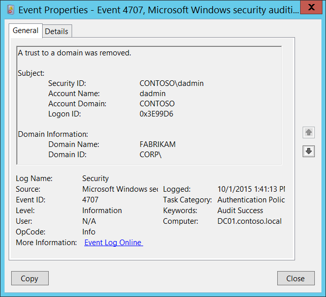

# 4707(S): A trust to a domain was removed.

**Applies to**
-   Windows 10
-   Windows Server 2016




***Subcategory:***&nbsp;[Audit Authentication Policy Change](audit-authentication-policy-change.md)

***Event Description:***

This event generates when a domain trust was removed.

This event is generated only on domain controllers.

> **Note**&nbsp;&nbsp;For recommendations, see [Security Monitoring Recommendations](#security-monitoring-recommendations) for this event.

<br clear="all">

***Event XML:***
```
- <Event xmlns="http://schemas.microsoft.com/win/2004/08/events/event">
- <System>
 <Provider Name="Microsoft-Windows-Security-Auditing" Guid="{54849625-5478-4994-A5BA-3E3B0328C30D}" /> 
 <EventID>4707</EventID> 
 <Version>0</Version> 
 <Level>0</Level> 
 <Task>13569</Task> 
 <Opcode>0</Opcode> 
 <Keywords>0x8020000000000000</Keywords> 
 <TimeCreated SystemTime="2015-10-01T20:41:13.080444700Z" /> 
 <EventRecordID>1049754</EventRecordID> 
 <Correlation /> 
 <Execution ProcessID="500" ThreadID="580" /> 
 <Channel>Security</Channel> 
 <Computer>DC01.contoso.local</Computer> 
 <Security /> 
 </System>
- <EventData>
 <Data Name="DomainName">FABRIKAM</Data> 
 <Data Name="DomainSid">S-1-5-21-2226861337-2836268956-2433141405</Data> 
 <Data Name="SubjectUserSid">S-1-5-21-3457937927-2839227994-823803824-1104</Data> 
 <Data Name="SubjectUserName">dadmin</Data> 
 <Data Name="SubjectDomainName">CONTOSO</Data> 
 <Data Name="SubjectLogonId">0x3e99d6</Data> 
 </EventData>
 </Event>

```

***Required Server Roles:*** Active Directory domain controller.

***Minimum OS Version:*** Windows Server 2008.

***Event Versions:*** 0.

***Field Descriptions:***

**Subject:**

-   **Security ID** \[Type = SID\]**:** SID of account that requested the “remove domain trust” operation. Event Viewer automatically tries to resolve SIDs and show the account name. If the SID cannot be resolved, you will see the source data in the event.

> **Note**&nbsp;&nbsp;A **security identifier (SID)** is a unique value of variable length used to identify a trustee (security principal). Each account has a unique SID that is issued by an authority, such as an Active Directory domain controller, and stored in a security database. Each time a user logs on, the system retrieves the SID for that user from the database and places it in the access token for that user. The system uses the SID in the access token to identify the user in all subsequent interactions with Windows security. When a SID has been used as the unique identifier for a user or group, it cannot ever be used again to identify another user or group. For more information about SIDs, see [Security identifiers](/windows/access-protection/access-control/security-identifiers).

-   **Account Name** \[Type = UnicodeString\]**:** the name of the account that requested the “remove domain trust” operation.

-   **Account Domain** \[Type = UnicodeString\]**:** subject’s domain or computer name. Formats vary, and include the following:

    -   Domain NETBIOS name example: CONTOSO

    -   Lowercase full domain name: contoso.local

    -   Uppercase full domain name: CONTOSO.LOCAL

    -   For some [well-known security principals](https://support.microsoft.com/kb/243330), such as LOCAL SERVICE or ANONYMOUS LOGON, the value of this field is “NT AUTHORITY”.

    -   For local user accounts, this field will contain the name of the computer or device that this account belongs to, for example: “Win81”.

-   **Logon ID** \[Type = HexInt64\]**:** hexadecimal value that can help you correlate this event with recent events that might contain the same Logon ID, for example, “[4624](event-4624.md): An account was successfully logged on.”

**Domain Information:**

-   **Domain Name** \[Type = UnicodeString\]**:** the name of removed trusted domain.

-   **Domain ID** \[Type = SID\]**:** SID of removed trusted domain. Event Viewer automatically tries to resolve SIDs and show the account name. If the SID cannot be resolved, you will see the source data in the event.

## Security Monitoring Recommendations

For 4707(S): A trust to a domain was removed.

-   Any changes related to Active Directory domain trusts (especially trust removal) must be monitored and alerts should be triggered. If this change was not planned, investigate the reason for the change.

