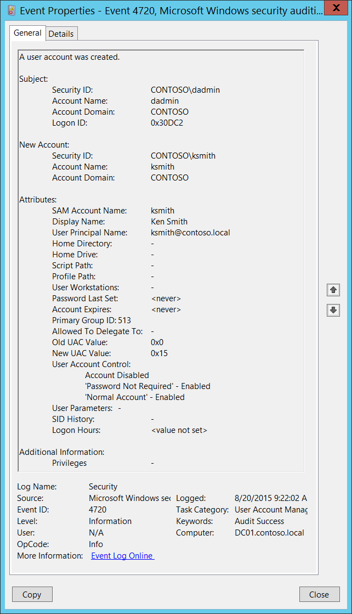

# 4720(S): A user account was created.

**Applies to**
-   Windows 10
-   Windows Server 2016




***Subcategory:***&nbsp;[Audit User Account Management](audit-user-account-management.md)

***Event Description:***

This event generates every time a new user object is created.

This event generates on domain controllers, member servers, and workstations.

> **Note**&nbsp;&nbsp;For recommendations, see [Security Monitoring Recommendations](#security-monitoring-recommendations) for this event.

<br clear="all">

***Event XML:***
```
- <Event xmlns="http://schemas.microsoft.com/win/2004/08/events/event">
- <System>
 <Provider Name="Microsoft-Windows-Security-Auditing" Guid="{54849625-5478-4994-A5BA-3E3B0328C30D}" /> 
 <EventID>4720</EventID> 
 <Version>0</Version> 
 <Level>0</Level> 
 <Task>13824</Task> 
 <Opcode>0</Opcode> 
 <Keywords>0x8020000000000000</Keywords> 
 <TimeCreated SystemTime="2015-08-20T16:22:02.759912000Z" /> 
 <EventRecordID>175408</EventRecordID> 
 <Correlation /> 
 <Execution ProcessID="520" ThreadID="1508" /> 
 <Channel>Security</Channel> 
 <Computer>DC01.contoso.local</Computer> 
 <Security /> 
 </System>
- <EventData>
 <Data Name="TargetUserName">ksmith</Data> 
 <Data Name="TargetDomainName">CONTOSO</Data> 
 <Data Name="TargetSid">S-1-5-21-3457937927-2839227994-823803824-6609</Data> 
 <Data Name="SubjectUserSid">S-1-5-21-3457937927-2839227994-823803824-1104</Data> 
 <Data Name="SubjectUserName">dadmin</Data> 
 <Data Name="SubjectDomainName">CONTOSO</Data> 
 <Data Name="SubjectLogonId">0x30dc2</Data> 
 <Data Name="PrivilegeList">-</Data> 
 <Data Name="SamAccountName">ksmith</Data> 
 <Data Name="DisplayName">Ken Smith</Data> 
 <Data Name="UserPrincipalName">ksmith@contoso.local</Data> 
 <Data Name="HomeDirectory">-</Data> 
 <Data Name="HomePath">-</Data> 
 <Data Name="ScriptPath">-</Data> 
 <Data Name="ProfilePath">-</Data> 
 <Data Name="UserWorkstations">-</Data> 
 <Data Name="PasswordLastSet">%%1794</Data> 
 <Data Name="AccountExpires">%%1794</Data> 
 <Data Name="PrimaryGroupId">513</Data> 
 <Data Name="AllowedToDelegateTo">-</Data> 
 <Data Name="OldUacValue">0x0</Data> 
 <Data Name="NewUacValue">0x15</Data> 
 <Data Name="UserAccountControl">%%2080 %%2082 %%2084</Data> 
 <Data Name="UserParameters">-</Data> 
 <Data Name="SidHistory">-</Data> 
 <Data Name="LogonHours">%%1793</Data> 
 </EventData>
 </Event>
```

***Required Server Roles:*** None.

***Minimum OS Version:*** Windows Server 2008, Windows Vista.

***Event Versions:*** 0.

***Field Descriptions:***

**Subject:**

-   **Security ID** \[Type = SID\]**:** SID of account that requested the “create user account” operation. Event Viewer automatically tries to resolve SIDs and show the account name. If the SID cannot be resolved, you will see the source data in the event.

> **Note**&nbsp;&nbsp;A **security identifier (SID)** is a unique value of variable length used to identify a trustee (security principal). Each account has a unique SID that is issued by an authority, such as an Active Directory domain controller, and stored in a security database. Each time a user logs on, the system retrieves the SID for that user from the database and places it in the access token for that user. The system uses the SID in the access token to identify the user in all subsequent interactions with Windows security. When a SID has been used as the unique identifier for a user or group, it cannot ever be used again to identify another user or group. For more information about SIDs, see [Security identifiers](/windows/access-protection/access-control/security-identifiers).

-   **Account Name** \[Type = UnicodeString\]**:** the name of the account that requested the “create user account” operation.

-   **Account Domain** \[Type = UnicodeString\]**:** subject’s domain or computer name. Formats vary, and include the following:

    -   Domain NETBIOS name example: CONTOSO

    -   Lowercase full domain name: contoso.local

    -   Uppercase full domain name: CONTOSO.LOCAL

    -   For some [well-known security principals](https://support.microsoft.com/kb/243330), such as LOCAL SERVICE or ANONYMOUS LOGON, the value of this field is “NT AUTHORITY”.

    -   For local user accounts, this field will contain the name of the computer or device that this account belongs to, for example: “Win81”.

-   **Logon ID** \[Type = HexInt64\]**:** hexadecimal value that can help you correlate this event with recent events that might contain the same Logon ID, for example, “[4624](event-4624.md): An account was successfully logged on.”

**New Account:**

-   **Security ID** \[Type = SID\]**:** SID of created user account. Event Viewer automatically tries to resolve SIDs and show the account name. If the SID cannot be resolved, you will see the source data in the event.

-   **Account Name** \[Type = UnicodeString\]**:** the name of the user account that was created. For example: dadmin.

-   **Account Domain** \[Type = UnicodeString\]**:** domain name of created user account. Formats vary, and include the following:

    -   Domain NETBIOS name example: CONTOSO

    -   Lowercase full domain name: contoso.local

    -   Uppercase full domain name: CONTOSO.LOCAL

    -   For local accounts, this field will contain the name of the computer to which this new account belongs, for example: “Win81”.

**Attributes:**

- **SAM Account Name** \[Type = UnicodeString\]: logon name for account used to support clients and servers from previous versions of Windows (pre-Windows 2000 logon name). The value of **sAMAccountName** attribute of new user object. For example: ksmith. For local account this field contains the name of new user account.

- **Display Name** \[Type = UnicodeString\]: the value of **displayName** attribute of new user object. It is a name displayed in the address book for a particular account .This is usually the combination of the user's first name, middle initial, and last name. For example, Ken Smith. You can change this attribute by using Active Directory Users and Computers, or through a script, for example. Local accounts contain **Full Name** attribute in this field, but for new local accounts this field typically has value “**&lt;value not set&gt;**”.

- **User Principal Name** \[Type = UnicodeString\]: internet-style login name for the account, based on the Internet standard RFC 822. By convention this should map to the account's email name. This parameter contains the value of **userPrincipalName** attribute of new user object. For example, ksmith@contoso.local. For local users this field is not applicable and has value “**-**“. You can change this attribute by using Active Directory Users and Computers, or through a script, for example.

- **Home Directory** \[Type = UnicodeString\]: user's home directory. If **homeDrive** attribute is set and specifies a drive letter, **homeDirectory** should be a UNC path. The path must be a network UNC of the form \\\\Server\\Share\\Directory. This parameter contains the value of **homeDirectory** attribute of new user object. For new local accounts this field typically has value “**&lt;value not set&gt;**”. You can change this attribute by using Active Directory Users and Computers, or through a script, for example. This parameter might not be captured in the event, and in that case appears as “-”.

- **Home Drive** \[Type = UnicodeString\]**:** specifies the drive letter to which to map the UNC path specified by **homeDirectory** account’s attribute. The drive letter must be specified in the form “DRIVE\_LETTER:”. For example – “H:”. This parameter contains the value of **homeDrive** attribute of new user object. You can change this attribute by using Active Directory Users and Computers, or through a script, for example. This parameter might not be captured in the event, and in that case appears as “-”. For new local accounts this field typically has value “**&lt;value not set&gt;**”.

- **Script Path** \[Type = UnicodeString\]**:** specifies the path of the account’s logon script. This parameter contains the value of **scriptPath** attribute of new user object. You can change this attribute by using Active Directory Users and Computers, or through a script, for example. This parameter might not be captured in the event, and in that case appears as “-”. For new local accounts this field typically has value “**&lt;value not set&gt;**”.

- **Profile Path** \[Type = UnicodeString\]: specifies a path to the account's profile. This value can be a null string, a local absolute path, or a UNC path. This parameter contains the value of **profilePath** attribute of new user object. You can change this attribute by using Active Directory Users and Computers, or through a script, for example. This parameter might not be captured in the event, and in that case appears as “-”. For new local accounts this field typically has value “**&lt;value not set&gt;**”.

- **User Workstations** \[Type = UnicodeString\]: contains the list of NetBIOS or DNS names of the computers from which the user can logon. Each computer name is separated by a comma. The name of a computer is the **sAMAccountName** property of a user object. This parameter contains the value of **userWorkstations** attribute of new user object. You can change this attribute by using Active Directory Users and Computers, or through a script, for example. This parameter might not be captured in the event, and in that case appears as “-”. For local users this field is not applicable and typically has value “**&lt;value not set&gt;**”.

- **Password Last Set** \[Type = UnicodeString\]**:** last time the account’s password was modified. For manually created user account, using Active Directory Users and Computers snap-in, this field typically has value “**&lt;never&gt;”**. This parameter contains the value of **pwdLastSet** attribute of new user object.

- **Account Expires** \[Type = UnicodeString\]: the date when the account expires. This parameter contains the value of **accountExpires** attribute of new user object. You can change this attribute by using Active Directory Users and Computers, or through a script, for example. This parameter might not be captured in the event, and in that case appears as “-”. For manually created local and domain user accounts this field typically has value “**&lt;never&gt;**”.

- **Primary Group ID** \[Type = UnicodeString\]: Relative Identifier (RID) of user’s object primary group.

> **Note**&nbsp;&nbsp;**Relative identifier (RID)** is a variable length number that is assigned to objects at creation and becomes part of the object's Security Identifier (SID) that uniquely identifies an account or group within a domain.

Typically, **Primary Group** field for new user accounts has the following values:

-   513 (Domain Users. For local accounts this RID means Users) – for domain and local users.

    See this article <https://support.microsoft.com/kb/243330> for more information. This parameter contains the value of **primaryGroupID** attribute of new user object.

<!-- -->

-   **Allowed To Delegate To** \[Type = UnicodeString\]: the list of SPNs to which this account can present delegated credentials. Can be changed using Active Directory Users and Computers management console in **Delegation** tab of user account, if this account has at least one SPN registered. This parameter contains the value of **AllowedToDelegateTo** attribute of new user object. For local user accounts this field is not applicable and typically has value “**-**“. For new domain user accounts it is typically has value “**-**“. See description of **AllowedToDelegateTo** field for “[4738](event-4738.md)(S): A user account was changed.” event for more details.

> **Note**&nbsp;&nbsp;**Service Principal Name (SPN)** is the name by which a client uniquely identifies an instance of a service. If you install multiple instances of a service on computers throughout a forest, each instance must have its own SPN. A given service instance can have multiple SPNs if there are multiple names that clients might use for authentication. For example, an SPN always includes the name of the host computer on which the service instance is running, so a service instance might register an SPN for each name or alias of its host.

-   **Old UAC Value** \[Type = UnicodeString\]: specifies flags that control password, lockout, disable/enable, script, and other behavior for the user account. **Old UAC value** always **“0x0”** for new user accounts. This parameter contains the previous value of **userAccountControl** attribute of user object.

-   **New UAC Value** \[Type = UnicodeString\]: specifies flags that control password, lockout, disable/enable, script, and other behavior for the user account. This parameter contains the value of **userAccountControl** attribute of new user object.

To decode this value, you can go through the property value definitions in the “Table 7. User’s or Computer’s account UAC flags.” from largest to smallest. Compare each property value to the flags value in the event. If the flags value in the event is greater than or equal to the property value, then the property is "set" and applies to that event. Subtract the property value from the flags value in the event and note that the flag applies and then go on to the next flag.

Here's an example: Flags value from event: 0x15

Decoding:

• PASSWD\_NOTREQD 0x0020

• LOCKOUT 0x0010

• HOMEDIR\_REQUIRED 0x0008

• (undeclared) 0x0004

• ACCOUNTDISABLE 0x0002

• SCRIPT 0x0001

0x0020 &gt; 0x15, so PASSWD\_NOTREQD does not apply to this event

0x10 &lt; 0x15, so LOCKOUT applies to this event. 0x15 - 0x10 = 0x5

0x4 &lt; 0x5, so the undeclared value is set. We'll pretend it doesn't mean anything. 0x5 - 0x4 = 0x1

0x2 &gt; 0x1, so ACCOUNTDISABLE does not apply to this event

0x1 = 0x1, so SCRIPT applies to this event. 0x1 - 0x1 = 0x0, we're done.

So this UAC flags value decodes to: LOCKOUT and SCRIPT

-   **User Account Control** \[Type = UnicodeString\]**:** shows the list of changes in **userAccountControl** attribute. You will see a line of text for each change. For new user accounts, when the object for this account was created, the **userAccountControl** value was considered to be **“0x0”**, and then it was changed from **“0x0”** to the real value for the account's **userAccountControl** attribute. See possible values in the table below. In the “User Account Control field text” column, you can see the text that will be displayed in the **User Account Control** field in 4720 event.

| Flag Name                          | userAccountControl in hexadecimal | userAccountControl in decimal | Description                                                                                                                                                                                                                                                                                                                                                                                                                                                                                            | User Account Control field text                                                                                 |
|------------------------------------|-----------------------------------|-------------------------------|--------------------------------------------------------------------------------------------------------------------------------------------------------------------------------------------------------------------------------------------------------------------------------------------------------------------------------------------------------------------------------------------------------------------------------------------------------------------------------------------------------|-----------------------------------------------------------------------------------------------------------------|
| SCRIPT                             | 0x0001                            | 1                             | The logon script will be run.                                                                                                                                                                                                                                                                                                                                                                                                                                                                          | Changes of this flag do not show in 4720 events.                                                                |
| ACCOUNTDISABLE                     | 0x0002                            | 2                             | The user account is disabled.                                                                                                                                                                                                                                                                                                                                                                                                                                                                          | Account Disabled<br>Account Enabled                                                                       |
| Undeclared                         | 0x0004                            | 4                             | This flag is undeclared.                                                                                                                                                                                                                                                                                                                                                                                                                                                                               | Changes of this flag do not show in 4720 events.                                                                |
| HOMEDIR\_REQUIRED                  | 0x0008                            | 8                             | The home folder is required.                                                                                                                                                                                                                                                                                                                                                                                                                                                                           | 'Home Directory Required' - Enabled<br>'Home Directory Required' - Disabled                               |
| LOCKOUT                            | 0x0010                            | 16                            |                                                                                                                                                                                                                                                                                                                                                                                                                                                                                                        | Changes of this flag do not show in 4720 events.                                                                |
| PASSWD\_NOTREQD                    | 0x0020                            | 32                            | No password is required.                                                                                                                                                                                                                                                                                                                                                                                                                                                                               | 'Password Not Required' - Enabled<br>'Password Not Required' - Disabled                                   |
| PASSWD\_CANT\_CHANGE               | 0x0040                            | 64                            | The user cannot change the password. This is a permission on the user's object.                                                                                                                                                                                                                                                                                                                                                                                                                        | Changes of this flag do not show in 4720 events.                                                                |
| ENCRYPTED\_TEXT\_PWD\_ALLOWED      | 0x0080                            | 128                           | The user can send an encrypted password.<br>Can be set using “Store password using reversible encryption” checkbox.                                                                                                                                                                                                                                                                                                                                                                              | 'Encrypted Text Password Allowed' - Disabled<br>'Encrypted Text Password Allowed' - Enabled               |
| TEMP\_DUPLICATE\_ACCOUNT           | 0x0100                            | 256                           | This is an account for users whose primary account is in another domain. This account provides user access to this domain, but not to any domain that trusts this domain. This is sometimes referred to as a local user account.                                                                                                                                                                                                                                                                       | Cannot be set for computer account.                                                                             |
| NORMAL\_ACCOUNT                    | 0x0200                            | 512                           | This is a default account type that represents a typical user.                                                                                                                                                                                                                                                                                                                                                                                                                                         | 'Normal Account' - Disabled<br>'Normal Account' - Enabled                                                 |
| INTERDOMAIN\_TRUST\_ACCOUNT        | 0x0800                            | 2048                          | This is a permit to trust an account for a system domain that trusts other domains.                                                                                                                                                                                                                                                                                                                                                                                                                    | Cannot be set for computer account.                                                                             |
| WORKSTATION\_TRUST\_ACCOUNT        | 0x1000                            | 4096                          | This is a computer account for a computer that is running Microsoft Windows NT 4.0 Workstation, Microsoft Windows NT 4.0 Server, Microsoft Windows 2000 Professional, or Windows 2000 Server and is a member of this domain.                                                                                                                                                                                                                                                                           | 'Workstation Trust Account' - Disabled<br>'Workstation Trust Account' - Enabled                           |
| SERVER\_TRUST\_ACCOUNT             | 0x2000                            | 8192                          | This is a computer account for a domain controller that is a member of this domain.                                                                                                                                                                                                                                                                                                                                                                                                                    | 'Server Trust Account' - Enabled<br>'Server Trust Account' - Disabled                                     |
| DONT\_EXPIRE\_PASSWORD             | 0x10000                           | 65536                         | Represents the password, which should never expire on the account.<br>Can be set using “Password never expires” checkbox.                                                                                                                                                                                                                                                                                                                                                                        | 'Don't Expire Password' - Disabled<br>'Don't Expire Password' - Enabled                                   |
| MNS\_LOGON\_ACCOUNT                | 0x20000                           | 131072                        | This is an MNS logon account.                                                                                                                                                                                                                                                                                                                                                                                                                                                                          | 'MNS Logon Account' - Disabled<br>'MNS Logon Account' - Enabled                                           |
| SMARTCARD\_REQUIRED                | 0x40000                           | 262144                        | When this flag is set, it forces the user to log on by using a smart card.                                                                                                                                                                                                                                                                                                                                                                                                                             | 'Smartcard Required' - Disabled<br>'Smartcard Required' - Enabled                                         |
| TRUSTED\_FOR\_DELEGATION           | 0x80000                           | 524288                        | When this flag is set, the service account (the user or computer account) under which a service runs is trusted for Kerberos delegation. Any such service can impersonate a client requesting the service. To enable a service for Kerberos delegation, you must set this flag on the userAccountControl property of the service account.<br>If you enable Kerberos constraint or unconstraint delegation or disable these types of delegation in Delegation tab you will get this flag changed. | 'Trusted For Delegation' - Enabled<br>'Trusted For Delegation' - Disabled                                 |
| NOT\_DELEGATED                     | 0x100000                          | 1048576                       | When this flag is set, the security context of the user is not delegated to a service even if the service account is set as trusted for Kerberos delegation.<br>Can be set using “Account is sensitive and cannot be delegated” checkbox.                                                                                                                                                                                                                                                        | 'Not Delegated' - Disabled<br>'Not Delegated' - Enabled                                                   |
| USE\_DES\_KEY\_ONLY                | 0x200000                          | 2097152                       | Restrict this principal to use only Data Encryption Standard (DES) encryption types for keys.<br>Can be set using “Use Kerberos DES encryption types for this account” checkbox.                                                                                                                                                                                                                                                                                                                 | 'Use DES Key Only' - Disabled<br>'Use DES Key Only' - Enabled                                             |
| DONT\_REQ\_PREAUTH                 | 0x400000                          | 4194304                       | This account does not require Kerberos pre-authentication for logging on.<br>Can be set using “Do not require Kerberos preauthentication” checkbox.                                                                                                                                                                                                                                                                                                                                              | 'Don't Require Preauth' - Disabled<br>'Don't Require Preauth' - Enabled                                   |
| PASSWORD\_EXPIRED                  | 0x800000                          | 8388608                       | The user's password has expired.                                                                                                                                                                                                                                                                                                                                                                                                                                                                       | Changes of this flag do not show in 4720 events.                                                                |
| TRUSTED\_TO\_AUTH\_FOR\_DELEGATION | 0x1000000                         | 16777216                      | The account is enabled for delegation. This is a security-sensitive setting. Accounts that have this option enabled should be tightly controlled. This setting lets a service that runs under the account assume a client's identity and authenticate as that user to other remote servers on the network.<br>If you enable Kerberos protocol transition delegation or disable this type of delegation in Delegation tab you will get this flag changed.                                         | 'Trusted To Authenticate For Delegation' - Disabled<br>'Trusted To Authenticate For Delegation' - Enabled |
| PARTIAL\_SECRETS\_ACCOUNT          | 0x04000000                        | 67108864                      | The account is a read-only domain controller (RODC). This is a security-sensitive setting. Removing this setting from an RODC compromises security on that server.                                                                                                                                                                                                                                                                                                                                     | No information.                                                                                                 |

For new, manually created, domain or local user accounts typical flags are:

-   Account Disabled

-   'Password Not Required' - Enabled

-   'Normal Account' – Enabled

    After new user creation event you will typically see couple of “[4738](event-4738.md): A user account was changed.” events with new flags:

-   'Password Not Required' – Disabled

-   Account Enabled

<!-- -->

-   **User Parameters** \[Type = UnicodeString\]: if you change any setting using Active Directory Users and Computers management console in Dial-in tab of user’s account properties, then you will see **&lt;value changed, but not displayed&gt;** in this field in “[4738](event-4738.md): A user account was changed.” This parameter might not be captured in the event, and in that case appears as “-”. For new local accounts this field typically has value “**&lt;value not set&gt;**”.

-   **SID History** \[Type = UnicodeString\]: contains previous SIDs used for the object if the object was moved from another domain. Whenever an object is moved from one domain to another, a new SID is created and becomes the objectSID. The previous SID is added to the **sIDHistory** property. This parameter contains the value of **sIDHistory** attribute of new user object. This parameter might not be captured in the event, and in that case appears as “-”.

-   **Logon Hours** \[Type = UnicodeString\]: hours that the account is allowed to logon to the domain. The value of **logonHours** attribute of new user object. You can change this attribute by using Active Directory Users and Computers, or through a script, for example. You will typically see “**&lt;value not set&gt;**” value for new manually created user accounts in event 4720. For new local accounts this field is not applicable and typically has value “**All**”.

**Additional Information:**

-   **Privileges** \[Type = UnicodeString\]: the list of user privileges which were used during the operation, for example, SeBackupPrivilege. This parameter might not be captured in the event, and in that case appears as “-”. See full list of user privileges in “Table 8. User Privileges.”.

## Security Monitoring Recommendations

For 4720(S): A user account was created.

> **Important**&nbsp;&nbsp;For this event, also see [Appendix A: Security monitoring recommendations for many audit events](appendix-a-security-monitoring-recommendations-for-many-audit-events.md).

-   Some organizations monitor every [4720](event-4720.md) event.

-   Consider whether to track the following fields and values:

| **Field and value to track**                                                                                                                                              | **Reason to track**                                                                                                                                                                                         |
|---------------------------------------------------------------------------------------------------------------------------------------------------------------------------|-------------------------------------------------------------------------------------------------------------------------------------------------------------------------------------------------------------|
| **SAM Account Name** is empty or -                                                                                                                                        | This field must contain the user account name. If it is empty or **-**, it might indicate an anomaly.                                                                                                       |
| **User Principal Name** is empty or -                                                                                                                                     | Typically this field should not be empty for new user accounts. If it is empty or **-**, it might indicate an anomaly.                                                                                      |
| **Home Directory** is not -<br>**Home Drive** is not -<br>**Script Path** is not -<br>**Profile Path** is not -<br>**User Workstations** is not - | Typically these fields are **-** for new user accounts. Other values might indicate an anomaly and should be monitored. <br>For local accounts these fields should display **&lt;value not set&gt;**. |
| **Password Last Set** is **&lt;never&gt;**                                                                                                                                | This typically means this is a manually created user account, which you might need to monitor.                                                                                                              |
| **Password Last Set** is a time in the future                                                                                                                             | This might indicate an anomaly.                                                                                                                                                                             |
| **Account Expires** is not **&lt;never&gt;**                                                                                                                              | Typically this field is **&lt;never&gt;** for new user accounts. Other values might indicate an anomaly and should be monitored.                                                                            |
| **Primary Group ID** is not 513                                                                                                                                           | Typically, the **Primary Group** value is 513 for domain and local users. Other values should be monitored.                                                                                                 |
| **Allowed To Delegate To** is not -                                                                                                                                       | Typically this field is **-** for new user accounts. Other values might indicate an anomaly and should be monitored.                                                                                        |
| **Old UAC Value** is not 0x0                                                                                                                                              | Typically this field is **0x0** for new user accounts. Other values might indicate an anomaly and should be monitored.                                                                                      |
| **SID History** is not -                                                                                                                                                  | This field will always be set to - unless the account was migrated from another domain.                                                                                                                     |
| **Logon Hours** value other than **&lt;value not set&gt;** or** “All”**                                                                                                   | This should always be **&lt;value not set&gt;** for new domain user accounts, and **“All”** for new local user accounts.                                                                                    |

-   Consider whether to track the following user account control flags:

| **User account control flag to track**                                                                                                                                                                                                                                                      | **Information about the flag**                                                                                                                                                                                                               |
|---------------------------------------------------------------------------------------------------------------------------------------------------------------------------------------------------------------------------------------------------------------------------------------------|----------------------------------------------------------------------------------------------------------------------------------------------------------------------------------------------------------------------------------------------|
| **'Normal Account'** – Disabled                                                                                                                                                                                                                                                             | Should not be disabled for user accounts.                                                                                                                                                                                                    |
| **'Encrypted Text Password Allowed'** – Enabled<br>**'Smartcard Required'** – Enabled<br>**'Not Delegated'** – Enabled<br>**'Use DES Key Only'** – Enabled<br>**'Don't Require Preauth'** – Enabled<br>**'Trusted To Authenticate For Delegation'** – Enabled | By default, these flags should not be enabled for new user accounts created with the “Active Directory Users and Computers” snap-in.                                                                                                         |
| **'Server Trust Account'** – Enabled                                                                                                                                                                                                                                                        | Should never be enabled for user accounts. Applies only to domain controller (computer) accounts.                                                                                                                                            |
| **'Don't Expire Password'** – Enabled                                                                                                                                                                                                                                                       | Should be monitored for critical accounts, or all accounts if your organization does not allow this flag. By default, this flag should not be enabled for new user accounts created with the “Active Directory Users and Computers” snap-in. |
| **'Trusted For Delegation'** – Enabled                                                                                                                                                                                                                                                      | By default, this flag should not be enabled for new user accounts created with the “Active Directory Users and Computers” snap-in. It is enabled by default only for new domain controllers.                                                 |

