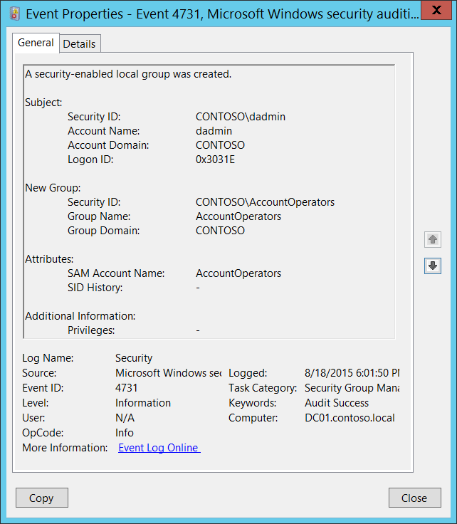

# 4731(S): A security-enabled local group was created.

**Applies to**
-   Windows 10
-   Windows Server 2016




***Subcategory:***&nbsp;[Audit Security Group Management](audit-security-group-management.md)

***Event Description:***

This event generates every time a new security-enabled (security) local group was created.

This event generates on domain controllers, member servers, and workstations.

> **Note**&nbsp;&nbsp;For recommendations, see [Security Monitoring Recommendations](#security-monitoring-recommendations) for this event.

<br clear="all">

***Event XML:***
```
- <Event xmlns="http://schemas.microsoft.com/win/2004/08/events/event">
- <System>
 <Provider Name="Microsoft-Windows-Security-Auditing" Guid="{54849625-5478-4994-A5BA-3E3B0328C30D}" /> 
 <EventID>4731</EventID> 
 <Version>0</Version> 
 <Level>0</Level> 
 <Task>13826</Task> 
 <Opcode>0</Opcode> 
 <Keywords>0x8020000000000000</Keywords> 
 <TimeCreated SystemTime="2015-08-19T01:01:50.646049700Z" /> 
 <EventRecordID>174849</EventRecordID> 
 <Correlation /> 
 <Execution ProcessID="512" ThreadID="1092" /> 
 <Channel>Security</Channel> 
 <Computer>DC01.contoso.local</Computer> 
 <Security /> 
 </System>
- <EventData>
 <Data Name="TargetUserName">AccountOperators</Data> 
 <Data Name="TargetDomainName">CONTOSO</Data> 
 <Data Name="TargetSid">S-1-5-21-3457937927-2839227994-823803824-6605</Data> 
 <Data Name="SubjectUserSid">S-1-5-21-3457937927-2839227994-823803824-1104</Data> 
 <Data Name="SubjectUserName">dadmin</Data> 
 <Data Name="SubjectDomainName">CONTOSO</Data> 
 <Data Name="SubjectLogonId">0x3031e</Data> 
 <Data Name="PrivilegeList">-</Data> 
 <Data Name="SamAccountName">AccountOperators</Data> 
 <Data Name="SidHistory">-</Data> 
 </EventData>
 </Event>

```

***Required Server Roles:*** None.

***Minimum OS Version:*** Windows Server 2008, Windows Vista.

***Event Versions:*** 0.

***Field Descriptions:***

**Subject:**

-   **Security ID** \[Type = SID\]**:** SID of account that requested the “create group” operation. Event Viewer automatically tries to resolve SIDs and show the account name. If the SID cannot be resolved, you will see the source data in the event.

> **Note**&nbsp;&nbsp;A **security identifier (SID)** is a unique value of variable length used to identify a trustee (security principal). Each account has a unique SID that is issued by an authority, such as an Active Directory domain controller, and stored in a security database. Each time a user logs on, the system retrieves the SID for that user from the database and places it in the access token for that user. The system uses the SID in the access token to identify the user in all subsequent interactions with Windows security. When a SID has been used as the unique identifier for a user or group, it cannot ever be used again to identify another user or group. For more information about SIDs, see [Security identifiers](/windows/access-protection/access-control/security-identifiers).

-   **Account Name** \[Type = UnicodeString\]**:** the name of the account that requested the “create group” operation.

-   **Account Domain** \[Type = UnicodeString\]**:** subject’s domain or computer name. Formats vary, and include the following:

    -   Domain NETBIOS name example: CONTOSO

    -   Lowercase full domain name: contoso.local

    -   Uppercase full domain name: CONTOSO.LOCAL

    -   For some [well-known security principals](https://support.microsoft.com/kb/243330), such as LOCAL SERVICE or ANONYMOUS LOGON, the value of this field is “NT AUTHORITY”.

    -   For local user accounts, this field will contain the name of the computer or device that this account belongs to, for example: “Win81”.

-   **Logon ID** \[Type = HexInt64\]**:** hexadecimal value that can help you correlate this event with recent events that might contain the same Logon ID, for example, “[4624](event-4624.md): An account was successfully logged on.”

**New Group:**

-   **Security ID** \[Type = SID\]**:** SID of created group. Event Viewer automatically tries to resolve SIDs and show the group name. If the SID cannot be resolved, you will see the source data in the event.

-   **Group Name** \[Type = UnicodeString\]**:** the name of the group that was created. For example: ServiceDesk

-   **Group Domain** \[Type = UnicodeString\]: domain or computer name of the created group. Formats vary, and include the following:

    -   Domain NETBIOS name example: CONTOSO

    -   Lowercase full domain name: contoso.local

    -   Uppercase full domain name: CONTOSO.LOCAL

    -   For a local group, this field will contain the name of the computer to which this new group belongs, for example: “Win81”.

**Attributes:**

-   **SAM Account Name** \[Type = UnicodeString\]: This is a name of new group used to support clients and servers from previous versions of Windows (pre-Windows 2000 logon name). The value of **sAMAccountName** attribute of new group object. For example: ServiceDesk. For local groups it is simply a name of new group.

-   **SID History** \[Type = UnicodeString\]: contains previous SIDs used for the object if the object was moved from another domain. Whenever an object is moved from one domain to another, a new SID is created and becomes the objectSID. The previous SID is added to the **sIDHistory** property. This parameter contains the value of **sIDHistory** attribute of new group object. This parameter might not be captured in the event, and in that case appears as “-”. For local groups it is not applicable and always has “**-**“ value.

**Additional Information:**

-   **Privileges** \[Type = UnicodeString\]: the list of user privileges which were used during the operation, for example, SeBackupPrivilege. This parameter might not be captured in the event, and in that case appears as “-”. See full list of user privileges in “Table 8. User Privileges.”.

## Security Monitoring Recommendations

For 4731(S): A security-enabled local group was created.

> **Important**&nbsp;&nbsp;For this event, also see [Appendix A: Security monitoring recommendations for many audit events](appendix-a-security-monitoring-recommendations-for-many-audit-events.md).

-   If you need to monitor each time a new security group is created, to see who created the group and when, monitor this event.

-   If you need to monitor the creation of local security groups on different servers, and you use Windows Event Forwarding to collect events in a central location, check “**New Group\\Group Domain.**” It should not be the name of the domain, but instead should be the computer name.

-   If your organization has naming conventions for account names, monitor “**Attributes\\SAM Account Name”** for names that don’t comply with the naming conventions.

