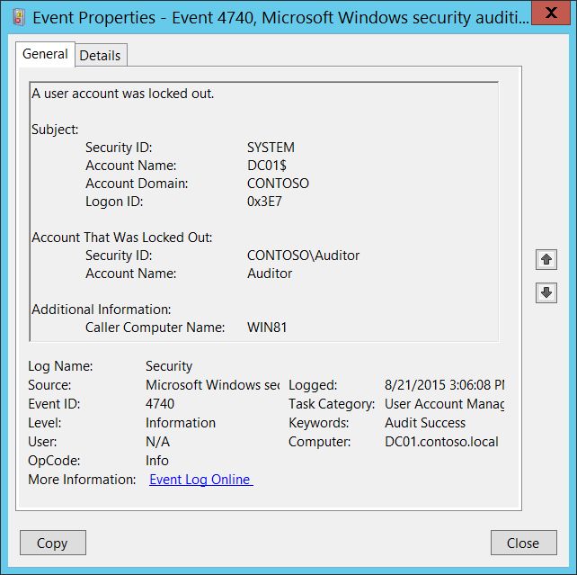

# 4740(S): A user account was locked out.




***Subcategory:***&nbsp;[Audit User Account Management](audit-user-account-management.md)

***Event Description:***

This event generates every time a user account is locked out.

For user accounts, this event generates on domain controllers, member servers, and workstations.

> **Note**&nbsp;&nbsp;For recommendations, see [Security Monitoring Recommendations](#security-monitoring-recommendations) for this event.

<br clear="all">

***Event XML:***
```
- <Event xmlns="http://schemas.microsoft.com/win/2004/08/events/event">
- <System>
 <Provider Name="Microsoft-Windows-Security-Auditing" Guid="{54849625-5478-4994-A5BA-3E3B0328C30D}" /> 
 <EventID>4740</EventID> 
 <Version>0</Version> 
 <Level>0</Level> 
 <Task>13824</Task> 
 <Opcode>0</Opcode> 
 <Keywords>0x8020000000000000</Keywords> 
 <TimeCreated SystemTime="2015-08-21T22:06:08.576887500Z" /> 
 <EventRecordID>175703</EventRecordID> 
 <Correlation /> 
 <Execution ProcessID="520" ThreadID="1112" /> 
 <Channel>Security</Channel> 
 <Computer>DC01.contoso.local</Computer> 
 <Security /> 
 </System>
- <EventData>
 <Data Name="TargetUserName">Auditor</Data> 
 <Data Name="TargetDomainName">WIN81</Data> 
 <Data Name="TargetSid">S-1-5-21-3457937927-2839227994-823803824-2104</Data> 
 <Data Name="SubjectUserSid">S-1-5-18</Data> 
 <Data Name="SubjectUserName">DC01$</Data> 
 <Data Name="SubjectDomainName">CONTOSO</Data> 
 <Data Name="SubjectLogonId">0x3e7</Data> 
 </EventData>
 </Event>

```

***Required Server Roles:*** None.

***Minimum OS Version:*** Windows Server 2008, Windows Vista.

***Event Versions:*** 0.

***Field Descriptions:***

**Subject:**

-   **Security ID** \[Type = SID\]**:** SID of account that performed the lockout operation. Event Viewer automatically tries to resolve SIDs and show the account name. If the SID cannot be resolved, you will see the source data in the event.

> **Note**&nbsp;&nbsp;A **security identifier (SID)** is a unique value of variable length used to identify a trustee (security principal). Each account has a unique SID that is issued by an authority, such as an Active Directory domain controller, and stored in a security database. Each time a user logs on, the system retrieves the SID for that user from the database and places it in the access token for that user. The system uses the SID in the access token to identify the user in all subsequent interactions with Windows security. When a SID has been used as the unique identifier for a user or group, it cannot ever be used again to identify another user or group. For more information about SIDs, see [Security identifiers](/windows/access-protection/access-control/security-identifiers).

-   **Account Name** \[Type = UnicodeString\]**:** the name of the account that performed the lockout operation.

-   **Account Domain** \[Type = UnicodeString\]**:** domain or computer name. Formats vary, and include the following:

    -   Domain NETBIOS name example: CONTOSO

    -   Lowercase full domain name: contoso.local

    -   Uppercase full domain name: CONTOSO.LOCAL

    -   For some [well-known security principals](/windows/security/identity-protection/access-control/security-identifiers), such as LOCAL SERVICE or ANONYMOUS LOGON, the value of this field is “NT AUTHORITY”.

    -   For local user accounts, this field will contain the name of the computer or device that this account belongs to, for example: “Win81”.

-   **Logon ID** \[Type = HexInt64\]**:** hexadecimal value that can help you correlate this event with recent events that might contain the same Logon ID, for example, “[4624](event-4624.md): An account was successfully logged on.”

**Account That Was Locked Out:**

-   **Security ID** \[Type = SID\]**:** SID of account that was locked out. Event Viewer automatically tries to resolve SIDs and show the account name. If the SID cannot be resolved, you will see the source data in the event.

-   **Account Name** \[Type = UnicodeString\]**:** the name of the account that was locked out.

**Additional Information:**

-   **Caller Computer Name** \[Type = UnicodeString\]**:** the name of computer account from which logon attempt was received and after which target account was locked out. For example: WIN81.

## Security Monitoring Recommendations

For 4740(S): A user account was locked out.

> **Important**&nbsp;&nbsp;For this event, also see [Appendix A: Security monitoring recommendations for many audit events](appendix-a-security-monitoring-recommendations-for-many-audit-events.md).

-   Because this event is typically triggered by the SYSTEM account, we recommend that you report it whenever **“Subject\\Security ID”** is not SYSTEM.

-   If you have high-value domain or local accounts (for example, domain administrator accounts) for which you need to monitor every lockout, monitor all [4740](event-4740.md) events with the **“Account That Was Locked Out \\Security ID”** values that correspond to the accounts.

<!-- -->

-   If you have a high-value domain or local account for which you need to monitor every change, monitor all [4740](event-4740.md) events with the **“Account That Was Locked Out \\Security ID”** that corresponds to the account.

-   If the user account **“Account That Was Locked Out\\Security ID”** should not be used (for authentication attempts) from the **Additional Information\\Caller Computer Name**, then trigger an alert.

-   Monitor for all [4740](event-4740.md) events where **Additional Information\\Caller Computer Name** is not from your domain. However, be aware that even if the computer is not in your domain you will get the computer name instead of an IP address in the [4740](event-4740.md) event.

