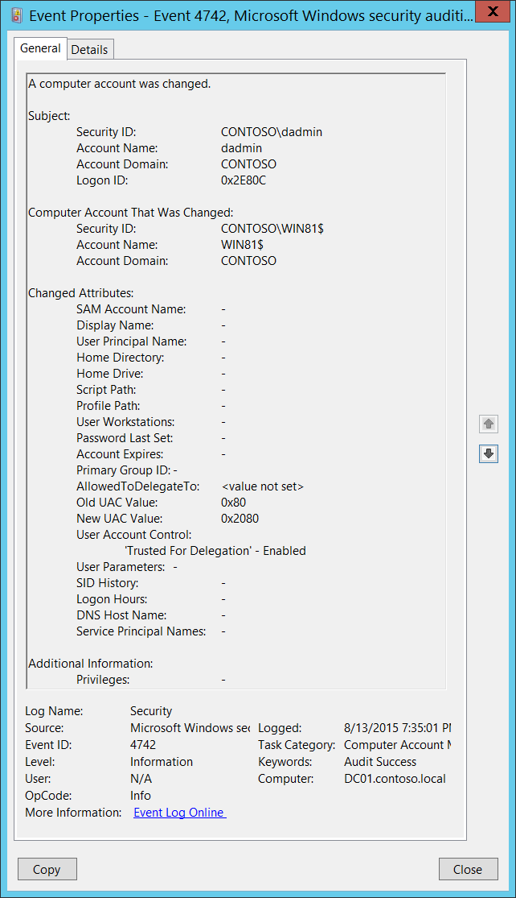

# 4742(S): A computer account was changed.

**Applies to**
-   Windows 10
-   Windows Server 2016




***Subcategory:***&nbsp;[Audit Computer Account Management](audit-computer-account-management.md)

***Event Description:***

This event generates every time a computer object is changed.

This event generates only on domain controllers.

You might see the same values for **Subject**\\**Security ID** and **Computer Account That Was Changed**\\**Security ID** in this event. This usually happens when you reboot a computer after adding it to the domain (the change takes effect after the reboot).

For each change, a separate 4742 event will be generated.

Some changes do not invoke a 4742 event, for example, changes made using Active Directory Users and Computers management console in **Managed By** tab in computer account properties.

You might see this event without any changes inside, that is, where all **Changed Attributes** apear as “-“. This usually happens when a change is made to an attribute that is not listed in the event. In this case there is no way to determine which attribute was changed. For example, this would happen if you change the **Description** of a group object using the Active Directory Users and Computers administrative console. Also, if the [discretionary access control list](https://msdn.microsoft.com/library/windows/desktop/aa374872(v=vs.85).aspx) (DACL) is changed, a 4742 event will generate, but all attributes will be “-“.

***Important*:** If you manually change any user-related setting or attribute, for example if you set the SMARTCARD\_REQUIRED flag in **userAccountControl** for the computer account, then the **sAMAccountType** of the computer account will be changed to NORMAL\_USER\_ACCOUNT and you will get “[4738](event-4738.md): A user account was changed” instead of 4742 for this computer account. Essentially, the computer account will “become” a user account. For NORMAL\_USER\_ACCOUNT you will always get events from [Audit User Account Management](audit-user-account-management.md) subcategory. We strongly recommend that you avoid changing any user-related settings manually for computer objects.

> **Note**&nbsp;&nbsp;For recommendations, see [Security Monitoring Recommendations](#security-monitoring-recommendations) for this event.

<br clear="all">

***Event XML:***
```
- <Event xmlns="http://schemas.microsoft.com/win/2004/08/events/event">
- <System>
 <Provider Name="Microsoft-Windows-Security-Auditing" Guid="{54849625-5478-4994-A5BA-3E3B0328C30D}" /> 
 <EventID>4742</EventID> 
 <Version>0</Version> 
 <Level>0</Level> 
 <Task>13825</Task> 
 <Opcode>0</Opcode> 
 <Keywords>0x8020000000000000</Keywords> 
 <TimeCreated SystemTime="2015-08-14T02:35:01.252397000Z" /> 
 <EventRecordID>171754</EventRecordID> 
 <Correlation /> 
 <Execution ProcessID="520" ThreadID="1108" /> 
 <Channel>Security</Channel> 
 <Computer>DC01.contoso.local</Computer> 
 <Security /> 
 </System>
- <EventData>
 <Data Name="ComputerAccountChange">-</Data> 
 <Data Name="TargetUserName">WIN81$</Data> 
 <Data Name="TargetDomainName">CONTOSO</Data> 
 <Data Name="TargetSid">S-1-5-21-3457937927-2839227994-823803824-6116</Data> 
 <Data Name="SubjectUserSid">S-1-5-21-3457937927-2839227994-823803824-1104</Data> 
 <Data Name="SubjectUserName">dadmin</Data> 
 <Data Name="SubjectDomainName">CONTOSO</Data> 
 <Data Name="SubjectLogonId">0x2e80c</Data> 
 <Data Name="PrivilegeList">-</Data> 
 <Data Name="SamAccountName">-</Data> 
 <Data Name="DisplayName">-</Data> 
 <Data Name="UserPrincipalName">-</Data> 
 <Data Name="HomeDirectory">-</Data> 
 <Data Name="HomePath">-</Data> 
 <Data Name="ScriptPath">-</Data> 
 <Data Name="ProfilePath">-</Data> 
 <Data Name="UserWorkstations">-</Data> 
 <Data Name="PasswordLastSet">-</Data> 
 <Data Name="AccountExpires">-</Data> 
 <Data Name="PrimaryGroupId">-</Data> 
 <Data Name="AllowedToDelegateTo">%%1793</Data> 
 <Data Name="OldUacValue">0x80</Data> 
 <Data Name="NewUacValue">0x2080</Data> 
 <Data Name="UserAccountControl">%%2093</Data> 
 <Data Name="UserParameters">-</Data> 
 <Data Name="SidHistory">-</Data> 
 <Data Name="LogonHours">-</Data> 
 <Data Name="DnsHostName">-</Data> 
 <Data Name="ServicePrincipalNames">-</Data> 
 </EventData>
 </Event>
```

***Required Server Roles:*** Active Directory domain controller.

***Minimum OS Version:*** Windows Server 2008.

***Event Versions:*** 0.

***Field Descriptions:***

**Subject:**

-   **Security ID** \[Type = SID\]**:** SID of account that requested the “change Computer object” operation. Event Viewer automatically tries to resolve SIDs and show the account name. If the SID cannot be resolved, you will see the source data in the event.

> **Note**&nbsp;&nbsp;A **security identifier (SID)** is a unique value of variable length used to identify a trustee (security principal). Each account has a unique SID that is issued by an authority, such as an Active Directory domain controller, and stored in a security database. Each time a user logs on, the system retrieves the SID for that user from the database and places it in the access token for that user. The system uses the SID in the access token to identify the user in all subsequent interactions with Windows security. When a SID has been used as the unique identifier for a user or group, it cannot ever be used again to identify another user or group. For more information about SIDs, see [Security identifiers](/windows/access-protection/access-control/security-identifiers).

-   **Account Name** \[Type = UnicodeString\]**:** the name of the account that requested the “change Computer object” operation.

-   **Account Domain** \[Type = UnicodeString\]**:** subject’s domain name. Formats vary, and include the following:

    -   Domain NETBIOS name example: CONTOSO

    -   Lowercase full domain name: contoso.local

    -   Uppercase full domain name: CONTOSO.LOCAL

    -   For some [well-known security principals](https://support.microsoft.com/kb/243330), such as LOCAL SERVICE or ANONYMOUS LOGON, the value of this field is “NT AUTHORITY”.

-   **Logon ID** \[Type = HexInt64\]**:** hexadecimal value that can help you correlate this event with recent events that might contain the same Logon ID, for example, “[4624](event-4624.md): An account was successfully logged on.”

**Computer Account That Was Changed:**

-   **Security ID** \[Type = SID\]**:** SID of changed computer account. Event Viewer automatically tries to resolve SIDs and show the account name. If the SID cannot be resolved, you will see the source data in the event.

-   **Account Name** \[Type = UnicodeString\]**:** the name of the computer account that was changed. For example: WIN81$

-   **Account Domain** \[Type = UnicodeString\]**:** domain name of changed computer account. Formats vary, and include the following:

    -   Domain NETBIOS name example: CONTOSO

    -   Lowercase full domain name: contoso.local

    -   Uppercase full domain name: CONTOSO.LOCAL

**Changed Attributes:**

> **Note**&nbsp;&nbsp;If attribute was not changed it will have “-“ value.

-   **SAM Account Name** \[Type = UnicodeString\]: logon name for account used to support clients and servers from previous versions of Windows (pre-Windows 2000 logon name). If the value of **sAMAccountName** attribute of computer object was changed, you will see the new value here. For example: WIN8$.

-   **Display Name** \[Type = UnicodeString\]: it is a name displayed in the address book for a particular account (typically – user account). This is usually the combination of the user's first name, middle initial, and last name. For computer objects, it is optional, and typically is not set. You can change this attribute by using Active Directory Users and Computers, or through a script, for example. If the value of **displayName** attribute of computer object was changed, you will see the new value here.

-   **User Principal Name** \[Type = UnicodeString\]: internet-style login name for the account, based on the Internet standard RFC 822. By convention this should map to the account's email name. If the value of **userPrincipalName** attribute of computer object was changed, you will see the new value here. For computer objects, it is optional, and typically is not set. You can change this attribute by using Active Directory Users and Computers, or through a script, for example.

-   **Home Directory** \[Type = UnicodeString\]: user's home directory. If **homeDrive** attribute is set and specifies a drive letter, **homeDirectory** should be a UNC path. The path must be a network UNC of the form \\\\Server\\Share\\Directory. If the value of **homeDirectory** attribute of computer object was changed, you will see the new value here. For computer objects, it is optional, and typically is not set. You can change this attribute by using Active Directory Users and Computers, or through a script, for example.

-   **Home Drive** \[Type = UnicodeString\]**:** specifies the drive letter to which to map the UNC path specified by **homeDirectory** account’s attribute. The drive letter must be specified in the form “DRIVE\_LETTER:”. For example – “H:”. If the value of **homeDrive** attribute of computer object was changed, you will see the new value here. For computer objects, it is optional, and typically is not set. You can change this attribute by using Active Directory Users and Computers, or through a script, for example.

-   **Script Path** \[Type = UnicodeString\]**:** specifies the path of the account’s logon script. If the value of **scriptPath** attribute of computer object was changed, you will see the new value here. For computer objects, it is optional, and typically is not set. You can change this attribute by using Active Directory Users and Computers, or through a script, for example.

-   **Profile Path** \[Type = UnicodeString\]: specifies a path to the account's profile. This value can be a null string, a local absolute path, or a UNC path. If the value of **profilePath** attribute of computer object was changed, you will see the new value here. For computer objects, it is optional, and typically is not set. You can change this attribute by using Active Directory Users and Computers, or through a script, for example.

-   **User Workstations** \[Type = UnicodeString\]: contains the list of NetBIOS or DNS names of the computers from which the user can logon. Each computer name is separated by a comma. The name of a computer is the **sAMAccountName** property of a computer object. If the value of **userWorkstations** attribute of computer object was changed, you will see the new value here. For computer objects, it is optional, and typically is not set. You can change this attribute by using Active Directory Users and Computers, or through a script, for example.

-   **Password Last Set** \[Type = UnicodeString\]**:** last time the account’s password was modified. If the value of **pwdLastSet** attribute of computer object was changed, you will see the new value here. For example: 8/12/2015 11:41:39 AM. This value will be changed, for example, after manual computer account reset action or automatically every 30 days by default for computer objects.

-   **Account Expires** \[Type = UnicodeString\]: the date when the account expires. If the value of **accountExpires** attribute of computer object was changed, you will see the new value here. For computer objects, it is optional, and typically is not set. You can change this attribute by using Active Directory Users and Computers, or through a script, for example.

-   **Primary Group ID** \[Type = UnicodeString\]: Relative Identifier (RID) of computer’s object primary group.

> **Note**&nbsp;&nbsp;**Relative identifier (RID)** is a variable length number that is assigned to objects at creation and becomes part of the object's Security Identifier (SID) that uniquely identifies an account or group within a domain.

This field will contain some value if computer’s object primary group was changed. You can change computer’s primary group using Active Directory Users and Computers management console in the **Member Of** tab of computer object properties. You will see a RID of new primary group as a field value. For example, 515 (Domain Computers) for workstations, is a default primary group.

Typical **Primary Group** values for computer accounts:

-   516 (Domain Controllers) – for domain controllers.

-   521 (Read-only Domain Controllers) – read-only domain controllers (RODC).

-   515 (Domain Computers) – servers and workstations.

    See this article <https://support.microsoft.com/kb/243330> for more information. If the value of **primaryGroupID** attribute of computer object was changed, you will see the new value here.

<!-- -->

-   **AllowedToDelegateTo** \[Type = UnicodeString\]: the list of SPNs to which this account can present delegated credentials. Can be changed using Active Directory Users and Computers management console in **Delegation** tab of computer account. If the SPNs list on **Delegation** tab of a computer account was changed, you will see the new SPNs list in **AllowedToDelegateTo** field (note that you will see the new list instead of changes) of this event. This is an example of **AllowedToDelegateTo**:

    -   dcom/WIN2012

    -   dcom/WIN2012.contoso.local

        If the value of **msDS-AllowedToDelegateTo** attribute of computer object was changed, you will see the new value here.

        The value can be **&lt;value not set&gt;**, for example, if delegation was disabled.

> **Note**&nbsp;&nbsp;**Service Principal Name (SPN)** is the name by which a client uniquely identifies an instance of a service. If you install multiple instances of a service on computers throughout a forest, each instance must have its own SPN. A given service instance can have multiple SPNs if there are multiple names that clients might use for authentication. For example, an SPN always includes the name of the host computer on which the service instance is running, so a service instance might register an SPN for each name or alias of its host.

-   **Old UAC Value** \[Type = UnicodeString\]: specifies flags that control password, lockout, disable/enable, script, and other behavior for the user or computer account. This parameter contains the previous value of **userAccountControl** attribute of computer object.

-   **New UAC Value** \[Type = UnicodeString\]: specifies flags that control password, lockout, disable/enable, script, and other behavior for the user or computer account. If the value of **userAccountControl** attribute of computer object was changed, you will see the new value here.

To decode this value, you can go through the property value definitions in the “Table 7. User’s or Computer’s account UAC flags.” from largest to smallest. Compare each property value to the flags value in the event. If the flags value in the event is greater than or equal to the property value, then the property is "set" and applies to that event. Subtract the property value from the flags value in the event and note that the flag applies and then go on to the next flag.

Here's an example: Flags value from event: 0x15

Decoding:

• PASSWD\_NOTREQD 0x0020

• LOCKOUT 0x0010

• HOMEDIR\_REQUIRED 0x0008

• (undeclared) 0x0004

• ACCOUNTDISABLE 0x0002

• SCRIPT 0x0001

0x0020 &gt; 0x15, so PASSWD\_NOTREQD does not apply to this event

0x10 &lt; 0x15, so LOCKOUT applies to this event. 0x15 - 0x10 = 0x5

0x4 &lt; 0x5, so the undeclared value is set. We'll pretend it doesn't mean anything. 0x5 - 0x4 = 0x1

0x2 &gt; 0x1, so ACCOUNTDISABLE does not apply to this event

0x1 = 0x1, so SCRIPT applies to this event. 0x1 - 0x1 = 0x0, we're done.

So this UAC flags value decodes to: LOCKOUT and SCRIPT

-   **User Account Control** \[Type = UnicodeString\]**:** shows the list of changes in **userAccountControl** attribute. You will see a line of text for each change. See possible values in here: “Table 7. User’s or Computer’s account UAC flags.”. In the “User Account Control field text” column, you can see text that will be displayed in the **User Account Control** field in 4742 event.

<!-- -->

-   **User Parameters** \[Type = UnicodeString\]: if you change any setting using Active Directory Users and Computers management console in Dial-in tab of computer’s account properties, then you will see **&lt;value changed, but not displayed&gt;** in this field.

-   **SID History** \[Type = UnicodeString\]: contains previous SIDs used for the object if the object was moved from another domain. Whenever an object is moved from one domain to another, a new SID is created and becomes the objectSID. The previous SID is added to the **sIDHistory** property. If the value of **sIDHistory** attribute of computer object was changed, you will see the new value here.

-   **Logon Hours** \[Type = UnicodeString\]: hours that the account is allowed to logon to the domain. If the value of **logonHours** attribute of computer object was changed, you will see the new value here. For computer objects, it is optional, and typically is not set. You can change this attribute by using Active Directory Users and Computers, or through a script, for example.

-   **DNS Host Name** \[Type = UnicodeString\]: name of computer account as registered in DNS. If the value of **dNSHostName** attribute of computer object was changed, you will see the new value here.

<!-- -->

- **Service Principal Names** \[Type = UnicodeString\]**:** The list of SPNs, registered for computer account. If the SPN list of a computer account changed, you will see the new SPN list in **Service Principal Names** field (note that you will see the new list instead of changes). If the value of **servicePrincipalName** attribute of computer object was changed, you will see the new value here.

  Here is an example of **Service Principal Names** field for new domain joined workstation in event 4742 on domain controller, after workstation reboots<strong>:</strong>

  HOST/Win81.contoso.local

  RestrictedKrbHost/Win81.contoso.local

  HOST/WIN81

  RestrictedKrbHost/WIN81

TERMSRV/Win81.contoso.local

**Additional Information:**

-   **Privileges** \[Type = UnicodeString\]: the list of user privileges which were used during the operation, for example, SeBackupPrivilege. This parameter might not be captured in the event, and in that case appears as “-”. See full list of user privileges in “Table 8. User Privileges.”.

## Security Monitoring Recommendations

For 4742(S): A computer account was changed.

> **Important**&nbsp;&nbsp;For this event, also see [Appendix A: Security monitoring recommendations for many audit events](appendix-a-security-monitoring-recommendations-for-many-audit-events.md).

-   If you have critical domain computer accounts (database servers, domain controllers, administration workstations, and so on) for which you need to monitor each change, monitor this event with the **“Computer Account That Was Changed\\Security ID”** that corresponds to the high-value account or accounts.

-   If you have computer accounts for which any change in the services list on the **Delegation** tab should be monitored, monitor this event when **AllowedToDelegateTo** is not -. This value means the services list was changed.

-   Consider whether to track the following fields and values:

| **Field and value to track**                                                                                                                                                                                                                                                                                                       | **Reason to track**                                                                                                                                                                                                                                                              |
|------------------------------------------------------------------------------------------------------------------------------------------------------------------------------------------------------------------------------------------------------------------------------------------------------------------------------------|----------------------------------------------------------------------------------------------------------------------------------------------------------------------------------------------------------------------------------------------------------------------------------|
| **Display Name** is not -<br>**User Principal Name** is not -<br>**Home Directory** is not -<br>**Home Drive** is not -<br>**Script Path** is not -<br>**Profile Path** is not -<br>**User Workstations** is not -<br>**Account Expires** is not -<br>**Logon Hours** is not **-** | Typically these fields are **-** for computer accounts. Other values might indicate an anomaly and should be monitored.                                                                                                                                                          |
| **Password Last Set** changes occur more often than usual                                                                                                                                                                                                                                                                          | Changes that are more frequent than the default (typically once a month) might indicate an anomaly or attack.                                                                                                                                                                    |
| **Primary Group ID** is not 516, 521, or 515                                                                                                                                                                                                                                                                                       | Typically, the **Primary Group ID** value is one of the following:<br>**516** for domain controllers<br>**521** for read only domain controllers (RODCs)<br>**515** for servers and workstations (domain computers)<br>Other values should be monitored. |
| For computer accounts for which the services list (on the **Delegation** tab) should not be empty: **AllowedToDelegateTo** is marked **&lt;value not set&gt;**                                                                                                                                                                    | If **AllowedToDelegateTo** is marked **&lt;value not set&gt;** on computers that previously had a services list (on the **Delegation** tab), it means the list was cleared.                                                                                                      |
| **SID History** is not -                                                                                                                                                                                                                                                                                                           | This field will always be set to - unless the account was migrated from another domain.                                                                                                                                                                                          |

-   Consider whether to track the following account control flags:

| **User account control flag to track**                  | **Information about the flag**                                                                                                                                                                                                                                                                                                                                                                |
|---------------------------------------------------------|-----------------------------------------------------------------------------------------------------------------------------------------------------------------------------------------------------------------------------------------------------------------------------------------------------------------------------------------------------------------------------------------------|
| **'Password Not Required'** – Enabled                   | Should not be set for computer accounts. Computer accounts typically require a password by default, except manually created computer objects.                                                                                                                                                                                                                                                 |
| **'Encrypted Text Password Allowed'** – Enabled         | Should not be set for computer accounts. By default, it will not be set, and it cannot be set in the account properties in Active Directory Users and Computers.                                                                                                                                                                                                                              |
| **'Server Trust Account'** – Enabled                    | Should be enabled **only** for domain controllers.                                                                                                                                                                                                                                                                                                                                            |
| **'Server Trust Account'** – Disabled                   | Should **not** be disabled for domain controllers.                                                                                                                                                                                                                                                                                                                                            |
| **'Don't Expire Password'** – Enabled                   | Should not be enabled for computer accounts, because the password automatically changes every 30 days by default. For computer accounts, this flag cannot be set in the account properties in Active Directory Users and Computers.                                                                                                                                                           |
| **'Smartcard Required'** – Enabled                      | Should not be enabled for computer accounts.                                                                                                                                                                                                                                                                                                                                                  |
| **'Trusted For Delegation'** – Enabled                  | Means that Kerberos Constraint or Unconstraint delegation was enabled for the computer account. We recommend monitoring this to discover whether it is an approved action (done by an administrator), a mistake, or a malicious action.                                                                                                                                                       |
| **'Trusted For Delegation'** – Disabled                 | Means that Kerberos Constraint or Unconstraint delegation was disabled for the computer account. We recommend monitoring this to discover whether it is an approved action (done by an administrator), a mistake, or a malicious action.<br>Also, if you have a list of computer accounts for which delegation is critical and should not be disabled, monitor this for those accounts. |
| **'Trusted To Authenticate For Delegation'** – Enabled  | Means that Protocol Transition delegation was enabled for the computer account. We recommend monitoring this to discover whether it is an approved action (done by an administrator), a mistake, or a malicious action.                                                                                                                                                                       |
| **'Trusted To Authenticate For Delegation'** – Disabled | Means that Protocol Transition delegation was disabled for the computer account. We recommend monitoring this to discover whether it is an approved action (done by an administrator), a mistake, or a malicious action.<br>Also, if you have a list of computer accounts for which delegation is critical and should not be disabled, monitor this for those accounts.                 |
| **'Not Delegated'** – Enabled                           | Means that **Account is sensitive and cannot be delegated** was selected for the computer account. For computer accounts, this flag cannot be set using the graphical interface. We recommend monitoring this to discover whether it is an approved action (done by an administrator), a mistake, or a malicious action.                                                                      |
| **'Use DES Key Only'** – Enabled                        | Should not be enabled for computer accounts. For computer accounts, it cannot be set in the account properties in Active Directory Users and Computers.                                                                                                                                                                                                                                       |
| **'Don't Require Preauth'** - Enabled                   | Should not be enabled for computer accounts. For computer accounts, it cannot be set in the account properties in Active Directory Users and Computers.                                                                                                                                                                                                                                       |

