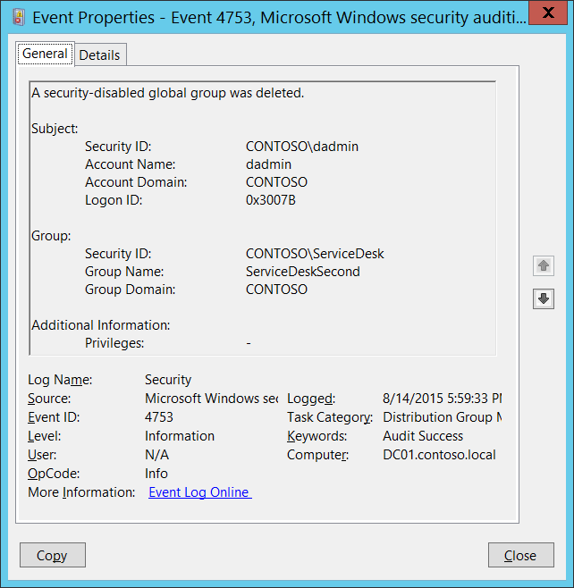

# 4753(S): A security-disabled global group was deleted.

**Applies to**
-   Windows 10
-   Windows Server 2016




***Subcategory:***&nbsp;[Audit Distribution Group Management](audit-distribution-group-management.md)

***Event Description:***

This event generates every time security-disabled (distribution) global group is deleted.

This event generates only on domain controllers.

> **Note**&nbsp;&nbsp;For recommendations, see [Security Monitoring Recommendations](#security-monitoring-recommendations) for this event.

<br clear="all">

***Event XML:***
```
- <Event xmlns="http://schemas.microsoft.com/win/2004/08/events/event">
- <System>
 <Provider Name="Microsoft-Windows-Security-Auditing" Guid="{54849625-5478-4994-A5BA-3E3B0328C30D}" /> 
 <EventID>4753</EventID> 
 <Version>0</Version> 
 <Level>0</Level> 
 <Task>13827</Task> 
 <Opcode>0</Opcode> 
 <Keywords>0x8020000000000000</Keywords> 
 <TimeCreated SystemTime="2015-08-15T00:59:33.621155200Z" /> 
 <EventRecordID>172230</EventRecordID> 
 <Correlation /> 
 <Execution ProcessID="520" ThreadID="1504" /> 
 <Channel>Security</Channel> 
 <Computer>DC01.contoso.local</Computer> 
 <Security /> 
 </System>
- <EventData>
 <Data Name="TargetUserName">ServiceDeskSecond</Data> 
 <Data Name="TargetDomainName">CONTOSO</Data> 
 <Data Name="TargetSid">S-1-5-21-3457937927-2839227994-823803824-6119</Data> 
 <Data Name="SubjectUserSid">S-1-5-21-3457937927-2839227994-823803824-1104</Data> 
 <Data Name="SubjectUserName">dadmin</Data> 
 <Data Name="SubjectDomainName">CONTOSO</Data> 
 <Data Name="SubjectLogonId">0x3007b</Data> 
 <Data Name="PrivilegeList">-</Data> 
 </EventData>
 </Event>

```

***Required Server Roles:*** Active Directory domain controller.

***Minimum OS Version:*** Windows Server 2008.

***Event Versions:*** 0.

***Field Descriptions:***

**Subject:**

-   **Security ID** \[Type = SID\]**:** SID of account that requested the “delete group” operation. Event Viewer automatically tries to resolve SIDs and show the account name. If the SID cannot be resolved, you will see the source data in the event.

> **Note**&nbsp;&nbsp;A **security identifier (SID)** is a unique value of variable length used to identify a trustee (security principal). Each account has a unique SID that is issued by an authority, such as an Active Directory domain controller, and stored in a security database. Each time a user logs on, the system retrieves the SID for that user from the database and places it in the access token for that user. The system uses the SID in the access token to identify the user in all subsequent interactions with Windows security. When a SID has been used as the unique identifier for a user or group, it cannot ever be used again to identify another user or group. For more information about SIDs, see [Security identifiers](/windows/access-protection/access-control/security-identifiers).

-   **Account Name** \[Type = UnicodeString\]**:** the name of the account that requested the “delete group” operation.

-   **Account Domain** \[Type = UnicodeString\]**:** subject’s domain name. Formats vary, and include the following:

    -   Domain NETBIOS name example: CONTOSO

    -   Lowercase full domain name: contoso.local

    -   Uppercase full domain name: CONTOSO.LOCAL

    -   For some [well-known security principals](https://support.microsoft.com/kb/243330), such as LOCAL SERVICE or ANONYMOUS LOGON, the value of this field is “NT AUTHORITY”.

-   **Logon ID** \[Type = HexInt64\]**:** hexadecimal value that can help you correlate this event with recent events that might contain the same Logon ID, for example, “[4624](event-4624.md): An account was successfully logged on.”

**Group:**

-   **Security ID** \[Type = SID\]**:** SID of deleted group. Event Viewer automatically tries to resolve SIDs and show the group name. If the SID cannot be resolved, you will see the source data in the event.

-   **Group Name** \[Type = UnicodeString\]**:** the name of the group that was deleted. For example: ServiceDesk

-   **Group Domain** \[Type = UnicodeString\]**:** domain name of deleted group. Formats vary, and include the following:

    -   Domain NETBIOS name example: CONTOSO

    -   Lowercase full domain name: contoso.local

    -   Uppercase full domain name: CONTOSO.LOCAL

    -   [Built-in groups](https://technet.microsoft.com/library/dn169025(v=ws.10).aspx): Builtin

**Additional Information:**

-   **Privileges** \[Type = UnicodeString\]: the list of user privileges which were used during the operation, for example, SeBackupPrivilege. This parameter might not be captured in the event, and in that case appears as “-”. See full list of user privileges in “Table 8. User Privileges.”.

## Security Monitoring Recommendations

For 4753(S): A security-disabled global group was deleted.

> **Important**&nbsp;&nbsp;For this event, also see [Appendix A: Security monitoring recommendations for many audit events](appendix-a-security-monitoring-recommendations-for-many-audit-events.md).

-   If you have a list of critical distribution groups in the organization, and need to specifically monitor these groups for any change, especially group deletion, monitor events with the “**Group\\Group Name”** values that correspond to the critical distribution groups.

-   If you need to monitor each time a distribution group is deleted, to see who deleted it and when, monitor this event. Typically, this event is used as an informational event, to be reviewed if needed.


