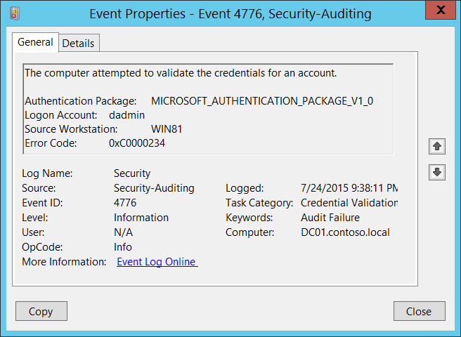

# 4776(S, F): The computer attempted to validate the credentials for an account.




***Subcategory:***&nbsp;[Audit Credential Validation](audit-credential-validation.md)

***Event Description:***

This event generates every time that a credential validation occurs using NTLM authentication.

This event occurs only on the computer that is authoritative for the provided credentials. For domain accounts, the domain controller is authoritative. For local accounts, the local computer is authoritative.

It shows successful and unsuccessful credential validation attempts.

It shows only the computer name (**Source Workstation**) from which the authentication attempt was performed (authentication source). For example, if you authenticate from CLIENT-1 to SERVER-1 using a domain account you'll see CLIENT-1 in the **Source Workstation** field. Information about the destination computer (SERVER-1) isn't presented in this event.

If a credential validation attempt fails, you'll see a Failure event with **Error Code** parameter value not equal to "**0x0**".

The main advantage of this event is that on domain controllers you can see all authentication attempts for domain accounts when NTLM authentication was used.

For monitoring local account logon attempts, it's better to use event "[4624](event-4624.md): An account was successfully logged on" because it contains more details and is more informative.

This event also generates when a workstation unlock event occurs.

This event does *not* generate when a domain account logs on locally to a domain controller.

> **Note**&nbsp;&nbsp;For recommendations, see [Security Monitoring Recommendations](#security-monitoring-recommendations) for this event.

<br clear="all">

***Event XML:***
```
- <Event xmlns="http://schemas.microsoft.com/win/2004/08/events/event">
- <System>
 <Provider Name="Microsoft-Windows-Security-Auditing" Guid="{54849625-5478-4994-A5BA-3E3B0328C30D}" /> 
 <EventID>4776</EventID> 
 <Version>0</Version> 
 <Level>0</Level> 
 <Task>14336</Task> 
 <Opcode>0</Opcode> 
 <Keywords>0x8010000000000000</Keywords> 
 <TimeCreated SystemTime="2015-07-25T04:38:11.003163100Z" /> 
 <EventRecordID>165437</EventRecordID> 
 <Correlation /> 
 <Execution ProcessID="500" ThreadID="532" /> 
 <Channel>Security</Channel> 
 <Computer>DC01.contoso.local</Computer> 
 <Security /> 
 </System>
- <EventData>
 <Data Name="PackageName">MICROSOFT\_AUTHENTICATION\_PACKAGE\_V1\_0</Data> 
 <Data Name="TargetUserName">dadmin</Data> 
 <Data Name="Workstation">WIN81</Data> 
 <Data Name="Status">0xc0000234</Data> 
 </EventData>
 </Event>

```

***Required Server Roles:*** no specific requirements.

***Minimum OS Version:*** Windows Server 2008, Windows Vista.

***Event Versions:*** 0.

***Field Descriptions:***

-   **Authentication Package** \[Type = UnicodeString\]: the name of [Authentication Package](/windows/win32/secauthn/authentication-packages) that was used for credential validation. It's always "**MICROSOFT\_AUTHENTICATION\_PACKAGE\_V1\_0**" for [4776](event-4776.md) event.

> **Note**&nbsp;&nbsp;**Authentication package** is a DLL that encapsulates the authentication logic used to determine whether to permit a user to log on. [Local Security Authority](/windows/win32/secgloss/l-gly#_security_local_security_authority_gly) (LSA) authenticates a user logon by sending the request to an authentication package. The authentication package then examines the logon information and either authenticates or rejects the user logon attempt.

-   **Logon Account** \[Type = UnicodeString\]: the name of the account that had its credentials validated by the **Authentication Package**. Can be user name, computer account name or [well-known security principal](/windows/security/identity-protection/access-control/security-identifiers) account name. Examples:

    -   User example: dadmin

    -   Computer account example: WIN81$

    -   Local System account example: Local

    -   Local Service account example: Local Service

-   **Source Workstation** \[Type = UnicodeString\]: the name of the computer from which the logon attempt originated.

-   **Error Code** \[Type = HexInt32\]: contains error code for Failure events. For Success events this parameter has "**0x0**" value. The table below contains most common error codes for this event:

| Error Code | Description                                                                                                                                                                                                                                                                               |
|------------|-------------------------------------------------------------------------------------------------------------------------------------------------------------------------------------------------------------------------------------------------------------------------------------------|
| 0xC0000064 | The username you typed does not exist. Bad username.                                                                                                                                                                                                                                      |
| 0xC000006A | Account logon with misspelled or bad password.                                                                                                                                                                                                                                            |
| 0xC000006D | -   Generic logon failure.<br>Some of the potential causes for this:<br>An invalid username and/or password was used<br>[LAN Manager Authentication Level](/previous-versions/windows/it-pro/windows-server-2012-R2-and-2012/jj852207(v=ws.11)) mismatch between the source and target computers. |
| 0xC000006F | Account logon outside authorized hours.                                                                                                                                                                                                                                                   |
| 0xC0000070 | Account logon from unauthorized workstation.                                                                                                                                                                                                                                              |
| 0xC0000071 | Account logon with expired password.                                                                                                                                                                                                                                                      |
| 0xC0000072 | Account logon to account disabled by administrator.                                                                                                                                                                                                                                       |
| 0xC0000193 | Account logon with expired account.                                                                                                                                                                                                                                                       |
| 0xC0000224 | Account logon with "Change Password at Next Logon" flagged.                                                                                                                                                                                                                               |
| 0xC0000234 | Account logon with account locked.                                                                                                                                                                                                                                                        |
| 0xC0000371 | The local account store does not contain secret material for the specified account.                                                                                                                                                                                                       |
| 0x0        | No errors.                                                                                                                                                                                                                                                                                |

> Table 1. Winlogon Error Codes.

## Security Monitoring Recommendations

For 4776(S, F): The computer attempted to validate the credentials for an account.

| **Type of monitoring required**     | **Recommendation**          |
|-----------------|---------|
| **High-value accounts**: You might have high-value domain or local accounts for which you need to monitor each action.<br>Examples of high-value accounts are database administrators, built-in local administrator account, domain administrators, service accounts, domain controller accounts and so on. | Monitor this event with the **"Logon Account"** that corresponds to the high-value account or accounts.        |
| **Anomalies or malicious actions**: You might have specific requirements for detecting anomalies or monitoring potential malicious actions. For example, you might need to monitor for use of an account outside of working hours.                                                                                | When you monitor for anomalies or malicious actions, use the **"Logon Account"** value (with other information) to monitor how or when a particular account is being used.<br>To monitor activity of specific user accounts outside of working hours, monitor the appropriate **Logon Account + Source Workstation** pairs. |
| **Non-active accounts**: You might have non-active, disabled, or guest accounts, or other accounts that should never be used. | Monitor this event with the **"Logon Account"** that should never be used.   |
| **Account allow list**: You might have a specific allow list of accounts that are the only ones allowed to perform actions corresponding to particular events.   | If this event corresponds to a "allow list-only" action, review the **"Logon Account"** for accounts that are outside the allow list.     |
| **Restricted-use computers**: You might have certain computers from which certain people (accounts) shouldn't log on.   | Monitor the target **Source Workstation** for credential validation requests from the **"Logon Account"** that you're concerned about.  |
| **Account naming conventions**: Your organization might have specific naming conventions for account names.  | Monitor "**Logon Account"** for names that don't comply with naming conventions. |

-   If NTLM authentication shouldn't be used for a specific account, monitor for that account. Don't forget that local logon will always use NTLM authentication if an account logs on to a device where its user account is stored.

-   You can use this event to collect all NTLM authentication attempts in the domain, if needed. Don't forget that local logon will always use NTLM authentication if the account logs on to a device where its user account is stored.

-   If a local account should be used only locally (for example, network logon or terminal services logon isn't allowed), you need to monitor for all events where **Source Workstation** and **Computer** (where the event was generated and where the credentials are stored) have different values.

-   Consider tracking the following errors for the reasons listed:

| **Error to track**  | **What the error might indicate**   |
|----------|----------------|
| **User logon with misspelled or bad user account**  | For example, N events in the last N minutes can be an indicator of an account enumeration attack, especially relevant for highly critical accounts. |
| **User logon with misspelled or bad password**      | For example, N events in the last N minutes can be an indicator of a brute-force password attack, especially relevant for highly critical accounts. |
| **User logon outside authorized hours**             | Can indicate a compromised account; especially relevant for highly critical accounts.  |
| **User logon from unauthorized workstation**        | Can indicate a compromised account; especially relevant for highly critical accounts.    |
| **User logon to account disabled by administrator** | For example, N events in last N minutes can be an indicator of an account compromise attempt, especially relevant for highly critical accounts.     |
| **User logon with expired account**                 | Can indicate an account compromise attempt; especially relevant for highly critical accounts.   |
| **User logon with account locked**                  | Can indicate a brute-force password attack; especially relevant for highly critical accounts.  |
