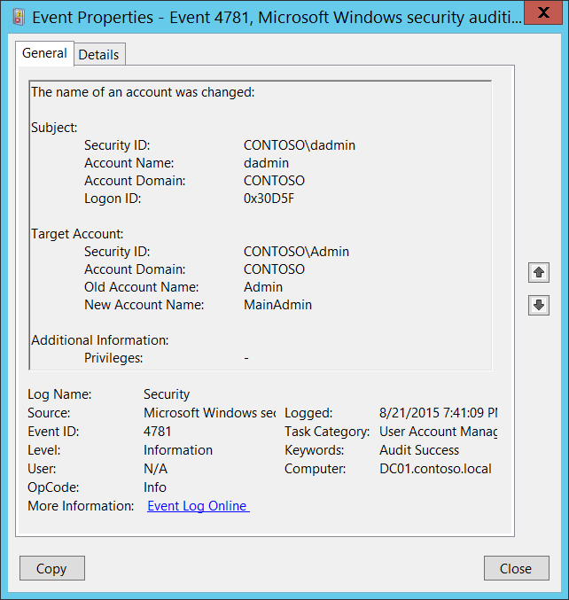

# 4781(S): The name of an account was changed.

**Applies to**
-   Windows 10
-   Windows Server 2016




***Subcategory:***&nbsp;[Audit User Account Management](audit-user-account-management.md)

***Event Description:***

This event generates every time a user or computer account name (**sAMAccountName** attribute) is changed.

For user accounts, this event generates on domain controllers, member servers, and workstations.

For computer accounts, this event generates only on domain controllers.

> **Note**&nbsp;&nbsp;For recommendations, see [Security Monitoring Recommendations](#security-monitoring-recommendations) for this event.

<br clear="all">

***Event XML:***
```
- <Event xmlns="http://schemas.microsoft.com/win/2004/08/events/event">
- <System>
 <Provider Name="Microsoft-Windows-Security-Auditing" Guid="{54849625-5478-4994-A5BA-3E3B0328C30D}" /> 
 <EventID>4781</EventID> 
 <Version>0</Version> 
 <Level>0</Level> 
 <Task>13824</Task> 
 <Opcode>0</Opcode> 
 <Keywords>0x8020000000000000</Keywords> 
 <TimeCreated SystemTime="2015-08-22T02:41:09.737420900Z" /> 
 <EventRecordID>175754</EventRecordID> 
 <Correlation /> 
 <Execution ProcessID="520" ThreadID="1112" /> 
 <Channel>Security</Channel> 
 <Computer>DC01.contoso.local</Computer> 
 <Security /> 
 </System>
- <EventData>
 <Data Name="OldTargetUserName">Admin</Data> 
 <Data Name="NewTargetUserName">MainAdmin</Data> 
 <Data Name="TargetDomainName">CONTOSO</Data> 
 <Data Name="TargetSid">S-1-5-21-3457937927-2839227994-823803824-6117</Data> 
 <Data Name="SubjectUserSid">S-1-5-21-3457937927-2839227994-823803824-1104</Data> 
 <Data Name="SubjectUserName">dadmin</Data> 
 <Data Name="SubjectDomainName">CONTOSO</Data> 
 <Data Name="SubjectLogonId">0x30d5f</Data> 
 <Data Name="PrivilegeList">-</Data> 
 </EventData>
 </Event>

```

***Required Server Roles:*** None.

***Minimum OS Version:*** Windows Server 2008, Windows Vista.

***Event Versions:*** 0.

***Field Descriptions:***

**Subject:**

-   **Security ID** \[Type = SID\]**:** SID of account that performed the “change account name” operation. Event Viewer automatically tries to resolve SIDs and show the account name. If the SID cannot be resolved, you will see the source data in the event.

> **Note**&nbsp;&nbsp;A **security identifier (SID)** is a unique value of variable length used to identify a trustee (security principal). Each account has a unique SID that is issued by an authority, such as an Active Directory domain controller, and stored in a security database. Each time a user logs on, the system retrieves the SID for that user from the database and places it in the access token for that user. The system uses the SID in the access token to identify the user in all subsequent interactions with Windows security. When a SID has been used as the unique identifier for a user or group, it cannot ever be used again to identify another user or group. For more information about SIDs, see [Security identifiers](/windows/access-protection/access-control/security-identifiers).

-   **Account Name** \[Type = UnicodeString\]**:** the name of the account that performed the “change account name” operation.

-   **Account Domain** \[Type = UnicodeString\]**:** subject’s domain or computer name. Formats vary, and include the following:

    -   Domain NETBIOS name example: CONTOSO

    -   Lowercase full domain name: contoso.local

    -   Uppercase full domain name: CONTOSO.LOCAL

    -   For some [well-known security principals](https://support.microsoft.com/kb/243330), such as LOCAL SERVICE or ANONYMOUS LOGON, the value of this field is “NT AUTHORITY”.

    -   For local user accounts, this field will contain the name of the computer or device that this account belongs to, for example: “Win81”.

-   **Logon ID** \[Type = HexInt64\]**:** hexadecimal value that can help you correlate this event with recent events that might contain the same Logon ID, for example, “[4624](event-4624.md): An account was successfully logged on.”

**Target Account:**

-   **Security ID** \[Type = SID\]**:** SID of account on which the name was changed. Event Viewer automatically tries to resolve SIDs and show the account name. If the SID cannot be resolved, you will see the source data in the event.

-   **Account Domain** \[Type = UnicodeString\]**:** target account’s domain or computer name. Formats vary, and include the following:

    -   Domain NETBIOS name example: CONTOSO

    -   Lowercase full domain name: contoso.local

    -   Uppercase full domain name: CONTOSO.LOCAL

    -   For local user accounts, this field will contain the name of the computer or device that this account belongs to, for example: “Win81”.

-   **Old Account Name** \[Type = UnicodeString\]**:** old name of target account.

-   **New Account Name** \[Type = UnicodeString\]**:** new name of target account.

**Additional Information:**

-   **Privileges** \[Type = UnicodeString\]: the list of user privileges which were used during the operation, for example, SeBackupPrivilege. This parameter might not be captured in the event, and in that case appears as “-”. See full list of user privileges in “Table 8. User Privileges.”.

## Security Monitoring Recommendations

For 4781(S): The name of an account was changed.

> **Important**&nbsp;&nbsp;For this event, also see [Appendix A: Security monitoring recommendations for many audit events](appendix-a-security-monitoring-recommendations-for-many-audit-events.md).

-   If you have high-value user or computer accounts (or local user accounts) for which you need to monitor each change to the accounts, monitor this event with the **“Target Account\\Security ID”** that corresponds to the high-value accounts.

