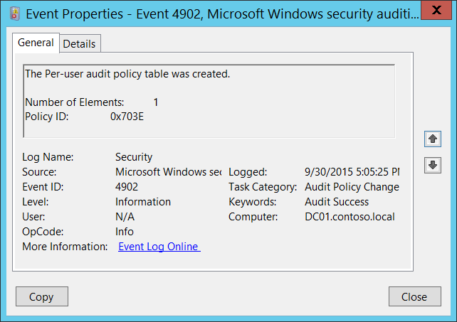
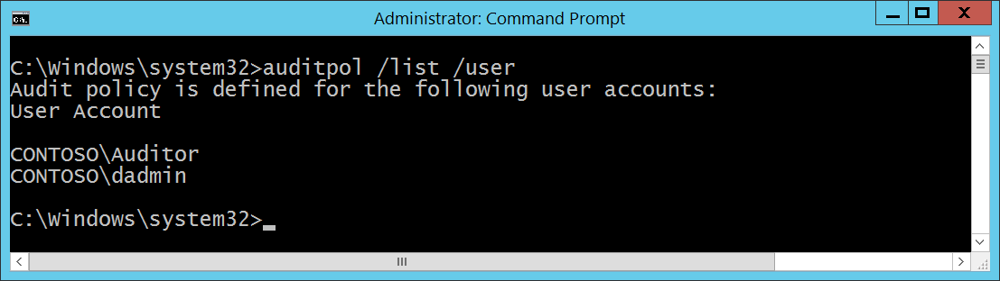

# 4902(S): The Per-user audit policy table was created.




***Subcategory:***&nbsp;[Audit Policy Change](audit-audit-policy-change.md)

***Event Description:***

This event generates during system startup if Per-user audit policy is defined on the computer.

> **Note**&nbsp;&nbsp;For recommendations, see [Security Monitoring Recommendations](#security-monitoring-recommendations) for this event.

<br clear="all">

***Event XML:***
```
- <Event xmlns="http://schemas.microsoft.com/win/2004/08/events/event">
- <System>
 <Provider Name="Microsoft-Windows-Security-Auditing" Guid="{54849625-5478-4994-A5BA-3E3B0328C30D}" /> 
 <EventID>4902</EventID> 
 <Version>0</Version> 
 <Level>0</Level> 
 <Task>13568</Task> 
 <Opcode>0</Opcode> 
 <Keywords>0x8020000000000000</Keywords> 
 <TimeCreated SystemTime="2015-10-01T00:05:25.814466500Z" /> 
 <EventRecordID>1049490</EventRecordID> 
 <Correlation /> 
 <Execution ProcessID="520" ThreadID="556" /> 
 <Channel>Security</Channel> 
 <Computer>DC01.contoso.local</Computer> 
 <Security /> 
 </System>
- <EventData>
 <Data Name="PuaCount">1</Data> 
 <Data Name="PuaPolicyId">0x703e</Data> 
 </EventData>
 </Event>

```

***Required Server Roles:*** None.

***Minimum OS Version:*** Windows Server 2008, Windows Vista.

***Event Versions:*** 0.

***Field Descriptions:***

**Number of Elements** \[Type = UInt32\]: number of users for which Per-user policies were defined (number of unique users). You can get the list of users for which Per-user policies are defined using “auditpol /list /user” command:



**Policy ID** \[Type = HexInt64\]: unique per-User Audit Policy hexadecimal identifier.

## Security Monitoring Recommendations

For 4902(S): The Per-user audit policy table was created.

-   If you don’t expect to see any per-User Audit Policies enabled on specific computers (**Computer**), monitor for these events.

-   If you don’t use per-User Audit Policies in your network, monitor for these events.

-   Typically this is an informational event and has little to no security relevance.

