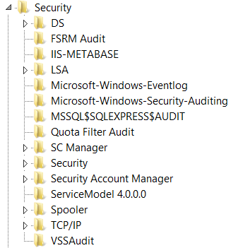

# 4905(S): An attempt was made to unregister a security event source.


***Subcategory:***&nbsp;[Audit Policy Change](audit-audit-policy-change.md)

***Event Description:***

This event generates every time a [security event source](/windows/win32/eventlog/event-sources) is unregistered.

You typically see this event if specific roles were removed, for example, Internet Information Services.

> **Note**&nbsp;&nbsp;For recommendations, see [Security Monitoring Recommendations](#security-monitoring-recommendations) for this event.

<br clear="all">

***Event XML:***
```
- <Event xmlns="http://schemas.microsoft.com/win/2004/08/events/event">
- <System>
 <Provider Name="Microsoft-Windows-Security-Auditing" Guid="{54849625-5478-4994-A5BA-3E3B0328C30D}" /> 
 <EventID>4905</EventID> 
 <Version>0</Version> 
 <Level>0</Level> 
 <Task>13568</Task> 
 <Opcode>0</Opcode> 
 <Keywords>0x8020000000000000</Keywords> 
 <TimeCreated SystemTime="2015-10-01T17:39:12.039825000Z" /> 
 <EventRecordID>1049718</EventRecordID> 
 <Correlation /> 
 <Execution ProcessID="500" ThreadID="1888" /> 
 <Channel>Security</Channel> 
 <Computer>DC01.contoso.local</Computer> 
 <Security /> 
 </System>
- <EventData>
 <Data Name="SubjectUserSid">S-1-5-18</Data> 
 <Data Name="SubjectUserName">DC01$</Data> 
 <Data Name="SubjectDomainName">CONTOSO</Data> 
 <Data Name="SubjectLogonId">0x3e7</Data> 
 <Data Name="AuditSourceName">IIS-METABASE</Data> 
 <Data Name="EventSourceId">0x20c15f</Data> 
 <Data Name="ProcessId">0xd90</Data> 
 <Data Name="ProcessName">-</Data> 
 </EventData>
 </Event>

```

***Required Server Roles:*** None.

***Minimum OS Version:*** Windows Server 2008, Windows Vista.

***Event Versions:*** 0.

***Field Descriptions:***

**Subject:**

-   **Security ID** \[Type = SID\]**:** SID of account that made an attempt to unregister a security event source. Event Viewer automatically tries to resolve SIDs and show the account name. If the SID cannot be resolved, you will see the source data in the event.

> **Note**&nbsp;&nbsp;A **security identifier (SID)** is a unique value of variable length used to identify a trustee (security principal). Each account has a unique SID that is issued by an authority, such as an Active Directory domain controller, and stored in a security database. Each time a user logs on, the system retrieves the SID for that user from the database and places it in the access token for that user. The system uses the SID in the access token to identify the user in all subsequent interactions with Windows security. When a SID has been used as the unique identifier for a user or group, it cannot ever be used again to identify another user or group. For more information about SIDs, see [Security identifiers](/windows/access-protection/access-control/security-identifiers).

-   **Account Name** \[Type = UnicodeString\]**:** the name of the account that made an attempt to unregister a security event source.

-   **Account Domain** \[Type = UnicodeString\]**:** subject’s domain or computer name. Formats vary, and include the following:

    -   Domain NETBIOS name example: CONTOSO

    -   Lowercase full domain name: contoso.local

    -   Uppercase full domain name: CONTOSO.LOCAL

    -   For some [well-known security principals](/windows/security/identity-protection/access-control/security-identifiers), such as LOCAL SERVICE or ANONYMOUS LOGON, the value of this field is “NT AUTHORITY”.

    -   For local user accounts, this field will contain the name of the computer or device that this account belongs to, for example: “Win81”.

-   **Logon ID** \[Type = HexInt64\]**:** hexadecimal value that can help you correlate this event with recent events that might contain the same Logon ID, for example, “[4624](event-4624.md): An account was successfully logged on.”

**Process Information:**

-   **Process ID** \[Type = Pointer\]: hexadecimal Process ID of the process that attempted to unregister the security event source. Process ID (PID) is a number used by the operating system to uniquely identify an active process. To see the PID for a specific process you can, for example, use Task Manager (Details tab, PID column):

    

    If you convert the hexadecimal value to decimal, you can compare it to the values in Task Manager.

    You can also correlate this process ID with a process ID in other events, for example, “[4688](event-4688.md): A new process has been created” **Process Information\\New Process ID**.

-   **Process Name** \[Type = UnicodeString\]**:** full path and the name of the executable for the process.

**Event Source:**

-   **Source Name** \[Type = UnicodeString\]: the name of unregistered security event source. You can see all registered security event source names in this registry path: “HKEY\_LOCAL\_MACHINE\\SYSTEM\\CurrentControlSet\\Services\\EventLog\\Security”. Here is an example:

    

-   **Event Source ID** \[Type = HexInt64\]: the unique hexadecimal identifier of unregistered security event source.

## Security Monitoring Recommendations

For 4905(S): An attempt was made to unregister a security event source.

> **Important**&nbsp;&nbsp;For this event, also see [Appendix A: Security monitoring recommendations for many audit events](appendix-a-security-monitoring-recommendations-for-many-audit-events.md).

-   Because this event is typically triggered by the SYSTEM account, we recommend that you report it whenever **“Subject\\Security ID”** is not SYSTEM.

-   If you have a pre-defined “**Process Name**” for the process reported in this event, monitor all events with “**Process Name**” not equal to your defined value.

-   You can monitor to see if “**Process Name**” is not in a standard folder (for example, not in **System32** or **Program Files**) or is in a restricted folder (for example, **Temporary Internet Files**).

-   If you have a pre-defined list of restricted substrings or words in process names (for example, “**mimikatz**” or “**cain.exe**”), check for these substrings in “**Process Name**.”

-   If you have a list of critical security event sources which should never have been unregistered, then you can use this event and check the “**Event Source\\Source Name**.”

-   Typically this event has an informational purpose.