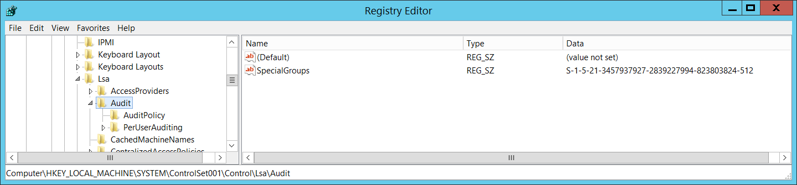

# 4908(S): Special Groups Logon table modified.

**Applies to**
-   Windows 10
-   Windows Server 2016


***Subcategory:***&nbsp;[Audit Policy Change](audit-audit-policy-change.md)

***Event Description:***

This event generates every time Special Groups logon table was modified.

This event also generates during system startup.

This event is always logged regardless of the "Audit Policy Change" sub-category setting.

More information about Special Groups auditing can be found here:

<http://blogs.technet.com/b/askds/archive/2008/03/11/special-groups-auditing-via-group-policy-preferences.aspx>

<https://support.microsoft.com/kb/947223>

> **Note**&nbsp;&nbsp;For recommendations, see [Security Monitoring Recommendations](#security-monitoring-recommendations) for this event.

<br clear="all">

***Event XML:***
```
- <Event xmlns="http://schemas.microsoft.com/win/2004/08/events/event">
- <System>
 <Provider Name="Microsoft-Windows-Security-Auditing" Guid="{54849625-5478-4994-A5BA-3E3B0328C30D}" /> 
 <EventID>4908</EventID> 
 <Version>0</Version> 
 <Level>0</Level> 
 <Task>13568</Task> 
 <Opcode>0</Opcode> 
 <Keywords>0x8020000000000000</Keywords> 
 <TimeCreated SystemTime="2015-10-01T00:20:40.210246600Z" /> 
 <EventRecordID>1049511</EventRecordID> 
 <Correlation /> 
 <Execution ProcessID="516" ThreadID="532" /> 
 <Channel>Security</Channel> 
 <Computer>DC01.contoso.local</Computer> 
 <Security /> 
 </System>
- <EventData>
 <Data Name="SidList">%{S-1-5-21-3457937927-2839227994-823803824-512}</Data> 
 </EventData>
 </Event>

```

***Required Server Roles:*** None.

***Minimum OS Version:*** Windows Server 2008, Windows Vista.

***Event Versions:*** 0.

***Field Descriptions:***

**Special Groups** \[Type = UnicodeString\]**:** contains current list of SIDs (groups or accounts) which are members of Special Groups. Event Viewer automatically tries to resolve SIDs and show the account name. If the SID cannot be resolved, you will see the source data in the event.

> **Note**&nbsp;&nbsp;A **security identifier (SID)** is a unique value of variable length used to identify a trustee (security principal). Each account has a unique SID that is issued by an authority, such as an Active Directory domain controller, and stored in a security database. Each time a user logs on, the system retrieves the SID for that user from the database and places it in the access token for that user. The system uses the SID in the access token to identify the user in all subsequent interactions with Windows security. When a SID has been used as the unique identifier for a user or group, it cannot ever be used again to identify another user or group. For more information about SIDs, see [Security identifiers](/windows/access-protection/access-control/security-identifiers).

“HKEY\_LOCAL\_MACHINE\\SYSTEM\\ControlSet001\\Control\\Lsa\\Audit\\SpecialGroups” registry value contains current list of SIDs which are included in Special Groups:



## Security Monitoring Recommendations

For 4908(S): Special Groups Logon table modified.

-   If you use the Special Groups feature, then this event should be always monitored, especially on high value assets or computers. If this change was not planned, investigate the reason for the change.

-   If you don’t use the Special Groups feature, then this event should be always monitored because it indicates use of the Special Groups feature outside of your standard procedures.

