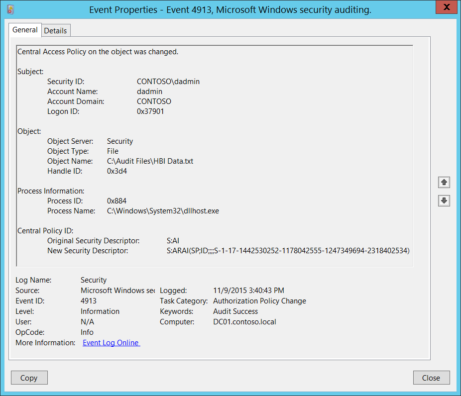
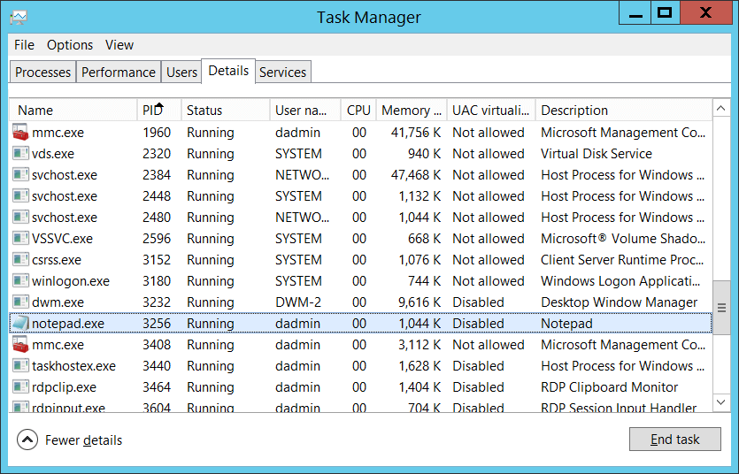

# 4913(S): Central Access Policy on the object was changed



***Subcategory:***&nbsp;[Audit Authorization Policy Change](audit-authorization-policy-change.md)

***Event Description:***

This event generates when a [Central Access Policy](/windows-server/identity/solution-guides/scenario--central-access-policy) on a file system object is changed.

This event always generates, regardless of the object's [SACL](/windows/win32/secauthz/access-control-lists) settings.

> [!NOTE]
> For recommendations, see [Security Monitoring Recommendations](#security-monitoring-recommendations) for this event.


***Event XML:***

```xml
- <Event xmlns="http://schemas.microsoft.com/win/2004/08/events/event">
- <System>
 <Provider Name="Microsoft-Windows-Security-Auditing" Guid="{54849625-5478-4994-A5BA-3E3B0328C30D}" />
 <EventID>4913</EventID>
 <Version>0</Version>
 <Level>0</Level>
 <Task>13570</Task>
 <Opcode>0</Opcode>
 <Keywords>0x8020000000000000</Keywords>
 <TimeCreated SystemTime="2015-11-09T23:40:43.118758100Z" />
 <EventRecordID>1183666</EventRecordID>
 <Correlation />
 <Execution ProcessID="516" ThreadID="524" />
 <Channel>Security</Channel>
 <Computer>DC01.contoso.local</Computer>
 <Security />
 </System>
- <EventData>
 <Data Name="SubjectUserSid">S-1-5-21-3457937927-2839227994-823803824-1104</Data>
 <Data Name="SubjectUserName">dadmin</Data>
 <Data Name="SubjectDomainName">CONTOSO</Data>
 <Data Name="SubjectLogonId">0x37901</Data>
 <Data Name="ObjectServer">Security</Data>
 <Data Name="ObjectType">File</Data>
 <Data Name="ObjectName">C:\\Audit Files\\HBI Data.txt</Data>
 <Data Name="HandleId">0x3d4</Data>
 <Data Name="OldSd">S:AI</Data>
 <Data Name="NewSd">S:ARAI(SP;ID;;;;S-1-17-1442530252-1178042555-1247349694-2318402534)</Data>
 <Data Name="ProcessId">0x884</Data>
 <Data Name="ProcessName">C:\\Windows\\System32\\dllhost.exe</Data>
 </EventData>
 </Event>
```

***Required Server Roles:*** None.

***Minimum OS Version:*** Windows Server 2012, Windows 8.

***Event Versions:*** 0.

***Field Descriptions:***

**Subject:**

-   **Security ID** \[Type = SID\]**:** SID of account that changed the Central Access Policy on the object. Event Viewer automatically tries to resolve SIDs and show the account name. If the SID can't be resolved, you'll see the source data in the event.

> **Note**&nbsp;&nbsp;A **security identifier (SID)** is a unique value of variable length used to identify a trustee (security principal). Each account has a unique SID that is issued by an authority, such as an Active Directory domain controller, and stored in a security database. Each time a user logs on, the system retrieves the SID for that user from the database and places it in the access token for that user. The system uses the SID in the access token to identify the user in all subsequent interactions with Windows security. When a SID has been used as the unique identifier for a user or group, it cannot ever be used again to identify another user or group. For more information about SIDs, see [Security identifiers](/windows/access-protection/access-control/security-identifiers).

-   **Account Name** \[Type = UnicodeString\]**:** the name of the account that changed the Central Access Policy on the object.

-   **Account Domain** \[Type = UnicodeString\]**:** subject's domain or computer name. Formats vary, and include the following ones:

    -   Domain NETBIOS name example: CONTOSO

    -   Lowercase full domain name: contoso.local

    -   Uppercase full domain name: CONTOSO.LOCAL

    -   For some [well-known security principals](/windows-server/identity/ad-ds/manage/understand-security-identifiers), such as LOCAL SERVICE or ANONYMOUS LOGON, the value of this field is "NT AUTHORITY".

    -   For local user accounts, this field will contain the name of the computer or device that this account belongs to, for example: "Win81".

-   **Logon ID** \[Type = HexInt64\]**:** hexadecimal value that can help you correlate this event with recent events that might contain the same Logon ID, for example, "[4624](event-4624.md): An account was successfully logged on."

**Object**:

-   **Object Server** \[Type = UnicodeString\]: has "**Security**" value for this event.

-   **Object Type** \[Type = UnicodeString\]: The type of an object that was accessed during the operation. Always **"File"** for this event.

    The following table contains the list of the most common **Object Types**:

| Directory               | Event        | Timer                | Device       |
|-------------------------|--------------|----------------------|--------------|
| Mutant                  | Type         | File                 | Token        |
| Thread                  | Section      | WindowStation        | DebugObject  |
| FilterCommunicationPort | EventPair    | Driver               | IoCompletion |
| Controller              | SymbolicLink | WmiGuid              | Process      |
| Profile                 | Desktop      | KeyedEvent           | Adapter      |
| Key                     | WaitablePort | Callback             | Semaphore    |
| Job                     | Port         | FilterConnectionPort | ALPC Port    |

-   **Object Name** \[Type = UnicodeString\]: full path and/or name of the object on which the Central Access Policy was changed.

<!-- -->

-   **Handle ID** \[Type = Pointer\]: hexadecimal value of a handle to **Object Name**. This field can help you correlate this event with other events that might contain the same Handle ID, for example, "[4663](event-4663.md)(S): An attempt was made to access an object." This parameter might not be captured in the event, and in that case appears as "0x0".

**Process:**

-   **Process ID** \[Type = Pointer\]: hexadecimal Process ID of the process using which Central Access Policy was changed. Process ID (PID) is a number used by the operating system to uniquely identify an active process. To see the PID for a specific process you can, for example, use Task Manager (Details tab, PID column):

    

    If you convert the hexadecimal value to decimal, you can compare it to the values in Task Manager.

    You can also correlate this process ID with a process ID in other events, for example, "[4688](event-4688.md): A new process has been created" **Process Information\\New Process ID** field.

-   **Process Name** \[Type = UnicodeString\]**:** full path and the name of the executable for the process.

**Central Policy ID:**

-   **Original Security Descriptor** \[Type = UnicodeString\]**:** the Security Descriptor Definition Language (SDDL) value for the old Central Policy ID (for the policy that was formerly applied to the object).

    SDDL contains Central Access Policy SID, here's an example: S:ARAI(SP;ID;;;;S-1-17-1442530252-1178042555-1247349694-2318402534), Central Access Policy SID here is "**S-1-17-1442530252-1178042555-1247349694-2318402534**". To resolve this SID to the real Central Access Policy name, you need to do the following steps:

1.  Find Central Access Policy Active Directory object in: "CN=Central Access Policies,CN=Claims Configuration,CN=Services,CN=Configuration,DC=XXX,DC=XX" Active Directory container.

2.  Open object's "**Properties**".

3.  Find "**msAuthz-CentralAccessPolicyID**" attribute.

4.  Convert hexadecimal value to SID (string).


> If no Central Access Policies were applied to the object, then SDDL will not contain any SIDs, for example "**S:AI**".

-   **New Security Descriptor** \[Type = UnicodeString\]**:** the Security Descriptor Definition Language (SDDL) value for the new Central Policy ID (for the policy that has been applied to the object). See more information in **Central Policy ID\\Original Security Descriptor** field section for this event.

> [!NOTE]
> The **Security Descriptor Definition Language (SDDL)** defines string elements for enumerating information contained in the security descriptor.
>
> Example:
>
> `*O*:BA*G*:SY*D*:(D;;0xf0007;;;AN)(D;;0xf0007;;;BG)(A;;0xf0007;;;SY)(A;;0×7;;;BA)*S*:ARAI(AU;SAFA;DCLCRPCRSDWDWO;;;WD)`
>
> - *O*: = Owner. SID of specific security principal, or reserved (pre-defined) value, for example: BA (BUILTIN\_ADMINISTRATORS), WD (Everyone), SY (LOCAL\_SYSTEM), etc.
> See the list of possible values in the table below:

| Value | Description                          | Value | Description                     |
|-------|--------------------------------------|-------|---------------------------------|
| "AO"  | Account operators                    | "PA"  | Group Policy administrators     |
| "RU"  | Alias to allow previous Windows 2000 | "IU"  | Interactively logged-on user    |
| "AN"  | Anonymous sign in                      | "LA"  | Local administrator             |
| "AU"  | Authenticated users                  | "LG"  | Local guest                     |
| "BA"  | Built-in administrators              | "LS"  | Local service account           |
| "BG"  | Built-in guests                      | "SY"  | Local system                    |
| "BO"  | Backup operators                     | "NU"  | Network sign-in user              |
| "BU"  | Built-in users                       | "NO"  | Network configuration operators |
| "CA"  | Certificate server administrators    | "NS"  | Network service account         |
| "CG"  | Creator group                        | "PO"  | Printer operators               |
| "CO"  | Creator owner                        | "PS"  | Personal self                   |
| "DA"  | Domain administrators                | "PU"  | Power users                     |
| "DC"  | Domain computers                     | "RS"  | RAS servers group               |
| "DD"  | Domain controllers                   | "RD"  | Terminal server users           |
| "DG"  | Domain guests                        | "RE"  | Replicator                      |
| "DU"  | Domain users                         | "RC"  | Restricted code                 |
| "EA"  | Enterprise administrators            | "SA"  | Schema administrators           |
| "ED"  | Enterprise domain controllers        | "SO"  | Server operators                |
| "WD"  | Everyone                             | "SU"  | Service sign-in user              |

- *G*: = Primary Group.
- *D*: = DACL Entries.
- *S*: = SACL Entries.

*DACL/SACL entry format:* entry\_type:inheritance\_flags(ace\_type;ace\_flags;rights;object\_guid;inherit\_object\_guid;account\_sid)

Example: D:(A;;FA;;;WD)

- entry\_type:

"D" - DACL

"S" - SACL

- inheritance\_flags:

"P" - SDDL\_PROTECTED, Inheritance from containers that are higher in the folder hierarchy are blocked.

"AI" - SDDL\_AUTO\_INHERITED, Inheritance is allowed, assuming that "P" isn't also set.

"AR" - SDDL\_AUTO\_INHERIT\_REQ, Child objects inherit permissions from this object.

- ace\_type:

"A" - ACCESS ALLOWED

"D" - ACCESS DENIED

"OA" - OBJECT ACCESS ALLOWED: only applies to a subset of the object(s).

"OD" - OBJECT ACCESS DENIED: only applies to a subset of the object(s).

"AU" - SYSTEM AUDIT

"A" - SYSTEM ALARM

"OU" - OBJECT SYSTEM AUDIT

"OL" - OBJECT SYSTEM ALARM

- ace\_flags:

"CI" - CONTAINER INHERIT: Child objects that are containers, such as directories, inherit the ACE as an explicit ACE.

"OI" - OBJECT INHERIT: Child objects that aren't containers inherit the ACE as an explicit ACE.

"NP" - NO PROPAGATE: only immediate children inherit this ace.

"IO" - INHERITANCE ONLY: ace doesn't apply to this object, but may affect children via inheritance.

"ID" - ACE IS INHERITED

"SA" - SUCCESSFUL ACCESS AUDIT

"FA" - FAILED ACCESS AUDIT
- rights: A hexadecimal string that denotes the access mask or reserved value, for example: FA (File All Access), FX (File Execute), FW (File Write), etc.

| Value                      | Description                     | Value                | Description              |
|----------------------------|---------------------------------|----------------------|--------------------------|
| Generic access rights      | Directory service access rights |
| "GA"                       | GENERIC ALL                     | "RC"                 | Read Permissions         |
| "GR"                       | GENERIC READ                    | "SD"                 | Delete                   |
| "GW"                       | GENERIC WRITE                   | "WD"                 | Modify Permissions       |
| "GX"                       | GENERIC EXECUTE                 | "WO"                 | Modify Owner             |
| File access rights         | "RP"                            | Read All Properties  |
| "FA"                       | FILE ALL ACCESS                 | "WP"                 | Write All Properties     |
| "FR"                       | FILE GENERIC READ               | "CC"                 | Create All Child Objects |
| "FW"                       | FILE GENERIC WRITE              | "DC"                 | Delete All Child Objects |
| "FX"                       | FILE GENERIC EXECUTE            | "LC"                 | List Contents            |
| Registry key access rights | "SW"                            | All Validated Writes |
| "KA"                       | "LO"                            | "LO"                 | List Object              |
| "K"                        | KEY READ                        | "DT"                 | Delete Subtree           |
| "KW"                       | KEY WRITE                       | "CR"                 | All Extended Rights      |
| "KX"                       | KEY EXECUTE                     |                      |                          |

- object\_guid: N/A
- inherit\_object\_guid: N/A
- account\_sid: SID of specific security principal, or reserved value, for example: AN (Anonymous), WD (Everyone), SY (LOCAL\_SYSTEM), etc. For more information, see the table above.

For more information about SDDL syntax, see these articles:

- [2.5.1.1 Syntax](/openspecs/windows_protocols/ms-dtyp/f4296d69-1c0f-491f-9587-a960b292d070)
- [ACCESS_MASK](/windows/win32/secauthz/access-mask)

## Security Monitoring Recommendations

For 4913(S): Central Access Policy on the object was changed.

> [!IMPORTANT]
> For this event, also see [Appendix A: Security monitoring recommendations for many audit events](appendix-a-security-monitoring-recommendations-for-many-audit-events.md).

-   If you need to monitor events related to specific Windows object types ("**Object Type**"), for example **File** or **Key**, monitor this event for the corresponding "**Object Type**."

-   If you need to monitor all changes to specific files or folders (in this case, changes to the Central Access Policy), monitor for the "**Object Name**" that corresponds to the file or folder.

-   If you have a pre-defined "**Process Name**" for the process reported in this event, monitor all events with "**Process Name**" not equal to your defined value.

-   You can monitor to see if "**Process Name**" isn't in a standard folder (for example, not in **System32** or **Program Files**) or is in a restricted folder (for example, **Temporary Internet Files**).

-   If you have a pre-defined list of restricted substrings or words in process names (for example, "**mimikatz**" or "**cain.exe**"), check for these substrings in "**Process Name**."

-   If you have specific files, folders, or entire systems to which a specific Central Access Policy should be applied, you can monitor this event and compare the Central Access Policy SID in "**New Security Descriptor**" to see if it matches the expected policy.
