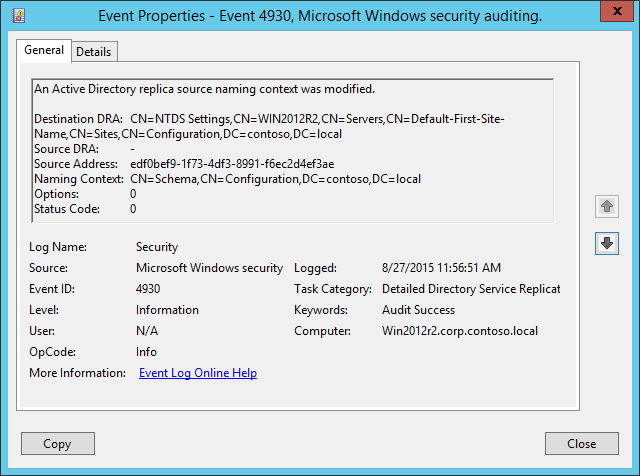

# 4930(S, F): An Active Directory replica source naming context was modified.

**Applies to**
-   Windows 10
-   Windows Server 2016




***Subcategory:***&nbsp;[Audit Detailed Directory Service Replication](audit-detailed-directory-service-replication.md)

***Event Description:***

This event generates every time Active Directory replica source naming context was modified.

Failure event generates if an error occurs (**Status Code** != 0).

It is not possible to understand what exactly was modified from this event.

> **Note**&nbsp;&nbsp;For recommendations, see [Security Monitoring Recommendations](#security-monitoring-recommendations) for this event.

<br clear="all">

***Event XML:***
```
- <Event xmlns="http://schemas.microsoft.com/win/2004/08/events/event">
- <System>
 <Provider Name="Microsoft-Windows-Security-Auditing" Guid="{54849625-5478-4994-A5BA-3E3B0328C30D}" /> 
 <EventID>4930</EventID> 
 <Version>0</Version> 
 <Level>0</Level> 
 <Task>14083</Task> 
 <Opcode>0</Opcode> 
 <Keywords>0x8020000000000000</Keywords> 
 <TimeCreated SystemTime="2015-08-27T18:56:51.474057400Z" /> 
 <EventRecordID>1564</EventRecordID> 
 <Correlation /> 
 <Execution ProcessID="504" ThreadID="1280" /> 
 <Channel>Security</Channel> 
 <Computer>Win2012r2.corp.contoso.local</Computer> 
 <Security /> 
 </System>
- <EventData>
 <Data Name="DestinationDRA">CN=NTDS Settings,CN=WIN2012R2,CN=Servers,CN=Default-First-Site-Name,CN=Sites,CN=Configuration,DC=contoso,DC=local</Data> 
 <Data Name="SourceDRA">-</Data> 
 <Data Name="SourceAddr">edf0bef9-1f73-4df3-8991-f6ec2d4ef3ae</Data> 
 <Data Name="NamingContext">CN=Schema,CN=Configuration,DC=contoso,DC=local</Data> 
 <Data Name="Options">0</Data> 
 <Data Name="StatusCode">0</Data> 
 </EventData>
 </Event>
```

***Required Server Roles:*** Active Directory domain controller.

***Minimum OS Version:*** Windows Server 2008.

***Event Versions:*** 0.

***Field Descriptions:***

-   **Destination DRA** \[Type = UnicodeString\]: destination directory replication agent distinguished name.

> **Note**&nbsp;&nbsp;The **Directory Replication Agent (DRA)** handles replication between domain controllers. The Directory Replication Agent uses the connection objects in the topology map to find out those partners that are relevant when replicating changes to directory partitions. The DRA sends a replication request to the partners of a domain controller when the domain controller needs to update its copy of Active Directory.

-   **Source DRA** \[Type = UnicodeString\]: source directory replication agent distinguished name. Typically equals “**-**“ for this event.

> **Note**&nbsp;&nbsp;The LDAP API references an LDAP object by its **distinguished name (DN)**. A DN is a sequence of relative distinguished names (RDN) connected by commas.
> 
> An RDN is an attribute with an associated value in the form attribute=value; . These are examples of RDNs attributes:
> 
> • DC - domainComponent
> 
> • CN - commonName
> 
> • OU - organizationalUnitName
> 
> • O - organizationName

-   **Source Address** \[Type = UnicodeString\]: DNS record of computer from which the modification request was received.

-   **Naming Context** \[Type = UnicodeString\]**:** naming context which was modified.

> **Note**&nbsp;&nbsp;The Directory Tree of Active Directory tree is partitioned to allow sections to be distributed (replicated) to domain controllers in different domains within the forest. Each domain controller stores a copy of a specific part of the directory tree, called a **Naming Context** also known as Directory Partition. **Naming Context** is replicated as a unit to other domain controllers in the forest that contain a replica of the same sub tree. A **Naming Context** is also called a Directory Partition.

-   **Options** \[Type = UInt32\]: decimal value of [DRS Options](https://msdn.microsoft.com/library/cc228477.aspx).

-   **Status Code** \[Type = UInt32\]**:** if there are no issues or errors, the status code will be 0. If an error happened, you will receive Failure event and Status Code will not be equal to “**0**”. You can check error code meaning here: <https://msdn.microsoft.com/library/windows/desktop/ms681381(v=vs.85).aspx>

## Security Monitoring Recommendations

For 4930(S, F): An Active Directory replica source naming context was modified.

-   Monitor for **Source Address** field, because the source of the request must be authorized for this action. If you find any unauthorized DRA you should trigger an event.

-   This event is typically used for Active Directory replication troubleshooting.

