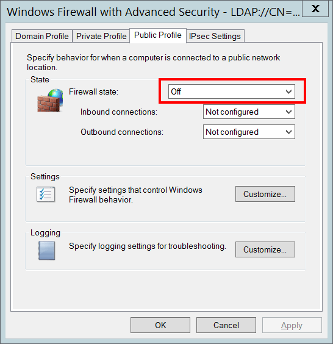

# 4944(S): The following policy was active when the Windows Firewall started.


***Subcategory:***&nbsp;[Audit MPSSVC Rule-Level Policy Change](audit-mpssvc-rule-level-policy-change.md)

***Event Description:***

This event generates every time Windows Firewall service starts.

This event shows Windows Firewall settings that were in effect when the Windows Firewall service started.

> **Note**&nbsp;&nbsp;For recommendations, see [Security Monitoring Recommendations](#security-monitoring-recommendations) for this event.

<br clear="all">

***Event XML:***
```
- <Event xmlns="http://schemas.microsoft.com/win/2004/08/events/event">
- <System>
 <Provider Name="Microsoft-Windows-Security-Auditing" Guid="{54849625-5478-4994-A5BA-3E3B0328C30D}" /> 
 <EventID>4944</EventID> 
 <Version>0</Version> 
 <Level>0</Level> 
 <Task>13571</Task> 
 <Opcode>0</Opcode> 
 <Keywords>0x8020000000000000</Keywords> 
 <TimeCreated SystemTime="2015-10-03T00:14:56.644728300Z" /> 
 <EventRecordID>1050808</EventRecordID> 
 <Correlation /> 
 <Execution ProcessID="500" ThreadID="2216" /> 
 <Channel>Security</Channel> 
 <Computer>DC01.contoso.local</Computer> 
 <Security /> 
 </System>
- <EventData>
 <Data Name="GroupPolicyApplied">No</Data> 
 <Data Name="Profile">Public</Data> 
 <Data Name="OperationMode">Off</Data> 
 <Data Name="RemoteAdminEnabled">Disabled</Data> 
 <Data Name="MulticastFlowsEnabled">Enabled</Data> 
 <Data Name="LogDroppedPacketsEnabled">Disabled</Data> 
 <Data Name="LogSuccessfulConnectionsEnabled">Disabled</Data> 
 </EventData>
 </Event>

```

***Required Server Roles:*** None.

***Minimum OS Version:*** Windows Server 2008, Windows Vista.

***Event Versions:*** 0.

***Field Descriptions:***

**Group Policy Applied** \[Type = UnicodeString\]: it always has “No” value for this event. This field should show information about: was Group Policy applied for Windows Firewall when it starts or not.

**Profile Used** \[Type = UnicodeString\]: shows the active profile name for the moment Windows Firewall service starts. It always has value “**Public**” for this event, because when this event generates, the active profile is not switched to “**Domain**” or “**Private**”. Typically you will see “[4956](event-4956.md)(S): Windows Firewall has changed the active profile” after this event, which will tell you the real active profile.

**Operational mode** \[Type = UnicodeString\]:

-   **On** – if “**Firewall state:**” setting was set to “On” for “Public” profile.

-   **Off** - if “**Firewall state:**” setting was set to “Off” for “Public” profile.



**Allow Remote Administration** \[Type = UnicodeString\]: looks like this setting is connected to ”[Windows Firewall: Allow remote administration exception](/previous-versions/windows/it-pro/windows-server-2003/cc738900(v=ws.10))” Group Policy setting, but it is always Disabled, no matter which option is set for “[Windows Firewall: Allow remote administration exception](/previous-versions/windows/it-pro/windows-server-2003/cc738900(v=ws.10))” Group Policy.

**Allow Unicast Responses to Multicast/Broadcast Traffic** \[Type = UnicodeString\]:

-   **Enabled** - if “**Allow unicast response:**” Settings configuration was set to “Yes” for “Public” profile.

-   **Disabled** - if “**Allow unicast response:**” Settings configuration was set to “No” for “Public” profile.


**Security Logging:**

-   **Log Dropped Packets** \[Type = UnicodeString\]:

    -   **Enabled** – if “**Log dropped packets:**” Logging configuration was set to “Yes” for “Public” profile.

    -   **Disabled** - if “**Log dropped packets:**” Logging configuration was set to “No” for “Public” profile.

-   **Log Successful Connections** \[Type = UnicodeString\]:

    -   **Enabled** - if “**Log successful connections:**” Logging configuration was set to “Yes” for “Public” profile.

    -   **Disabled** - if “**Log dropped packets:**” Logging configuration was set to “No” for “Public” profile.


## Security Monitoring Recommendations

For 4944(S): The following policy was active when the Windows Firewall started.

-   If you have a standard or baseline for Windows Firewall settings defined for **Public** profile (which can be the same as for Domain, for example), monitor this event and check whether the settings reported by the event are still the same as were defined in your standard or baseline.

-   Unfortunately this event shows configuration only for **Public** profile, but you can still compare all the settings with your organization's Windows Firewall baseline for Public profile on different computers and trigger an alert if the configuration is not the same.