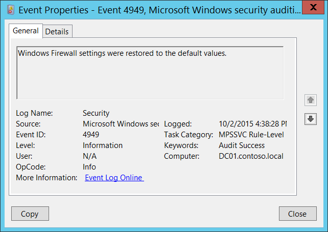

# 4949(S): Windows Firewall settings were restored to the default values.




***Subcategory:***&nbsp;[Audit MPSSVC Rule-Level Policy Change](audit-mpssvc-rule-level-policy-change.md)

***Event Description:***

This event generates when Windows Firewall settings were locally restored to the default configuration.

> **Note**&nbsp;&nbsp;For recommendations, see [Security Monitoring Recommendations](#security-monitoring-recommendations) for this event.

<br clear="all">

***Event XML:***
```
- <Event xmlns="http://schemas.microsoft.com/win/2004/08/events/event">
- <System>
 <Provider Name="Microsoft-Windows-Security-Auditing" Guid="{54849625-5478-4994-A5BA-3E3B0328C30D}" /> 
 <EventID>4949</EventID> 
 <Version>0</Version> 
 <Level>0</Level> 
 <Task>13571</Task> 
 <Opcode>0</Opcode> 
 <Keywords>0x8020000000000000</Keywords> 
 <TimeCreated SystemTime="2015-10-02T23:38:28.804003300Z" /> 
 <EventRecordID>1049926</EventRecordID> 
 <Correlation /> 
 <Execution ProcessID="500" ThreadID="3768" /> 
 <Channel>Security</Channel> 
 <Computer>DC01.contoso.local</Computer> 
 <Security /> 
 </System>
 <EventData /> 
 </Event>

```

***Required Server Roles:*** None.

***Minimum OS Version:*** Windows Server 2008, Windows Vista.

***Event Versions:*** 0.

## Security Monitoring Recommendations

For 4949(S): Windows Firewall settings were restored to the default values.

-   You shouldn’t see this event during normal Windows Firewall operations, because it should be intentionally done by user or software. This event should be always monitored and an alert should be triggered, especially on critical computers or devices.

-   This event can be helpful in case you want to monitor all changes of Firewall rules which were done locally, especially restores to default configuration.

