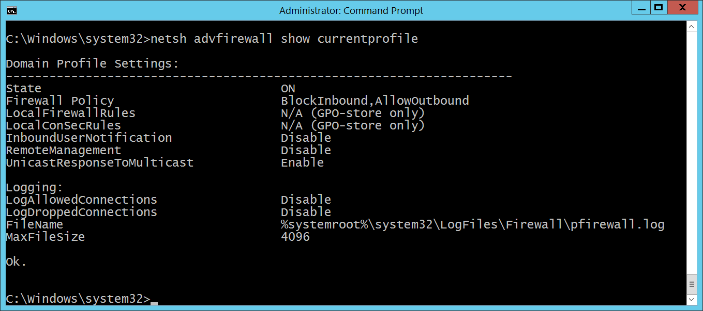

# 4950(S): A Windows Firewall setting has changed.

**Applies to**
-   Windows 10
-   Windows Server 2016


***Subcategory:***&nbsp;[Audit MPSSVC Rule-Level Policy Change](audit-mpssvc-rule-level-policy-change.md)

***Event Description:***

This event generates when Windows Firewall local setting was changed.

This event doesn't generate when Windows Firewall setting was changed via Group Policy.

> **Note**&nbsp;&nbsp;For recommendations, see [Security Monitoring Recommendations](#security-monitoring-recommendations) for this event.

<br clear="all">

***Event XML:***
```
- <Event xmlns="http://schemas.microsoft.com/win/2004/08/events/event">
- <System>
 <Provider Name="Microsoft-Windows-Security-Auditing" Guid="{54849625-5478-4994-A5BA-3E3B0328C30D}" /> 
 <EventID>4950</EventID> 
 <Version>0</Version> 
 <Level>0</Level> 
 <Task>13571</Task> 
 <Opcode>0</Opcode> 
 <Keywords>0x8020000000000000</Keywords> 
 <TimeCreated SystemTime="2015-10-03T21:38:08.086908400Z" /> 
 <EventRecordID>1050944</EventRecordID> 
 <Correlation /> 
 <Execution ProcessID="500" ThreadID="924" /> 
 <Channel>Security</Channel> 
 <Computer>DC01.contoso.local</Computer> 
 <Security /> 
 </System>
- <EventData>
 <Data Name="ProfileChanged">Domain</Data> 
 <Data Name="SettingType">Default Outbound Action</Data> 
 <Data Name="SettingValue">Block</Data> 
 </EventData>
 </Event>

```

***Required Server Roles:*** None.

***Minimum OS Version:*** Windows Server 2008, Windows Vista.

***Event Versions:*** 0.

***Field Descriptions:***

**Changed Profile** \[Type = UnicodeString\]**:** the name of profile in which setting was changed. Possible values are:

-   Public

-   Domain

-   Private

**New Setting:**

-   **Type** \[Type = UnicodeString\]: the name of the setting which was modified. You can use “**netsh advfirewall**” command to see or set Windows Firewall settings, for example, to see settings for current\\active Windows Firewall profile you need to execute “**netsh advfirewall show currentprofile**” command:



-   **Value** \[Type = UnicodeString\]: new value of modified setting.

## Security Monitoring Recommendations

For 4950(S): A Windows Firewall setting has changed.

-   If you have a standard or baseline for Windows Firewall settings defined, monitor this event and check whether the settings reported by the event are still the same as were defined in your standard or baseline.

-   This event can be helpful in case you want to monitor all changes in Windows Firewall settings which were done locally.

