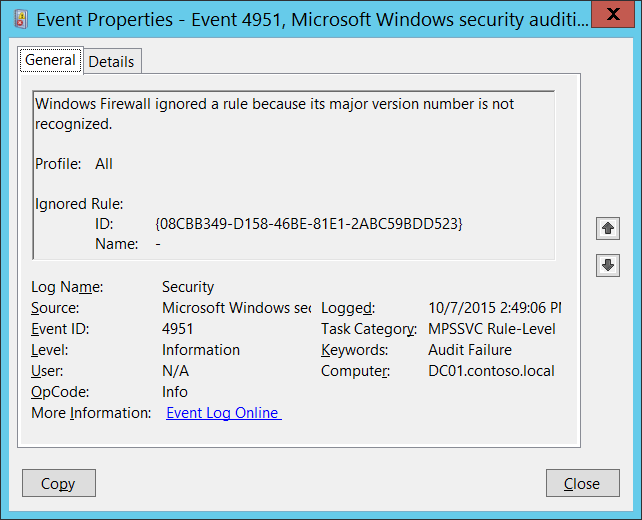

# 4951(F): A rule has been ignored because its major version number was not recognized by Windows Firewall.

**Applies to**
-   Windows 10
-   Windows Server 2016




***Subcategory:***&nbsp;[Audit MPSSVC Rule-Level Policy Change](audit-mpssvc-rule-level-policy-change.md)

***Event Description:***

When you create or edit a Windows Firewall rule, the settings that you can include depend upon the version of Windows you use when creating the rule. As new settings are added to later versions of Windows or to service packs for existing versions of Windows, the version number of the rules processing engine is updated, and that version number is stamped into rules that are created by using that version of Windows. For example, Windows Vista produces firewall rules that are stamped with version "v2.0". Future versions of Windows might use "v2.1", or "v3.0" to indicate, respectively, minor or major changes and additions.

If you create a firewall rule on a newer version of Windows that references firewall settings that are not available on earlier versions of Windows, and then try to deploy that rule to computers running the earlier version of Windows, the firewall engine produces this error to indicate that it cannot process the rule.

The only solution is to remove the incompatible rule, and then deploy a compatible rule.

> **Note**&nbsp;&nbsp;For recommendations, see [Security Monitoring Recommendations](#security-monitoring-recommendations) for this event.

<br clear="all">

***Event XML:***
```
- <Event xmlns="http://schemas.microsoft.com/win/2004/08/events/event">
- <System>
 <Provider Name="Microsoft-Windows-Security-Auditing" Guid="{54849625-5478-4994-A5BA-3E3B0328C30D}" /> 
 <EventID>4951</EventID> 
 <Version>0</Version> 
 <Level>0</Level> 
 <Task>13571</Task> 
 <Opcode>0</Opcode> 
 <Keywords>0x8010000000000000</Keywords> 
 <TimeCreated SystemTime="2015-10-07T21:49:06.951537900Z" /> 
 <EventRecordID>1052309</EventRecordID> 
 <Correlation /> 
 <Execution ProcessID="524" ThreadID="556" /> 
 <Channel>Security</Channel> 
 <Computer>DC01.contoso.local</Computer> 
 <Security /> 
 </System>
- <EventData>
 <Data Name="Profile">All</Data> 
 <Data Name="RuleId">{08CBB349-D158-46BE-81E1-2ABC59BDD523}</Data> 
 <Data Name="RuleName">-</Data> 
 </EventData>
 </Event>

```

***Required Server Roles:*** None.

***Minimum OS Version:*** Windows Server 2008, Windows Vista.

***Event Versions:*** 0.

***Field Descriptions:***

**Profile** \[Type = UnicodeString\]**:** the name of the profile of the ignored rule. Possible values are:

-   All

-   Domain,Public

-   Domain,Private

-   Private,Public

-   Public

-   Domain

-   Private

**Ignored Rule:**

-   **ID** \[Type = UnicodeString\]: the unique identifier for ignored firewall rule.

    To see the unique ID of the rule you need to navigate to “**HKEY\_LOCAL\_MACHINE\\SYSTEM\\CurrentControlSet\\Services\\SharedAccess\\Parameters\\FirewallPolicy\\FirewallRules”** registry key and you will see the list of Windows Firewall rule IDs (Name column) with parameters:


-   **Name** \[Type = UnicodeString\]: the name of the rule which was ignored. You can see the name of Windows Firewall rule using Windows Firewall with Advanced Security management console (**wf.msc**), check “Name” column:


## Security Monitoring Recommendations

For 4951(F): A rule has been ignored because its major version number was not recognized by Windows Firewall.

-   This event can be a sign of software issues, Windows Firewall registry errors or corruption, or Group Policy setting misconfigurations. We recommend monitoring this event and investigating the reason for the condition. Typically this event indicates configuration issues, not security issues.

