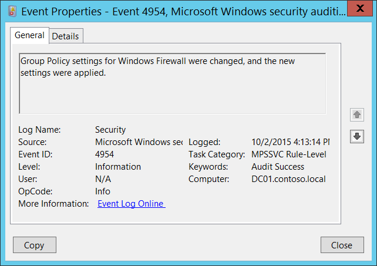

# 4954(S): Windows Firewall Group Policy settings have changed. The new settings have been applied.

**Applies to**
-   Windows 10
-   Windows Server 2016




***Subcategory:***&nbsp;[Audit MPSSVC Rule-Level Policy Change](audit-mpssvc-rule-level-policy-change.md)

***Event Description:***

This event generates every time Windows Firewall group policy is changed, locally or from Active Directory Group Policy.

This event generates every time local Group Policy is refreshed, even if no Windows Firewall settings were modified or presented.

> **Note**&nbsp;&nbsp;For recommendations, see [Security Monitoring Recommendations](#security-monitoring-recommendations) for this event.

<br clear="all">

***Event XML:***
```
- <Event xmlns="http://schemas.microsoft.com/win/2004/08/events/event">
- <System>
 <Provider Name="Microsoft-Windows-Security-Auditing" Guid="{54849625-5478-4994-A5BA-3E3B0328C30D}" /> 
 <EventID>4954</EventID> 
 <Version>0</Version> 
 <Level>0</Level> 
 <Task>13571</Task> 
 <Opcode>0</Opcode> 
 <Keywords>0x8020000000000000</Keywords> 
 <TimeCreated SystemTime="2015-10-02T23:13:14.527924800Z" /> 
 <EventRecordID>1049893</EventRecordID> 
 <Correlation /> 
 <Execution ProcessID="500" ThreadID="2284" /> 
 <Channel>Security</Channel> 
 <Computer>DC01.contoso.local</Computer> 
 <Security /> 
 </System>
 <EventData /> 
 </Event>

```

***Required Server Roles:*** None.

***Minimum OS Version:*** Windows Server 2008, Windows Vista.

***Event Versions:*** 0.

## Security Monitoring Recommendations

For 4954(S): Windows Firewall Group Policy settings have changed. The new settings have been applied.

-   Unfortunately this event generates every time local Group Policy is refreshed and does not indicate that settings really were modified. Typically this event can be ignored.

