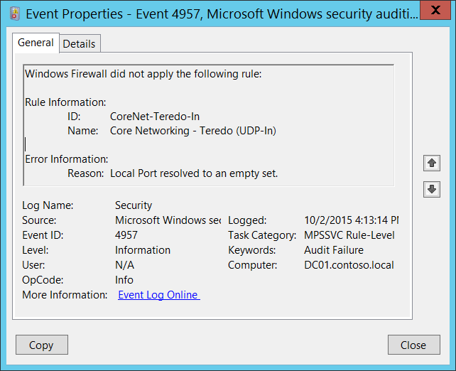

# 4957(F): Windows Firewall did not apply the following rule.




***Subcategory:***&nbsp;[Audit MPSSVC Rule-Level Policy Change](audit-mpssvc-rule-level-policy-change.md)

***Event Description:***

This event generates when Windows Firewall starts or apply new rule, and the rule can't be applied for some reason.

> **Note**&nbsp;&nbsp;For recommendations, see [Security Monitoring Recommendations](#security-monitoring-recommendations) for this event.

<br clear="all">

***Event XML:***
```
- <Event xmlns="http://schemas.microsoft.com/win/2004/08/events/event">
- <System>
 <Provider Name="Microsoft-Windows-Security-Auditing" Guid="{54849625-5478-4994-A5BA-3E3B0328C30D}" /> 
 <EventID>4957</EventID> 
 <Version>0</Version> 
 <Level>0</Level> 
 <Task>13571</Task> 
 <Opcode>0</Opcode> 
 <Keywords>0x8010000000000000</Keywords> 
 <TimeCreated SystemTime="2015-10-02T23:13:14.496678500Z" /> 
 <EventRecordID>1049892</EventRecordID> 
 <Correlation /> 
 <Execution ProcessID="500" ThreadID="2284" /> 
 <Channel>Security</Channel> 
 <Computer>DC01.contoso.local</Computer> 
 <Security /> 
 </System>
- <EventData>
 <Data Name="RuleId">CoreNet-Teredo-In</Data> 
 <Data Name="RuleName">Core Networking - Teredo (UDP-In)</Data> 
 <Data Name="RuleAttr">Local Port</Data> 
 </EventData>
 </Event>

```

***Required Server Roles:*** None.

***Minimum OS Version:*** Windows Server 2008, Windows Vista.

***Event Versions:*** 0.

***Field Descriptions:***

**Rule Information:**

-   **ID** \[Type = UnicodeString\]: the unique identifier for not applied firewall rule.

    To see the unique ID of the rule, you need to navigate to “**HKEY\_LOCAL\_MACHINE\\SYSTEM\\CurrentControlSet\\Services\\SharedAccess\\Parameters\\FirewallPolicy\\FirewallRules”** registry key and you'll see the list of Windows Firewall rule IDs (Name column) with parameters:


-   **Name** \[Type = UnicodeString\]: the name of the rule that wasn't applied. You can see the name of Windows Firewall rule using Windows Firewall with Advanced Security management console (**wf.msc**), check “Name” column:


**Error Information:**

-   **Reason** \[Type = UnicodeString\]: the reason why the rule wasn't applied.

## Security Monitoring Recommendations

For 4957(F): Windows Firewall did not apply the following rule.

-   This event can be a sign of software issues, Windows Firewall registry errors or corruption, or Group Policy setting misconfigurations. We recommend monitoring this event and investigating the reason for the condition. Typically this event indicates configuration issues, not security issues.

