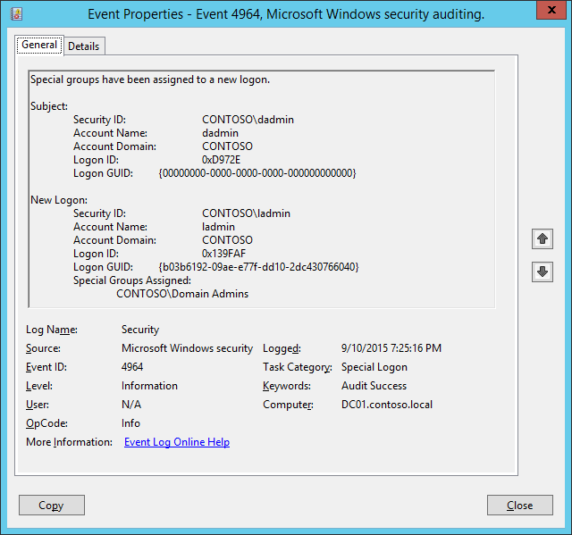

# 4964(S): Special groups have been assigned to a new logon.




***Subcategory:***&nbsp;[Audit Special Logon](audit-special-logon.md)

***Event Description:***

This event occurs when an account that is a member of any defined [Special Group](https://techcommunity.microsoft.com/t5/ask-the-directory-services-team/special-groups-auditing-via-group-policy-preferences/ba-p/395095) logs in.

> **Note**&nbsp;&nbsp;For recommendations, see [Security Monitoring Recommendations](#security-monitoring-recommendations) for this event.

<br clear="all">

***Event XML:***
```
- <Event xmlns="http://schemas.microsoft.com/win/2004/08/events/event">
- <System>
 <Provider Name="Microsoft-Windows-Security-Auditing" Guid="{54849625-5478-4994-A5BA-3E3B0328C30D}" /> 
 <EventID>4964</EventID> 
 <Version>0</Version> 
 <Level>0</Level> 
 <Task>12548</Task> 
 <Opcode>0</Opcode> 
 <Keywords>0x8020000000000000</Keywords> 
 <TimeCreated SystemTime="2015-09-11T02:25:16.236443300Z" /> 
 <EventRecordID>238923</EventRecordID> 
 <Correlation /> 
 <Execution ProcessID="504" ThreadID="5008" /> 
 <Channel>Security</Channel> 
 <Computer>DC01.contoso.local</Computer> 
 <Security /> 
 </System>
- <EventData>
 <Data Name="SubjectUserSid">S-1-5-21-3457937927-2839227994-823803824-1104</Data> 
 <Data Name="SubjectUserName">dadmin</Data> 
 <Data Name="SubjectDomainName">CONTOSO</Data> 
 <Data Name="SubjectLogonId">0xd972e</Data> 
 <Data Name="LogonGuid">{00000000-0000-0000-0000-000000000000}</Data> 
 <Data Name="TargetUserSid">S-1-5-21-3457937927-2839227994-823803824-500</Data> 
 <Data Name="TargetUserName">ladmin</Data> 
 <Data Name="TargetDomainName">CONTOSO</Data> 
 <Data Name="TargetLogonId">0x139faf</Data> 
 <Data Name="TargetLogonGuid">{B03B6192-09AE-E77F-DD10-2DC430766040}</Data> 
 <Data Name="SidList">%{S-1-5-21-3457937927-2839227994-823803824-512}</Data> 
 </EventData>
 </Event>

```

***Required Server Roles:*** None.

***Minimum OS Version:*** Windows Server 2008, Windows Vista.

***Event Versions:*** 0.

> **Note**&nbsp;&nbsp;Special Groups is a new feature in Windows Vista and in Windows Server 2008. The Special Groups feature lets the administrator find out when a member of a certain group logs on to the computer. The Special Groups feature lets an administrator set a list of group security identifiers (SIDs) in the registry.

&gt; To add Special Groups perform the following actions:

&gt; 1. Open Registry Editor.

&gt; 2. Locate and then click the following registry subkey: HKEY\_LOCAL\_MACHINE\\System\\CurrentControlSet\\Control\\Lsa\\Audit

&gt; 3. On the Edit menu, point to New, and then click String Value.

&gt; 4. Type SpecialGroups, and then press ENTER.

&gt; 5. Right-click SpecialGroups, and then click Modify.

&gt; 6. In the Value date box, type the group SIDs, and then click OK.

&gt; A semicolon character (;) can be used to delimit the SID list. For example, you can use the following string that contains a semicolon to delimit two SIDs:

&gt; S-1-5-32-544;S-1-5-32-123-54-65

&gt; For more information see: <https://blogs.technet.com/b/askds/archive/2008/03/11/special-groups-auditing-via-group-policy-preferences.aspx>

***Field Descriptions:***

**Subject:**

-   **Security ID** \[Type = SID\]**:** SID of account that requested logon for **New Logon** account. Event Viewer automatically tries to resolve SIDs and show the account name. If the SID cannot be resolved, you will see the source data in the event.

> **Note**&nbsp;&nbsp;A **security identifier (SID)** is a unique value of variable length used to identify a trustee (security principal). Each account has a unique SID that is issued by an authority, such as an Active Directory domain controller, and stored in a security database. Each time a user logs on, the system retrieves the SID for that user from the database and places it in the access token for that user. The system uses the SID in the access token to identify the user in all subsequent interactions with Windows security. When a SID has been used as the unique identifier for a user or group, it cannot ever be used again to identify another user or group. For more information about SIDs, see [Security identifiers](/windows/access-protection/access-control/security-identifiers).

-   **Account Name** \[Type = UnicodeString\]**:** the name of the account that requested logon for **New Logon** account.

-   **Account Domain** \[Type = UnicodeString\]**:** subject’s domain or computer name. Formats vary, and include the following:

    -   Domain NETBIOS name example: CONTOSO

    -   Lowercase full domain name: contoso.local

    -   Uppercase full domain name: CONTOSO.LOCAL

    -   For some [well-known security principals](/windows/security/identity-protection/access-control/security-identifiers), such as LOCAL SERVICE or ANONYMOUS LOGON, the value of this field is “NT AUTHORITY”.

    -   For local user accounts, this field will contain the name of the computer or device that this account belongs to, for example: “Win81”.

-   **Logon ID** \[Type = HexInt64\]**:** hexadecimal value that can help you correlate this event with recent events that might contain the same Logon ID, for example, “[4624](event-4624.md): An account was successfully logged on.”

-   **Logon GUID** \[Type = GUID\]: a GUID that can help you correlate this event with another event that can contain the same **Logon GUID**, “[4769](event-4769.md)(S, F): A Kerberos service ticket was requested event on a domain controller.

    It also can be used for correlation between a 4964 event and several other events (on the same computer) that can contain the same **Logon GUID**, “[4648](event-4648.md)(S): A logon was attempted using explicit credentials” and “[4624](event-4624.md)(S): An account was successfully logged on.”

    This parameter might not be captured in the event, and in that case appears as “{00000000-0000-0000-0000-000000000000}”.

> **Note**&nbsp;&nbsp;**GUID** is an acronym for 'Globally Unique Identifier'. It is a 128-bit integer number used to identify resources, activities or instances.

**New Logon:**

-   **Security ID** \[Type = SID\]**:** SID of account that performed the logon. Event Viewer automatically tries to resolve SIDs and show the account name. If the SID cannot be resolved, you will see the source data in the event.

-   **Account Name** \[Type = UnicodeString\]**:** the name of the account that performed the logon.

-   **Account Domain** \[Type = UnicodeString\]**:** subject’s domain or computer name. Formats vary, and include the following:

    -   Domain NETBIOS name example: CONTOSO

    -   Lowercase full domain name: contoso.local

    -   Uppercase full domain name: CONTOSO.LOCAL

    -   For some [well-known security principals](/windows/security/identity-protection/access-control/security-identifiers), such as LOCAL SERVICE or ANONYMOUS LOGON, the value of this field is “NT AUTHORITY”.

    -   For local user accounts, this field will contain the name of the computer or device that this account belongs to, for example: “Win81”.

-   **Logon ID** \[Type = HexInt64\]**:** hexadecimal value that can help you correlate this event with recent events that might contain the same Logon ID, for example, “[4624](event-4624.md): An account was successfully logged on.”

-   **Logon GUID** \[Type = GUID\]: a GUID that can help you correlate this event with another event that can contain the same **Logon GUID**, “[4769](event-4769.md)(S, F): A Kerberos service ticket was requested event on a domain controller.

    It also can be used for correlation between a 4964 event and several other events (on the same computer) that can contain the same **Logon GUID**, “[4648](event-4648.md)(S): A logon was attempted using explicit credentials” and “[4624](event-4624.md)(S): An account was successfully logged on.”

    This parameter might not be captured in the event, and in that case appears as “{00000000-0000-0000-0000-000000000000}”.

-   **Special Groups Assigned** \[Type = UnicodeString\]: the list of special group SIDs, which **New Logon\\Security ID** is a member of.

## Security Monitoring Recommendations

For 4964(S): Special groups have been assigned to a new logon.

-   Generally speaking, every [4964](event-4964.md) event should be monitored, because the purpose of Special Groups is to define a list of critical or important groups (Domain Admins, Enterprise Admins, service account groups, and so on) and trigger an event every time a member of these groups logs on to a computer. For example, you can monitor for every Domain Administrators logon to a non-administrative workstation.

