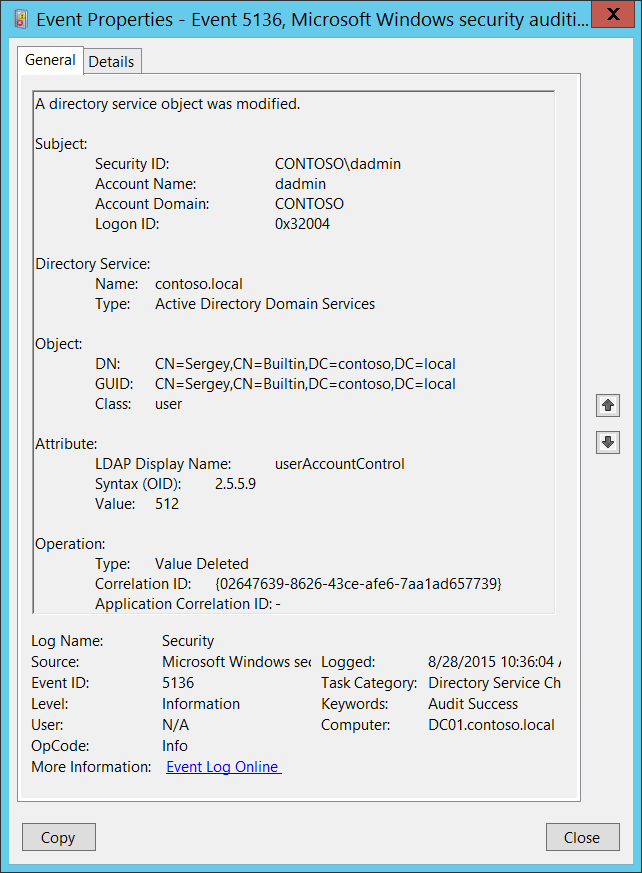

# 5136(S): A directory service object was modified.

**Applies to**
-   Windows 10
-   Windows Server 2016




***Subcategory:***&nbsp;[Audit Directory Service Changes](audit-directory-service-changes.md)

***Event Description:***

This event generates every time an Active Directory object is modified.

To generate this event, the modified object must have an appropriate entry in [SACL](https://msdn.microsoft.com/library/windows/desktop/aa374872(v=vs.85).aspx): the “**Write”** action auditing for specific attributes.

For a change operation you will typically see two 5136 events for one action, with different **Operation\\Type** fields: “Value Deleted” and then “Value Added”. “Value Deleted” event typically contains previous value and “Value Added” event contains new value.

> **Note**&nbsp;&nbsp;For recommendations, see [Security Monitoring Recommendations](#security-monitoring-recommendations) for this event.

<br clear="all">

***Event XML:***
```
- <Event xmlns="http://schemas.microsoft.com/win/2004/08/events/event">
- <System>
 <Provider Name="Microsoft-Windows-Security-Auditing" Guid="{54849625-5478-4994-A5BA-3E3B0328C30D}" /> 
 <EventID>5136</EventID> 
 <Version>0</Version> 
 <Level>0</Level> 
 <Task>14081</Task> 
 <Opcode>0</Opcode> 
 <Keywords>0x8020000000000000</Keywords> 
 <TimeCreated SystemTime="2015-08-28T17:36:04.129472600Z" /> 
 <EventRecordID>410204</EventRecordID> 
 <Correlation /> 
 <Execution ProcessID="516" ThreadID="4020" /> 
 <Channel>Security</Channel> 
 <Computer>DC01.contoso.local</Computer> 
 <Security /> 
 </System>
- <EventData>
 <Data Name="OpCorrelationID">{02647639-8626-43CE-AFE6-7AA1AD657739}</Data> 
 <Data Name="AppCorrelationID">-</Data> 
 <Data Name="SubjectUserSid">S-1-5-21-3457937927-2839227994-823803824-1104</Data> 
 <Data Name="SubjectUserName">dadmin</Data> 
 <Data Name="SubjectDomainName">CONTOSO</Data> 
 <Data Name="SubjectLogonId">0x32004</Data> 
 <Data Name="DSName">contoso.local</Data> 
 <Data Name="DSType">%%14676</Data> 
 <Data Name="ObjectDN">CN=Sergey,CN=Builtin,DC=contoso,DC=local</Data> 
 <Data Name="ObjectGUID">{4FE80A66-5F93-4F73-B215-68678058E613}</Data> 
 <Data Name="ObjectClass">user</Data> 
 <Data Name="AttributeLDAPDisplayName">userAccountControl</Data> 
 <Data Name="AttributeSyntaxOID">2.5.5.9</Data> 
 <Data Name="AttributeValue">512</Data> 
 <Data Name="OperationType">%%14675</Data> 
 </EventData>
 </Event>

```

***Required Server Roles:*** Active Directory domain controller.

***Minimum OS Version:*** Windows Server 2008.

***Event Versions:*** 0.

***Field Descriptions:***

**Subject:**

-   **Security ID** \[Type = SID\]**:** SID of account that requested the “modify object” operation. Event Viewer automatically tries to resolve SIDs and show the account name. If the SID cannot be resolved, you will see the source data in the event.

> **Note**&nbsp;&nbsp;A **security identifier (SID)** is a unique value of variable length used to identify a trustee (security principal). Each account has a unique SID that is issued by an authority, such as an Active Directory domain controller, and stored in a security database. Each time a user logs on, the system retrieves the SID for that user from the database and places it in the access token for that user. The system uses the SID in the access token to identify the user in all subsequent interactions with Windows security. When a SID has been used as the unique identifier for a user or group, it cannot ever be used again to identify another user or group. For more information about SIDs, see [Security identifiers](/windows/access-protection/access-control/security-identifiers).

-   **Account Name** \[Type = UnicodeString\]**:** the name of the account that requested the “modify object” operation.

-   **Account Domain** \[Type = UnicodeString\]**:** subject’s domain or computer name. Formats vary, and include the following:

    -   Domain NETBIOS name example: CONTOSO

    -   Lowercase full domain name: contoso.local

    -   Uppercase full domain name: CONTOSO.LOCAL

    -   For some [well-known security principals](https://support.microsoft.com/kb/243330), such as LOCAL SERVICE or ANONYMOUS LOGON, the value of this field is “NT AUTHORITY”.

    -   For local user accounts, this field will contain the name of the computer or device that this account belongs to, for example: “Win81”.

-   **Logon ID** \[Type = HexInt64\]**:** hexadecimal value that can help you correlate this event with recent events that might contain the same Logon ID, for example, “[4624](event-4624.md): An account was successfully logged on.”

**Directory Service:**

-   **Name** \[Type = UnicodeString\]: the name of the Active Directory domain where the modified object is located.

-   **Type** \[Type = UnicodeString\]**:** has “**Active Directory Domain Services**” value for this event.

**Object:**

-   **DN** \[Type = UnicodeString\]: distinguished name of the object that was modified.

> **Note**&nbsp;&nbsp;The LDAP API references an LDAP object by its **distinguished name (DN)**. A DN is a sequence of relative distinguished names (RDN) connected by commas.

> An RDN is an attribute with an associated value in the form attribute=value; . These are examples of RDNs attributes:

> • DC - domainComponent

> • CN - commonName

> • OU - organizationalUnitName

> • O - organizationName

-   **GUID** \[Type = GUID\]**:** each Active Directory object has globally unique identifier (GUID), which is a 128-bit value that is unique not only in the enterprise but also across the world. GUIDs are assigned to every object created by Active Directory. Each object's GUID is stored in its Object-GUID (**objectGUID**) property.

    Active Directory uses GUIDs internally to identify objects. For example, the GUID is one of an object's properties that is published in the global catalog. Searching the global catalog for a User object's GUID will yield results if the user has an account somewhere in the enterprise. In fact, searching for any object by Object-GUID might be the most reliable way of finding the object you want to find. The values of other object properties can change, but the Object-GUID never changes. When an object is assigned a GUID, it keeps that value for life.

    Event Viewer automatically resolves **GUID** field to real object.

    To translate this GUID, use the following procedure:

    -   Perform the following LDAP search using LDP.exe tool:

        -   Base DN: CN=Schema,CN=Configuration,DC=XXX,DC=XXX

        -   Filter: (&(objectClass=\*)(objectGUID=GUID))

            -   Perform the following operations with the GUID before using it in a search request:

                -   We have this GUID to search for: a6b34ab5-551b-4626-b8ee-2b36b3ee6672

                -   Take first 3 sections a6b34ab5-551b-4626.

                -   For each of these 3 sections you need to change (Invert) the order of bytes, like this b54ab3a6-1b55-2646

                -   Add the last 2 sections without transformation: b54ab3a6-1b55-2646-b8ee-2b36b3ee6672

                -   Delete - : b54ab3a61b552646b8ee2b36b3ee6672

                -   Divide bytes with backslashes: \\b5\\4a\\b3\\a6\\1b\\55\\26\\46\\b8\\ee\\2b\\36\\b3\\ee\\66\\72

            -   Filter example: (&(objectClass=\*)(objectGUID = \\b5\\4a\\b3\\a6\\1b\\55\\26\\46\\b8\\ee\\2b\\36\\b3\\ee\\66\\72))

        -   Scope: Subtree

        -   Attributes: objectGUID

<!-- -->

-   **Class** \[Type = UnicodeString\]: class of the object that was modified. Some of the common Active Directory object classes:

    -   container – for containers.

    -   user – for users.

    -   group – for groups.

    -   domainDNS – for domain object.

    -   groupPolicyContainer – for group policy objects.

        For all possible values of this field open Active Directory Schema snap-in (see how to enable this snap-in: <https://technet.microsoft.com/library/Cc755885(v=WS.10).aspx>) and navigate to **Active Directory Schema\\Classes**. Or use this document: <https://msdn.microsoft.com/library/cc221630.aspx>

**Attribute:**

-   **LDAP Display Name** \[Type = UnicodeString\]**:** the object attribute that was modified.

> **Note**&nbsp;&nbsp;[LDAP Display Name](https://msdn.microsoft.com/library/ms676828(v=vs.85).aspx) is the name used by LDAP clients, such as the ADSI LDAP provider, to read and write the attribute by using the LDAP protocol.

-   **Syntax (OID)** \[Type = UnicodeString\]**:** The syntax for an attribute defines the storage representation, byte ordering, and matching rules for comparisons of property types. Whether the attribute value must be a string, a number, or a unit of time is also defined. Every attribute of every object is associated with exactly one syntax. The syntaxes are not represented as objects in the schema, but they are programmed to be understood by Active Directory. The allowable syntaxes in Active Directory are predefined.

| OID      | Syntax Name                                | Description                                              |
|----------|--------------------------------------------|----------------------------------------------------------|
| 2.5.5.0  | Undefined                                  | Not a legal syntax.                                      |
| 2.5.5.1  | Object(DN-DN)                              | The fully qualified name of an object in the directory.  |
| 2.5.5.2  | String(Object-Identifier)                  | The object identifier.                                   |
| 2.5.5.3  | Case-Sensitive String                      | General String.                                          |
| 2.5.5.4  | CaseIgnoreString(Teletex)                  | Differentiates uppercase and lowercase.                  |
| 2.5.5.5  | String(Printable), String(IA5)             | Teletex. Does not differentiate uppercase and lowercase. |
| 2.5.5.6  | String(Numeric)                            | Printable string or IA5-String.                          |
| 2.5.5.7  | Object(DN-Binary)                          | Both character sets are case-sensitive.                  |
| 2.5.5.8  | Boolean                                    | A sequence of digits.                                    |
| 2.5.5.9  | Integer, Enumeration                       | A distinguished name plus a binary large object.         |
| 2.5.5.10 | String(Octet)                              | TRUE or FALSE values.                                    |
| 2.5.5.11 | String(UTC-Time), String(Generalized-Time) | A 32-bit number or enumeration.                          |
| 2.5.5.12 | String(Unicode)                            | A string of bytes.                                       |
| 2.5.5.13 | Object(Presentation-Address)               | UTC Time or Generalized-Time.                            |
| 2.5.5.14 | Object(DN-String)                          | Unicode string.                                          |
| 2.5.5.15 | String(NT-Sec-Desc)                        | Presentation address.                                    |
| 2.5.5.16 | LargeInteger                               | A DN-String plus a Unicode string.                       |
| 2.5.5.17 | String(Sid)                                | A Microsoft® Windows NT® Security descriptor.            |

> Table 10. LDAP Attribute Syntax OIDs.

-   **Value** \[Type = UnicodeString\]: the value which was added or deleted, depending on the **Operation\\Type** field.

**Operation:**

-   **Type** \[Type = UnicodeString\]**:** type of performed operation.

    -   **Value Added** – new value added.

    -   **Value Deleted** – value deleted (typically “Value Deleted” is a part of change operation).

<!-- -->

-   **Correlation ID** \[Type = GUID\]: multiple modifications are often executed as one operation via LDAP. This value allows you to correlate all the modification events that comprise the operation. Just look for other events from current subcategory with the same **Correlation ID**, for example “[5137](event-5137.md): A directory service object was created.” and “[5139](event-5139.md): A directory service object was moved.”

> **Note**&nbsp;&nbsp;**GUID** is an acronym for 'Globally Unique Identifier'. It is a 128-bit integer number used to identify resources, activities or instances.

-   **Application Correlation ID** \[Type = UnicodeString\]: always has “**-**“ value. Not in use.

## Security Monitoring Recommendations

For 5136(S): A directory service object was modified.

> **Important**&nbsp;&nbsp;For this event, also see [Appendix A: Security monitoring recommendations for many audit events](appendix-a-security-monitoring-recommendations-for-many-audit-events.md).

-   If you need to monitor modifications to specific Active Directory objects, monitor for **DN** field with specific object name. For example, we recommend that you monitor all modifications to “**CN=AdminSDHolder,CN=System,DC=domain,DC=com”** object.

-   If you need to monitor modifications to specific Active Directory classes, monitor for **Class** field with specific class name. For example, we recommend that you monitor all modifications to **domainDNS** class.

-   If you need to monitor modifications to specific Active Directory attributes, monitor for **LDAP Display Name** field with specific attribute name.

-   It is better to monitor **Operation\\Type = Value Added** events, because you will see the new value of attribute. At the same time you can correlate to previous **Operation\\Type = Value Deleted** event with the same **Correlation ID** to see the previous value.

