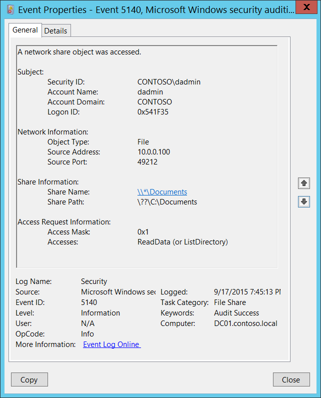

# 5140(S, F): A network share object was accessed.

**Applies to**
-   Windows 10
-   Windows Server 2016




***Subcategory:***&nbsp;[Audit File Share](audit-file-share.md)

***Event Description:***

This event generates every time network share object was accessed.

This event generates once per session, when first access attempt was made.

> **Note**&nbsp;&nbsp;For recommendations, see [Security Monitoring Recommendations](#security-monitoring-recommendations) for this event.

<br clear="all">

***Event XML:***
```
- <Event xmlns="http://schemas.microsoft.com/win/2004/08/events/event">
- <System>
 <Provider Name="Microsoft-Windows-Security-Auditing" Guid="{54849625-5478-4994-A5BA-3E3B0328C30D}" /> 
 <EventID>5140</EventID> 
 <Version>1</Version> 
 <Level>0</Level> 
 <Task>12808</Task> 
 <Opcode>0</Opcode> 
 <Keywords>0x8020000000000000</Keywords> 
 <TimeCreated SystemTime="2015-09-18T02:45:13.581231400Z" /> 
 <EventRecordID>268495</EventRecordID> 
 <Correlation /> 
 <Execution ProcessID="4" ThreadID="772" /> 
 <Channel>Security</Channel> 
 <Computer>DC01.contoso.local</Computer> 
 <Security /> 
 </System>
- <EventData>
 <Data Name="SubjectUserSid">S-1-5-21-3457937927-2839227994-823803824-1104</Data> 
 <Data Name="SubjectUserName">dadmin</Data> 
 <Data Name="SubjectDomainName">CONTOSO</Data> 
 <Data Name="SubjectLogonId">0x541f35</Data> 
 <Data Name="ObjectType">File</Data> 
 <Data Name="IpAddress">10.0.0.100</Data> 
 <Data Name="IpPort">49212</Data> 
 <Data Name="ShareName">\\\\\*\\Documents</Data> 
 <Data Name="ShareLocalPath">\\??\\C:\\Documents</Data> 
 <Data Name="AccessMask">0x1</Data> 
 <Data Name="AccessList">%%4416</Data> 
 </EventData>
 </Event>

```

***Required Server Roles:*** None.

***Minimum OS Version:*** Windows Server 2008, Windows Vista.

***Event Versions:***

-   0 - Windows Server 2008, Windows Vista.

***Field Descriptions:***

**Subject:**

-   **Security ID** \[Type = SID\]**:** SID of account that requested access to network share object. Event Viewer automatically tries to resolve SIDs and show the account name. If the SID cannot be resolved, you will see the source data in the event.

> **Note**&nbsp;&nbsp;A **security identifier (SID)** is a unique value of variable length used to identify a trustee (security principal). Each account has a unique SID that is issued by an authority, such as an Active Directory domain controller, and stored in a security database. Each time a user logs on, the system retrieves the SID for that user from the database and places it in the access token for that user. The system uses the SID in the access token to identify the user in all subsequent interactions with Windows security. When a SID has been used as the unique identifier for a user or group, it cannot ever be used again to identify another user or group. For more information about SIDs, see [Security identifiers](/windows/access-protection/access-control/security-identifiers).

-   **Account Name** \[Type = UnicodeString\]**:** the name of the account that requested access to network share object.

-   **Account Domain** \[Type = UnicodeString\]**:** subject’s domain or computer name. Formats vary, and include the following:

    -   Domain NETBIOS name example: CONTOSO

    -   Lowercase full domain name: contoso.local

    -   Uppercase full domain name: CONTOSO.LOCAL

    -   For some [well-known security principals](https://support.microsoft.com/kb/243330), such as LOCAL SERVICE or ANONYMOUS LOGON, the value of this field is “NT AUTHORITY”.

    -   For local user accounts, this field will contain the name of the computer or device that this account belongs to, for example: “Win81”.

-   **Logon ID** \[Type = HexInt64\]**:** hexadecimal value that can help you correlate this event with recent events that might contain the same Logon ID, for example, “[4624](event-4624.md): An account was successfully logged on.”

**Network Information:**

-   **Object Type** \[Type = UnicodeString\]: The type of an object that was accessed during the operation. Always “**File**” for this event.

    The following table contains the list of the most common **Object Types**:

| Directory               | Event        | Timer                | Device       |
|-------------------------|--------------|----------------------|--------------|
| Mutant                  | Type         | File                 | Token        |
| Thread                  | Section      | WindowStation        | DebugObject  |
| FilterCommunicationPort | EventPair    | Driver               | IoCompletion |
| Controller              | SymbolicLink | WmiGuid              | Process      |
| Profile                 | Desktop      | KeyedEvent           | Adapter      |
| Key                     | WaitablePort | Callback             | Semaphore    |
| Job                     | Port         | FilterConnectionPort | ALPC Port    |

-   **Source Address** \[Type = UnicodeString\]**:** source IP address from which access was performed.

    -   IPv6 address or ::ffff:IPv4 address of a client.

    -   ::1 or 127.0.0.1 means localhost.

-   **Source Port** \[Type = UnicodeString\]: source TCP or UDP port which was used from remote or local machine to request the access.

    -   0 for local access attempts.

**Share Information:**

-   **Share Name** \[Type = UnicodeString\]**:** the name of accessed network share. The format is: \\\\\*\\SHARE\_NAME.

-   **Share Path** \[Type = UnicodeString\]**:** the full system (NTFS) path for accessed share. The format is: \\\\??\\PATH. Can be empty, for example for **Share Name**: \\\\\*\\IPC$.

**Access Request Information:**

-   **Access Mask** \[Type = HexInt32\]: the sum of hexadecimal values of requested access rights. See “Table 13. File access codes.” for different hexadecimal values for access rights. Has always “**0x1**” value for this event.

-   **Accesses** \[Type = UnicodeString\]: the list of access rights which were requested by **Subject\\Security ID**. These access rights depend on **Object Type**. Has always “**ReadData (or ListDirectory)**” value for this event.

## Security Monitoring Recommendations

For 5140(S, F): A network share object was accessed.

> **Important**&nbsp;&nbsp;For this event, also see [Appendix A: Security monitoring recommendations for many audit events](appendix-a-security-monitoring-recommendations-for-many-audit-events.md).

-   If you have high-value computers for which you need to monitor all access to all shares or specific shares (“**Share Name**”), monitor this event**.** For example, you could monitor share **C$** on domain controllers.

-   Monitor this event if the **Network Information\\Source Address** is not from your internal IP range.

-   Monitor this event if the **Network Information\\Source Address** should not be able to connect with the specific computer (**Computer:**).

-   If you need to monitor access attempts to local shares from a specific IP address (“**Network Information\\Source Address”)**, use this event.

-   If you need to monitor for specific Access Types (for example, ReadData or WriteData), for all or specific shares (“**Share Name**”), monitor this event for the “**Access Type**.”

