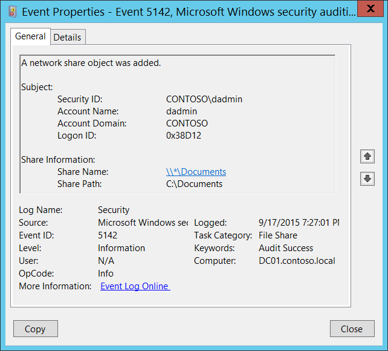

# 5142(S): A network share object was added.




***Subcategory:***&nbsp;[Audit File Share](audit-file-share.md)

***Event Description:***

This event generates every time network share object was added.

> **Note**&nbsp;&nbsp;For recommendations, see [Security Monitoring Recommendations](#security-monitoring-recommendations) for this event.

<br clear="all">

***Event XML:***
```
- <Event xmlns="http://schemas.microsoft.com/win/2004/08/events/event">
- <System>
 <Provider Name="Microsoft-Windows-Security-Auditing" Guid="{54849625-5478-4994-A5BA-3E3B0328C30D}" /> 
 <EventID>5142</EventID> 
 <Version>0</Version> 
 <Level>0</Level> 
 <Task>12808</Task> 
 <Opcode>0</Opcode> 
 <Keywords>0x8020000000000000</Keywords> 
 <TimeCreated SystemTime="2015-09-18T02:27:01.206646900Z" /> 
 <EventRecordID>268462</EventRecordID> 
 <Correlation /> 
 <Execution ProcessID="4" ThreadID="4304" /> 
 <Channel>Security</Channel> 
 <Computer>DC01.contoso.local</Computer> 
 <Security /> 
 </System>
- <EventData>
 <Data Name="SubjectUserSid">S-1-5-21-3457937927-2839227994-823803824-1104</Data> 
 <Data Name="SubjectUserName">dadmin</Data> 
 <Data Name="SubjectDomainName">CONTOSO</Data> 
 <Data Name="SubjectLogonId">0x38d12</Data> 
 <Data Name="ShareName">\\\\\*\\Documents</Data> 
 <Data Name="ShareLocalPath">C:\\Documents</Data> 
 </EventData>
 </Event>
```

***Required Server Roles:*** None.

***Minimum OS Version:*** Windows Server 2008 R2, Windows 7.

***Event Versions:*** 0.

***Field Descriptions:***

**Subject:**

-   **Security ID** \[Type = SID\]**:** SID of account that requested the “add network share object” operation. Event Viewer automatically tries to resolve SIDs and show the account name. If the SID cannot be resolved, you will see the source data in the event.

> **Note**&nbsp;&nbsp;A **security identifier (SID)** is a unique value of variable length used to identify a trustee (security principal). Each account has a unique SID that is issued by an authority, such as an Active Directory domain controller, and stored in a security database. Each time a user logs on, the system retrieves the SID for that user from the database and places it in the access token for that user. The system uses the SID in the access token to identify the user in all subsequent interactions with Windows security. When a SID has been used as the unique identifier for a user or group, it cannot ever be used again to identify another user or group. For more information about SIDs, see [Security identifiers](/windows/access-protection/access-control/security-identifiers).

-   **Account Name** \[Type = UnicodeString\]**:** the name of the account that requested the “add network share object” operation.

-   **Account Domain** \[Type = UnicodeString\]**:** subject’s domain or computer name. Formats vary, and include the following:

    -   Domain NETBIOS name example: CONTOSO

    -   Lowercase full domain name: contoso.local

    -   Uppercase full domain name: CONTOSO.LOCAL

    -   For some [well-known security principals](/windows/security/identity-protection/access-control/security-identifiers), such as LOCAL SERVICE or ANONYMOUS LOGON, the value of this field is “NT AUTHORITY”.

    -   For local user accounts, this field will contain the name of the computer or device that this account belongs to, for example: “Win81”.

-   **Logon ID** \[Type = HexInt64\]**:** hexadecimal value that can help you correlate this event with recent events that might contain the same Logon ID, for example, “[4624](event-4624.md): An account was successfully logged on.”

**Share Information:**

-   **Share Name** \[Type = UnicodeString\]**:** the name of the added share object. The format is: \\\\\*\\SHARE\_NAME.

-   **Share Path** \[Type = UnicodeString\]**:** the full system (NTFS) path for the added share object. The format is: \\\\??\\PATH.

## Security Monitoring Recommendations

For 5142(S): A network share object was added.

> **Important**&nbsp;&nbsp;For this event, also see [Appendix A: Security monitoring recommendations for many audit events](appendix-a-security-monitoring-recommendations-for-many-audit-events.md).

- If you have high-value computers for which you need to monitor creation of new file shares, monitor this event<b>.</b> For example, you could monitor domain controllers.

- We recommend checking “**Share Path**”, because it should not point to system directories, such as **C:\\Windows** or **C:\\**, or to critical local folders which contain private or high value information.

