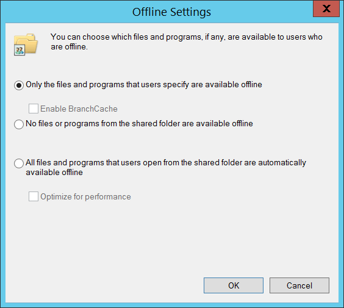

# 5143(S): A network share object was modified.

**Applies to**
-   Windows 10
-   Windows Server 2016


***Subcategory:***&nbsp;[Audit File Share](audit-file-share.md)

***Event Description:***

This event generates every time network share object was modified.

> **Note**&nbsp;&nbsp;For recommendations, see [Security Monitoring Recommendations](#security-monitoring-recommendations) for this event.

<br clear="all">

***Event XML:***
```
- <Event xmlns="http://schemas.microsoft.com/win/2004/08/events/event">
- <System>
 <Provider Name="Microsoft-Windows-Security-Auditing" Guid="{54849625-5478-4994-A5BA-3E3B0328C30D}" /> 
 <EventID>5143</EventID> 
 <Version>0</Version> 
 <Level>0</Level> 
 <Task>12808</Task> 
 <Opcode>0</Opcode> 
 <Keywords>0x8020000000000000</Keywords> 
 <TimeCreated SystemTime="2015-09-18T02:42:56.743298600Z" /> 
 <EventRecordID>268483</EventRecordID> 
 <Correlation /> 
 <Execution ProcessID="516" ThreadID="524" /> 
 <Channel>Security</Channel> 
 <Computer>DC01.contoso.local</Computer> 
 <Security /> 
 </System>
- <EventData>
 <Data Name="SubjectUserSid">S-1-5-21-3457937927-2839227994-823803824-1104</Data> 
 <Data Name="SubjectUserName">dadmin</Data> 
 <Data Name="SubjectDomainName">CONTOSO</Data> 
 <Data Name="SubjectLogonId">0x38d12</Data> 
 <Data Name="ObjectType">Directory</Data> 
 <Data Name="ShareName">\\\\\*\\Documents</Data> 
 <Data Name="ShareLocalPath">C:\\Documents</Data> 
 <Data Name="OldRemark">N/A</Data> 
 <Data Name="NewRemark">N/A</Data> 
 <Data Name="OldMaxUsers">0xffffffff</Data> 
 <Data Name="NewMaxUsers">0xffffffff</Data> 
 <Data Name="OldShareFlags">0x800</Data> 
 <Data Name="NewShareFlags">0x800</Data> 
 <Data Name="OldSD">O:S-1-5-21-3457937927-2839227994-823803824-1104G:DAD:(A;OICI;FA;;;BA)(A;OICI;FA;;;WD)</Data> 
 <Data Name="NewSD">O:BAG:DAD:(D;;FA;;;S-1-5-21-3457937927-2839227994-823803824-1104)(A;OICI;FA;;;WD)(A;OICI;FA;;;BA)</Data> 
 </EventData>
 </Event>
```

***Required Server Roles:*** None.

***Minimum OS Version:*** Windows Server 2008 R2, Windows 7.

***Event Versions:*** 0.

***Field Descriptions:***

**Subject:**

-   **Security ID** \[Type = SID\]**:** SID of account that requested the “modify network share object” operation. Event Viewer automatically tries to resolve SIDs and show the account name. If the SID cannot be resolved, you will see the source data in the event.

> **Note**&nbsp;&nbsp;A **security identifier (SID)** is a unique value of variable length used to identify a trustee (security principal). Each account has a unique SID that is issued by an authority, such as an Active Directory domain controller, and stored in a security database. Each time a user logs on, the system retrieves the SID for that user from the database and places it in the access token for that user. The system uses the SID in the access token to identify the user in all subsequent interactions with Windows security. When a SID has been used as the unique identifier for a user or group, it cannot ever be used again to identify another user or group. For more information about SIDs, see [Security identifiers](/windows/access-protection/access-control/security-identifiers).

-   **Account Name** \[Type = UnicodeString\]**:** the name of the account that requested the “modify network share object” operation.

-   **Account Domain** \[Type = UnicodeString\]**:** subject’s domain or computer name. Formats vary, and include the following:

    -   Domain NETBIOS name example: CONTOSO

    -   Lowercase full domain name: contoso.local

    -   Uppercase full domain name: CONTOSO.LOCAL

    -   For some [well-known security principals](https://support.microsoft.com/kb/243330), such as LOCAL SERVICE or ANONYMOUS LOGON, the value of this field is “NT AUTHORITY”.

    -   For local user accounts, this field will contain the name of the computer or device that this account belongs to, for example: “Win81”.

-   **Logon ID** \[Type = HexInt64\]**:** hexadecimal value that can help you correlate this event with recent events that might contain the same Logon ID, for example, “[4624](event-4624.md): An account was successfully logged on.”

**Share Information:**

-   **Object Type** \[Type = UnicodeString\]: The type of an object that was modified. Always “**Directory**” for this event.

    The following table contains the list of the most common **Object Types**:

| Directory               | Event        | Timer                | Device       |
|-------------------------|--------------|----------------------|--------------|
| Mutant                  | Type         | File                 | Token        |
| Thread                  | Section      | WindowStation        | DebugObject  |
| FilterCommunicationPort | EventPair    | Driver               | IoCompletion |
| Controller              | SymbolicLink | WmiGuid              | Process      |
| Profile                 | Desktop      | KeyedEvent           | Adapter      |
| Key                     | WaitablePort | Callback             | Semaphore    |
| Job                     | Port         | FilterConnectionPort | ALPC Port    |

-   **Share Name** \[Type = UnicodeString\]**:** the name of the modified share object. The format is: \\\\\*\\SHARE\_NAME

-   **Share Path** \[Type = UnicodeString\]**:** the full system (NTFS) path for the added share object. The format is: \\\\??\\PATH. Can be empty, for example for **Share Name**: \\\\\*\\IPC$.


-   **Old Remark** \[Type = UnicodeString\]: the old value of network share “**Comments:**” field. Has “**N/A**” value if it is not set.

-   **New Remark** \[Type = UnicodeString\]: the new value of network share “**Comments:**” field. Has “**N/A**” value if it is not set.

-   **Old MaxUsers** \[Type = HexInt32\]: old hexadecimal value of “**Limit the number of simultaneous user to:**” field. Has “**0xFFFFFFFF**” value if the number of connections is unlimited.

-   **New Maxusers** \[Type = HexInt32\]**:** new hexadecimal value of “**Limit the number of simultaneous user to:**” field. Has “**0xFFFFFFFF**” value if the number of connections is unlimited.

-   **Old ShareFlags** \[Type = HexInt32\]: old hexadecimal value of “**Offline Settings**” caching settings window flags.



-   **New ShareFlags** \[Type = HexInt32\]: new hexadecimal value of “**Offline Settings**” caching settings window flags.

-   **Old SD** \[Type = UnicodeString\]**:** the old Security Descriptor Definition Language (SDDL) value for network share security descriptor.

-   **New SD** \[Type = UnicodeString\]**:** the new Security Descriptor Definition Language (SDDL) value for network share security descriptor.

> **Note**&nbsp;&nbsp;The **Security Descriptor Definition Language (SDDL)** defines string elements for enumerating information contained in the security descriptor.
> 
> Example:
> 
> *O*:BA*G*:SY*D*:(D;;0xf0007;;;AN)(D;;0xf0007;;;BG)(A;;0xf0007;;;SY)(A;;0×7;;;BA)*S*:ARAI(AU;SAFA;DCLCRPCRSDWDWO;;;WD)
> 
> - *O*: = Owner. SID of specific security principal, or reserved (pre-defined) value, for example: BA (BUILTIN\_ADMINISTRATORS), WD (Everyone), SY (LOCAL\_SYSTEM), etc. 
> See the list of possible values in the table below:

| Value | Description                          | Value | Description                     |
|-------|--------------------------------------|-------|---------------------------------|
| "AO"  | Account operators                    | "PA"  | Group Policy administrators     |
| "RU"  | Alias to allow previous Windows 2000 | "IU"  | Interactively logged-on user    |
| "AN"  | Anonymous logon                      | "LA"  | Local administrator             |
| "AU"  | Authenticated users                  | "LG"  | Local guest                     |
| "BA"  | Built-in administrators              | "LS"  | Local service account           |
| "BG"  | Built-in guests                      | "SY"  | Local system                    |
| "BO"  | Backup operators                     | "NU"  | Network logon user              |
| "BU"  | Built-in users                       | "NO"  | Network configuration operators |
| "CA"  | Certificate server administrators    | "NS"  | Network service account         |
| "CG"  | Creator group                        | "PO"  | Printer operators               |
| "CO"  | Creator owner                        | "PS"  | Personal self                   |
| "DA"  | Domain administrators                | "PU"  | Power users                     |
| "DC"  | Domain computers                     | "RS"  | RAS servers group               |
| "DD"  | Domain controllers                   | "RD"  | Terminal server users           |
| "DG"  | Domain guests                        | "RE"  | Replicator                      |
| "DU"  | Domain users                         | "RC"  | Restricted code                 |
| "EA"  | Enterprise administrators            | "SA"  | Schema administrators           |
| "ED"  | Enterprise domain controllers        | "SO"  | Server operators                |
| "WD"  | Everyone                             | "SU"  | Service logon user              |

- *G*: = Primary Group.
- *D*: = DACL Entries.
- *S*: = SACL Entries.

*DACL/SACL entry format:* entry\_type:inheritance\_flags(ace\_type;ace\_flags;rights;object\_guid;inherit\_object\_guid;account\_sid)

Example: D:(A;;FA;;;WD)

- entry\_type:

“D” - DACL

“S” - SACL

- inheritance\_flags:

"P” - SDDL\_PROTECTED, Inheritance from containers that are higher in the folder hierarchy are blocked.

"AI" - SDDL\_AUTO\_INHERITED, Inheritance is allowed, assuming that "P" Is not also set.

"AR" - SDDL\_AUTO\_INHERIT\_REQ, Child objects inherit permissions from this object.

- ace\_type:

"A" - ACCESS ALLOWED

"D" - ACCESS DENIED

"OA" - OBJECT ACCESS ALLOWED: only applies to a subset of the object(s).

"OD" - OBJECT ACCESS DENIED: only applies to a subset of the object(s).

"AU" - SYSTEM AUDIT

"A" - SYSTEM ALARM

"OU" - OBJECT SYSTEM AUDIT

"OL" - OBJECT SYSTEM ALARM

- ace\_flags:

"CI" - CONTAINER INHERIT: Child objects that are containers, such as directories, inherit the ACE as an explicit ACE.

"OI" - OBJECT INHERIT: Child objects that are not containers inherit the ACE as an explicit ACE.

"NP" - NO PROPAGATE: only immediate children inherit this ace.

"IO" - INHERITANCE ONLY: ace doesn’t apply to this object, but may affect children via inheritance.

"ID" - ACE IS INHERITED

"SA" - SUCCESSFUL ACCESS AUDIT

"FA" - FAILED ACCESS AUDIT
- rights: A hexadecimal string which denotes the access mask or reserved value, for example: FA (File All Access), FX (File Execute), FW (File Write), etc.

| Value                      | Description                     | Value                | Description              |
|----------------------------|---------------------------------|----------------------|--------------------------|
| Generic access rights      | Directory service access rights |
| "GA"                       | GENERIC ALL                     | "RC"                 | Read Permissions         |
| "GR"                       | GENERIC READ                    | "SD"                 | Delete                   |
| "GW"                       | GENERIC WRITE                   | "WD"                 | Modify Permissions       |
| "GX"                       | GENERIC EXECUTE                 | "WO"                 | Modify Owner             |
| File access rights         | "RP"                            | Read All Properties  |
| "FA"                       | FILE ALL ACCESS                 | "WP"                 | Write All Properties     |
| "FR"                       | FILE GENERIC READ               | "CC"                 | Create All Child Objects |
| "FW"                       | FILE GENERIC WRITE              | "DC"                 | Delete All Child Objects |
| "FX"                       | FILE GENERIC EXECUTE            | "LC"                 | List Contents            |
| Registry key access rights | "SW"                            | All Validated Writes |
| "KA"                       | "LO"                            | "LO"                 | List Object              |
| "K"                        | KEY READ                        | "DT"                 | Delete Subtree           |
| "KW"                       | KEY WRITE                       | "CR"                 | All Extended Rights      |
| "KX"                       | KEY EXECUTE                     |                      |                          |

- object\_guid: N/A
- inherit\_object\_guid: N/A
- account\_sid: SID of specific security principal, or reserved value, for example: AN (Anonymous), WD (Everyone), SY (LOCAL\_SYSTEM), etc. See the table above for more details.

For more information about SDDL syntax, see these articles: <https://msdn.microsoft.com/library/cc230374.aspx>, <https://msdn.microsoft.com/library/windows/hardware/aa374892(v=vs.85).aspx>.

## Security Monitoring Recommendations

For 5143(S): A network share object was modified.

> **Important**&nbsp;&nbsp;For this event, also see [Appendix A: Security monitoring recommendations for many audit events](appendix-a-security-monitoring-recommendations-for-many-audit-events.md).

- If you have high-value computers for which you need to monitor all modifications to all shares or specific shares (“**Share Name**”), monitor this event<strong>.</strong> For example, you could monitor all changes to the SYSVOL share on domain controllers.

