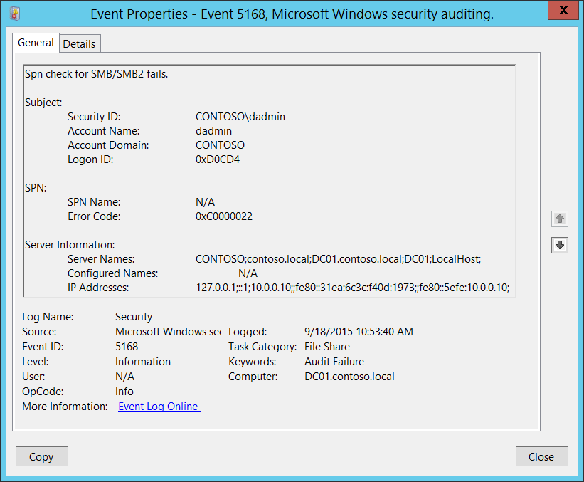

# 5168(F): SPN check for SMB/SMB2 failed.




***Subcategory:***&nbsp;[Audit File Share](audit-file-share.md)

***Event Description:***

This event generates when SMB SPN check fails.

It often happens because of NTLMv1 or LM protocols usage from client side when “[Microsoft Network Server: Server SPN target name validation level](/previous-versions/windows/it-pro/windows-server-2012-R2-and-2012/jj852272(v=ws.11))” group policy set to “Require from client” on server side. SPN only sent to server when NTLMv2 or Kerberos protocols are used, and after that SPN can be validated.

> **Note**&nbsp;&nbsp;For recommendations, see [Security Monitoring Recommendations](#security-monitoring-recommendations) for this event.

<br clear="all">

***Event XML:***
```
- <Event xmlns="http://schemas.microsoft.com/win/2004/08/events/event">
- <System>
 <Provider Name="Microsoft-Windows-Security-Auditing" Guid="{54849625-5478-4994-A5BA-3E3B0328C30D}" /> 
 <EventID>5168</EventID> 
 <Version>0</Version> 
 <Level>0</Level> 
 <Task>12808</Task> 
 <Opcode>0</Opcode> 
 <Keywords>0x8010000000000000</Keywords> 
 <TimeCreated SystemTime="2015-09-18T17:53:40.294859800Z" /> 
 <EventRecordID>268946</EventRecordID> 
 <Correlation /> 
 <Execution ProcessID="4" ThreadID="80" /> 
 <Channel>Security</Channel> 
 <Computer>DC01.contoso.local</Computer> 
 <Security /> 
 </System>
- <EventData>
 <Data Name="SubjectUserSid">S-1-5-21-3457937927-2839227994-823803824-1104</Data> 
 <Data Name="SubjectUserName">dadmin</Data> 
 <Data Name="SubjectDomainName">CONTOSO</Data> 
 <Data Name="SubjectLogonId">0xd0cd4</Data> 
 <Data Name="SpnName">N/A</Data> 
 <Data Name="ErrorCode">0xc0000022</Data> 
 <Data Name="ServerNames">CONTOSO;contoso.local;DC01.contoso.local;DC01;LocalHost;</Data> 
 <Data Name="ConfiguredNames">N/A</Data> 
 <Data Name="IpAddresses">127.0.0.1;::1;10.0.0.10;;fe80::31ea:6c3c:f40d:1973;;fe80::5efe:10.0.0.10;</Data> 
 </EventData>
 </Event>

```

***Required Server Roles:*** None.

***Minimum OS Version:*** Windows Server 2008 R2, Windows 7.

***Event Versions:*** 0.

***Field Descriptions:***

**Subject:**

-   **Security ID** \[Type = SID\]**:** SID of account for which SPN check operation was failed. Event Viewer automatically tries to resolve SIDs and show the account name. If the SID cannot be resolved, you will see the source data in the event.

> **Note**&nbsp;&nbsp;A **security identifier (SID)** is a unique value of variable length used to identify a trustee (security principal). Each account has a unique SID that is issued by an authority, such as an Active Directory domain controller, and stored in a security database. Each time a user logs on, the system retrieves the SID for that user from the database and places it in the access token for that user. The system uses the SID in the access token to identify the user in all subsequent interactions with Windows security. When a SID has been used as the unique identifier for a user or group, it cannot ever be used again to identify another user or group. For more information about SIDs, see [Security identifiers](/windows/access-protection/access-control/security-identifiers).

-   **Account Name** \[Type = UnicodeString\]**:** the name of the account for which SPN check operation was failed.

-   **Account Domain** \[Type = UnicodeString\]**:** subject’s domain or computer name. Formats vary, and include the following:

    -   Domain NETBIOS name example: CONTOSO

    -   Lowercase full domain name: contoso.local

    -   Uppercase full domain name: CONTOSO.LOCAL

    -   For some [well-known security principals](/windows/security/identity-protection/access-control/security-identifiers), such as LOCAL SERVICE or ANONYMOUS LOGON, the value of this field is “NT AUTHORITY”.

    -   For local user accounts, this field will contain the name of the computer or device that this account belongs to, for example: “Win81”.

-   **Logon ID** \[Type = HexInt64\]**:** hexadecimal value that can help you correlate this event with recent events that might contain the same Logon ID, for example, “[4624](event-4624.md): An account was successfully logged on.”

**SPN**:

-   **SPN Name** \[Type = UnicodeString\]: SPN which was used to access the server. If SPN was not provided, then the value will be “N/A”.

> **Note**&nbsp;&nbsp;**Service Principal Name (SPN)** is the name by which a client uniquely identifies an instance of a service. If you install multiple instances of a service on computers throughout a forest, each instance must have its own SPN. A given service instance can have multiple SPNs if there are multiple names that clients might use for authentication. For example, an SPN always includes the name of the host computer on which the service instance is running, so a service instance might register an SPN for each name or alias of its host.

-   **Error Code** \[Type = HexInt32\]: hexadecimal error code, for example “0xC0000022” = STATUS\_ACCESS\_DENIED. You can find description for all SMB error codes here: <https://msdn.microsoft.com/library/ee441884.aspx>.

**Server Information**:

-   **Server Names** \[Type = UnicodeString\]: information about possible server names to use to access the target server (NETBIOS, DNS, localhost, etc.).

-   **Configured Names** \[Type = UnicodeString\]: information about the names which were provided for validation. If no information was provided the value will be “**N/A**”.

-   **IP Addresses** \[Type = UnicodeString\]: information about possible IP addresses to use to access the target server (IPv4, IPv6).

## Security Monitoring Recommendations

For 5168(F): SPN check for SMB/SMB2 failed.

> **Important**&nbsp;&nbsp;For this event, also see [Appendix A: Security monitoring recommendations for many audit events](appendix-a-security-monitoring-recommendations-for-many-audit-events.md).

-   We recommend monitoring for any [5168](event-5168.md) event, because it can be a sign of a configuration issue or a malicious authentication attempt.