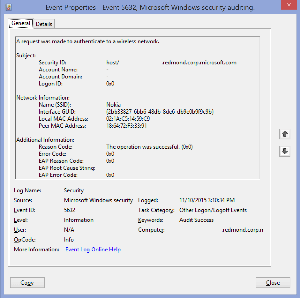

# 5632(S, F): A request was made to authenticate to a wireless network.

**Applies to**
-   Windows 10
-   Windows Server 2016




***Subcategory:***&nbsp;[Audit Other Logon/Logoff Events](audit-other-logonlogoff-events.md)

***Event Description:***

This event generates when [802.1x](https://technet.microsoft.com/library/hh831831.aspx) authentication attempt was made for wireless network.

It typically generates when network adapter connects to new wireless network.

> **Note**&nbsp;&nbsp;For recommendations, see [Security Monitoring Recommendations](#security-monitoring-recommendations) for this event.

<br clear="all">

***Event XML:***
```
- <Event xmlns="http://schemas.microsoft.com/win/2004/08/events/event">
- <System>
 <Provider Name="Microsoft-Windows-Security-Auditing" Guid="{54849625-5478-4994-A5BA-3E3B0328C30D}" /> 
 <EventID>5632</EventID> 
 <Version>1</Version> 
 <Level>0</Level> 
 <Task>12551</Task> 
 <Opcode>0</Opcode> 
 <Keywords>0x8020000000000000</Keywords> 
 <TimeCreated SystemTime="2015-11-10T23:10:34.052054800Z" /> 
 <EventRecordID>44113845</EventRecordID> 
 <Correlation /> 
 <Execution ProcessID="712" ThreadID="4176" /> 
 <Channel>Security</Channel> 
 <Computer>XXXXXXX.redmond.corp.microsoft.com</Computer> 
 <Security /> 
 </System>
- <EventData>
 <Data Name="SSID">Nokia</Data> 
 <Data Name="Identity">host/XXXXXXXX.redmond.corp.microsoft.com</Data> 
 <Data Name="SubjectUserName">-</Data> 
 <Data Name="SubjectDomainName">-</Data> 
 <Data Name="SubjectLogonId">0x0</Data> 
 <Data Name="PeerMac">18:64:72:F3:33:91</Data> 
 <Data Name="LocalMac">02:1A:C5:14:59:C9</Data> 
 <Data Name="IntfGuid">{2BB33827-6BB6-48DB-8DE6-DB9E0B9F9C9B}</Data> 
 <Data Name="ReasonCode">0x0</Data> 
 <Data Name="ReasonText">The operation was successful.</Data> 
 <Data Name="ErrorCode">0x0</Data> 
 <Data Name="EAPReasonCode">0x0</Data> 
 <Data Name="EapRootCauseString" /> 
 <Data Name="EAPErrorCode">0x0</Data> 
 </EventData>
 </Event>

```

***Required Server Roles:*** None.

***Minimum OS Version:*** Windows Server 2008, Windows Vista.

***Event Versions:*** 0.

***Field Descriptions:***

**Subject:**

-   **Security ID** \[Type = UnicodeString\]**:** User Principal Name (UPN) or another type of account identifier for which 802.1x authentication request was made.

> **Note**&nbsp;&nbsp;[User principal name](https://msdn.microsoft.com/library/windows/desktop/aa380525(v=vs.85).aspx) (UPN) format is used to specify an Internet-style name, such as UserName@Example.Microsoft.com.

-   **Account Name** \[Type = UnicodeString\]**:** the name of the account for which 802.1x authentication request was made.

-   **Account Domain** \[Type = UnicodeString\]**:** subject’s domain or computer name. Formats vary, and include the following:

    -   Domain NETBIOS name example: CONTOSO

    -   Lowercase full domain name: contoso.local

    -   Uppercase full domain name: CONTOSO.LOCAL

    -   For some [well-known security principals](https://support.microsoft.com/kb/243330), such as LOCAL SERVICE or ANONYMOUS LOGON, the value of this field is “NT AUTHORITY”.

    -   For local user accounts, this field will contain the name of the computer or device that this account belongs to, for example: “Win81”.

-   **Logon ID** \[Type = HexInt64\]**:** hexadecimal value that can help you correlate this event with recent events that might contain the same Logon ID, for example, “[4624](event-4624.md): An account was successfully logged on.”

**Network Information:**

-   **Name (SSID)** \[Type = UnicodeString\]**:** SSID of the wireless network to which authentication request was sent.

> **Note**&nbsp;&nbsp;A **service set identifier (SSID)** is a sequence of characters that uniquely names a wireless local area network (WLAN). An SSID is sometimes referred to as a "network name." This name allows stations to connect to the desired network when multiple independent networks operate in the same physical area.

-   **Interface GUID** \[Type = GUID\]**:** GUID of the network interface which was used for authentication request.

> **Note**&nbsp;&nbsp;**GUID** is an acronym for 'Globally Unique Identifier'. It is a 128-bit integer number used to identify resources, activities or instances.

You can see interface’s GUID using the following commands:

-   “netsh lan show interfaces” – for wired interfaces.

-   “netsh wlan show interfaces” – for wireless interfaces.


-   **Local MAC Address** \[Type = UnicodeString\]**:** local interface’s MAC-address.

-   **Peer MAC Address** \[Type = UnicodeString\]**:** peer’s (typically – access point) MAC-address.

**Additional Information:**

-   **Reason Code** \[Type = UnicodeString\]**:** contains Reason Text (explanation of Reason Code) and Reason Code for wireless authentication results. See more information about reason codes for wireless authentication here: <https://msdn.microsoft.com/library/windows/desktop/dd877212(v=vs.85).aspx>, <https://technet.microsoft.com/library/cc727747(v=ws.10).aspx>.

-   **Error Code** \[Type = HexInt32\]**:** there is no information about this field in this document.

-   **EAP Reason Code** \[Type = HexInt32\]**:** there is no information about this field in this document. See additional information here: <https://technet.microsoft.com/library/dd197570(v=ws.10).aspx>.

-   **EAP Root Cause String** \[Type = UnicodeString\]**:** there is no information about this field in this document.

-   **EAP Error Code** \[Type = HexInt32\]**:** there is no information about this field in this document.

## Security Monitoring Recommendations

For 5632(S, F): A request was made to authenticate to a wireless network.

-   There is no recommendation for this event in this document.

