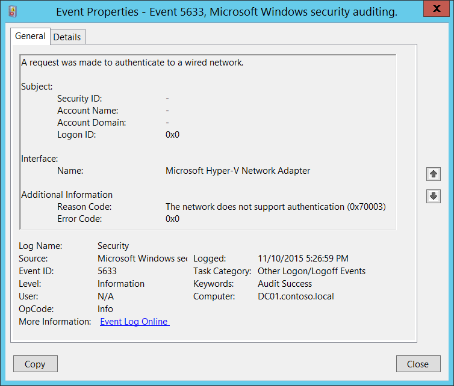

# 5633(S, F): A request was made to authenticate to a wired network.

**Applies to**
-   Windows 10
-   Windows Server 2016




***Subcategory:***&nbsp;[Audit Other Logon/Logoff Events](audit-other-logonlogoff-events.md)

***Event Description:***

This event generates when [802.1x](https://technet.microsoft.com/library/hh831831.aspx) authentication attempt was made for wired network.

It typically generates when network adapter connects to new wired network.

> **Note**&nbsp;&nbsp;For recommendations, see [Security Monitoring Recommendations](#security-monitoring-recommendations) for this event.

<br clear="all">

***Event XML:***
```
- <Event xmlns="http://schemas.microsoft.com/win/2004/08/events/event">
- <System>
 <Provider Name="Microsoft-Windows-Security-Auditing" Guid="{54849625-5478-4994-A5BA-3E3B0328C30D}" /> 
 <EventID>5633</EventID> 
 <Version>0</Version> 
 <Level>0</Level> 
 <Task>12551</Task> 
 <Opcode>0</Opcode> 
 <Keywords>0x8020000000000000</Keywords> 
 <TimeCreated SystemTime="2015-11-11T01:26:59.679232500Z" /> 
 <EventRecordID>1198715</EventRecordID> 
 <Correlation /> 
 <Execution ProcessID="500" ThreadID="2920" /> 
 <Channel>Security</Channel> 
 <Computer>DC01.contoso.local</Computer> 
 <Security /> 
 </System>
- <EventData>
 <Data Name="InterfaceName">Microsoft Hyper-V Network Adapter</Data> 
 <Data Name="Identity">-</Data> 
 <Data Name="SubjectUserName">-</Data> 
 <Data Name="SubjectDomainName">-</Data> 
 <Data Name="SubjectLogonId">0x0</Data> 
 <Data Name="ReasonCode">0x70003</Data> 
 <Data Name="ReasonText">The network does not support authentication</Data> 
 <Data Name="ErrorCode">0x0</Data> 
 </EventData>
</Event>
```

***Required Server Roles:*** None.

***Minimum OS Version:*** Windows Server 2008, Windows Vista.

***Event Versions:*** 0.

***Field Descriptions:***

**Subject:**

-   **Security ID** \[Type = UnicodeString\]**:** User Principal Name (UPN) of account for which 802.1x authentication request was made.

> **Note**&nbsp;&nbsp;[User principal name](https://msdn.microsoft.com/library/windows/desktop/aa380525(v=vs.85).aspx) (UPN) format is used to specify an Internet-style name, such as UserName@Example.Microsoft.com.

-   **Account Name** \[Type = UnicodeString\]**:** the name of the account for which 802.1x authentication request was made.

-   **Account Domain** \[Type = UnicodeString\]**:** subject’s domain or computer name. Formats vary, and include the following:

    -   Domain NETBIOS name example: CONTOSO

    -   Lowercase full domain name: contoso.local

    -   Uppercase full domain name: CONTOSO.LOCAL

    -   For some [well-known security principals](https://support.microsoft.com/kb/243330), such as LOCAL SERVICE or ANONYMOUS LOGON, the value of this field is “NT AUTHORITY”.

    -   For local user accounts, this field will contain the name of the computer or device that this account belongs to, for example: “Win81”.

-   **Logon ID** \[Type = HexInt64\]**:** hexadecimal value that can help you correlate this event with recent events that might contain the same Logon ID, for example, “[4624](event-4624.md): An account was successfully logged on.”

**Interface:**

-   **Name** \[Type = UnicodeString\]: the name (description) of network interface which was used for authentication request. You can get the list of all available network adapters using “**ipconfig /all**” command. See “Description” row for every network adapter:


**Additional Information:**

-   **Reason Code** \[Type = UnicodeString\]: contains Reason Text (explanation of Reason Code) and Reason Code for wired authentication results. See more information about reason codes for wired authentication here: <https://msdn.microsoft.com/library/windows/desktop/dd877212(v=vs.85).aspx>, <https://technet.microsoft.com/library/cc727747(v=ws.10).aspx>.

-   **Error Code** \[Type = HexInt32\]: unique [EAP error code](https://msdn.microsoft.com/library/windows/desktop/aa813691(v=vs.85).aspx).

## Security Monitoring Recommendations

For 5633(S, F): A request was made to authenticate to a wired network.

-   There is no recommendation for this event in this document.

