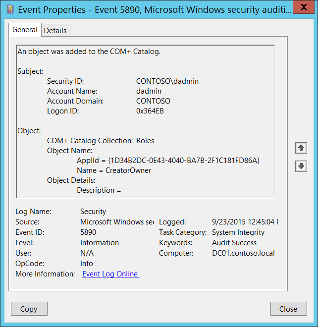

# 5890(S): An object was added to the COM+ Catalog.




***Subcategory:***&nbsp;[Audit Other Object Access Events](audit-other-object-access-events.md)

***Event Description:***

This event generates when new object was added to the [COM+ Catalog](/windows/win32/cossdk/the-com--catalog).

For some reason this event belongs to [Audit System Integrity](event-5890.md) subcategory, but generation of this event enables in this subcategory.

> **Note**&nbsp;&nbsp;For recommendations, see [Security Monitoring Recommendations](#security-monitoring-recommendations) for this event.

<br clear="all">

***Event XML:***
```
- <Event xmlns="http://schemas.microsoft.com/win/2004/08/events/event">
- <System>
 <Provider Name="Microsoft-Windows-Security-Auditing" Guid="{54849625-5478-4994-A5BA-3E3B0328C30D}" /> 
 <EventID>5890</EventID> 
 <Version>0</Version> 
 <Level>0</Level> 
 <Task>12290</Task> 
 <Opcode>0</Opcode> 
 <Keywords>0x8020000000000000</Keywords> 
 <TimeCreated SystemTime="2015-09-23T19:45:04.239886800Z" /> 
 <EventRecordID>344980</EventRecordID> 
 <Correlation /> 
 <Execution ProcessID="516" ThreadID="2856" /> 
 <Channel>Security</Channel> 
 <Computer>DC01.contoso.local</Computer> 
 <Security /> 
 </System>
- <EventData>
 <Data Name="SubjectUserSid">S-1-5-21-3457937927-2839227994-823803824-1104</Data> 
 <Data Name="SubjectUserName">dadmin</Data> 
 <Data Name="SubjectUserDomainName">CONTOSO</Data> 
 <Data Name="SubjectLogonId">222443</Data> 
 <Data Name="ObjectCollectionName">Roles</Data> 
 <Data Name="ObjectIdentifyingProperties">ApplId = {1D34B2DC-0E43-4040-BA7B-2F1C181FD86A} Name = CreatorOwner</Data> 
 <Data Name="ObjectProperties">Description =</Data> 
 </EventData>
 </Event>

```

***Required Server Roles:*** None.

***Minimum OS Version:*** Windows Server 2008, Windows Vista.

***Event Versions:*** 0.

***Field Descriptions:***

**Subject:**

-   **Security ID** \[Type = SID\]**:** SID of account that requested the “add object” operation. Event Viewer automatically tries to resolve SIDs and show the account name. If the SID cannot be resolved, you will see the source data in the event.

> **Note**&nbsp;&nbsp;A **security identifier (SID)** is a unique value of variable length used to identify a trustee (security principal). Each account has a unique SID that is issued by an authority, such as an Active Directory domain controller, and stored in a security database. Each time a user logs on, the system retrieves the SID for that user from the database and places it in the access token for that user. The system uses the SID in the access token to identify the user in all subsequent interactions with Windows security. When a SID has been used as the unique identifier for a user or group, it cannot ever be used again to identify another user or group. For more information about SIDs, see [Security identifiers](/windows/access-protection/access-control/security-identifiers).

-   **Account Name** \[Type = UnicodeString\]**:** the name of the account that requested the “add object” operation.

-   **Account Domain** \[Type = UnicodeString\]**:** subject’s domain or computer name. Formats vary, and include the following:

    -   Domain NETBIOS name example: CONTOSO

    -   Lowercase full domain name: contoso.local

    -   Uppercase full domain name: CONTOSO.LOCAL

    -   For some [well-known security principals](/windows/security/identity-protection/access-control/security-identifiers), such as LOCAL SERVICE or ANONYMOUS LOGON, the value of this field is “NT AUTHORITY”.

    -   For local user accounts, this field will contain the name of the computer or device that this account belongs to, for example: “Win81”.

-   **Logon ID** \[Type = HexInt64\]**:** hexadecimal value that can help you correlate this event with recent events that might contain the same Logon ID, for example, “[4624](event-4624.md): An account was successfully logged on.”

**Object**:

-   **COM+ Catalog Collection** \[Type = UnicodeString\]: the name of COM+ collection to which the new object was added. Here is the list of possible collection values with descriptions:

| Collection                                                                                                       | Description                                                                                                                                                                                                     |
|------------------------------------------------------------------------------------------------------------------|-----------------------------------------------------------------------------------------------------------------------------------------------------------------------------------------------------------------|
| [ApplicationCluster](/windows/win32/cossdk/applicationcluster)            | Contains a list of the servers in the application cluster.                                                                                                                                                      |
| [ApplicationInstances](/windows/win32/cossdk/applicationinstances)          | Contains an object for each instance of a running COM+ application.                                                                                                                                             |
| [Applications](/windows/win32/cossdk/applications)                  | Contains an object for each COM+ application installed on the local computer.                                                                                                                                   |
| [Components](/windows/win32/cossdk/components)                    | Contains an object for each component in the application to which it is related.                                                                                                                                |
| [ComputerList](/windows/win32/cossdk/computerlist)                  | Contains a list of the computers found in the Computers folder of the Component Services administration tool.                                                                                                   |
| [DCOMProtocols](/windows/win32/cossdk/dcomprotocols)                 | Contains a list of the protocols to be used by DCOM. It contains an object for each protocol.                                                                                                                   |
| [ErrorInfo](/windows/win32/cossdk/errorinfo)                     | Retrieves extended error information regarding methods that deal with multiple objects.                                                                                                                         |
| [EventClassesForIID](/windows/win32/cossdk/eventclassesforiid)            | Retrieves information regarding event classes.                                                                                                                                                                  |
| [FilesForImport](/windows/win32/cossdk/filesforimport)                | Retrieves information from its MSI file about an application that can be imported.                                                                                                                              |
| [InprocServers](/windows/win32/cossdk/inprocservers)                 | Contains a list of the in-process servers registered with the system. It contains an object for each component.                                                                                                 |
| [InterfacesForComponent](/windows/win32/cossdk/interfacesforcomponent)        | Contains an object for each interface exposed by the component to which the collection is related.                                                                                                              |
| [LegacyComponents](/windows/win32/cossdk/legacycomponents)              | Contains an object for each unconfigured component in the application to which it is related.                                                                                                                   |
| [LegacyServers](/windows/win32/cossdk/legacyservers)                 | Identical to the [InprocServers](/windows/win32/cossdk/inprocservers) collection except that this collection also includes local servers.                           |
| [LocalComputer](/windows/win32/cossdk/localcomputer)                 | Contains a single object that holds computer level settings information for the computer whose catalog you are accessing.                                                                                       |
| [MethodsForInterface](/windows/win32/cossdk/methodsforinterface)           | Contains an object for each method on the interface to which the collection is related.                                                                                                                         |
| [Partitions](/windows/win32/cossdk/partitions)                    | Used to specify the applications contained in each partition.                                                                                                                                                   |
| [PartitionUsers](/windows/win32/cossdk/partitionusers)                | Used to specify the users contained in each partition.                                                                                                                                                          |
| [PropertyInfo](/windows/win32/cossdk/propertyinfo)                  | Retrieves information about the properties that a specified collection supports.                                                                                                                                |
| [PublisherProperties](/windows/win32/cossdk/publisherproperties)           | Contains an object for each publisher property for the parent [SubscriptionsForComponent](/windows/win32/cossdk/subscriptionsforcomponent) collection.                          |
| [RelatedCollectionInfo](/windows/win32/cossdk/relatedcollectioninfo)         | Retrieves information about other collections related to the collection from which it is called.                                                                                                                |
| [Roles](/windows/win32/cossdk/roles)                         | Contains an object for each role assigned to the application to which it is related.                                                                                                                            |
| [RolesForComponent](/windows/win32/cossdk/rolesforcomponent)             | Contains an object for each role assigned to the component to which the collection is related.                                                                                                                  |
| [RolesForInterface](/windows/win32/cossdk/rolesforinterface)             | Contains an object for each role assigned to the interface to which the collection is related.                                                                                                                  |
| [RolesForMethod](/windows/win32/cossdk/rolesformethod)                | Contains an object for each role assigned to the method to which the collection is related.                                                                                                                     |
| [RolesForPartition](/windows/win32/cossdk/rolesforpartition)             | Contains an object for each role assigned to the partition to which the collection is related.                                                                                                                  |
| [Root](/windows/win32/cossdk/root)                          | Contains the top-level collections on the catalog.                                                                                                                                                              |
| [SubscriberProperties](/windows/win32/cossdk/subscriberproperties)          | Contains an object for each subscriber property for the parent [SubscriptionsForComponent](/windows/win32/cossdk/subscriptionsforcomponent) collection.                         |
| [SubscriptionsForComponent](/windows/win32/cossdk/subscriptionsforcomponent)     | Contains an object for each subscription for the parent [Components](/windows/win32/cossdk/components) collection.                                               |
| [TransientPublisherProperties](/windows/win32/cossdk/transientpublisherproperties)  | Contains an object for each publisher property for the parent [TransientSubscriptions](/windows/win32/cossdk/transientsubscriptions) collection.                             |
| [TransientSubscriberProperties](/windows/win32/cossdk/transientsubscriberproperties) | Contains an object for each subscriber property for the parent [TransientSubscriptions](/windows/win32/cossdk/transientsubscriptions) collection.                            |
| [TransientSubscriptions](/windows/win32/cossdk/transientsubscriptions)        | Contains an object for each transient subscription.                                                                                                                                                             |
| [UsersInPartitionRole](/windows/win32/cossdk/usersinpartitionrole)          | Contains an object for each user in the partition role to which the collection is related.                                                                                                                      |
| [UsersInRole](/windows/win32/cossdk/usersinrole)                   | Contains an object for each user in the role to which the collection is related.                                                                                                                                |
| [WOWInprocServers](/windows/win32/cossdk/wowinprocservers)              | Contains a list of the in-process servers registered with the system for 32-bit components on 64-bit computers.                                                                                                 |
| [WOWLegacyServers](/windows/win32/cossdk/wowlegacyservers)              | Identical to the [LegacyServers](/windows/win32/cossdk/legacyservers) collection except that this collection is drawn from the 32-bit registry on 64-bit computers. |

-   **Object Name** \[Type = UnicodeString\]: object-specific fields with the names and identifiers for the new object. It depends on **COM+ Catalog Collection** value, for example, if **COM+ Catalog Collection** = [Applications](/windows/win32/cossdk/applications), then you can find that:

    -   **ID** - A GUID representing the application. This property is returned when the [Key](/windows/win32/api/comadmin/nf-comadmin-icatalogobject-get_key) property method is called on an object of this collection.

    -   **AppPartitionID** - A GUID representing the application partition ID.

> **Note**&nbsp;&nbsp;**GUID** is an acronym for 'Globally Unique Identifier'. It is a 128-bit integer number used to identify resources, activities or instances.

-   **Object Details** \[Type = UnicodeString\]: the list of new object’s (**Object Name**) properties.

    The items have the following format: Property\_Name = VALUE

    Check description for specific **COM+ Catalog Collection** to see the list of object’s properties and descriptions.

## Security Monitoring Recommendations

For 5890(S): An object was added to the COM+ Catalog.

> **Important**&nbsp;&nbsp;For this event, also see [Appendix A: Security monitoring recommendations for many audit events](appendix-a-security-monitoring-recommendations-for-many-audit-events.md).

-   If you need to monitor for creation of new COM+ objects within specific COM+ collection, monitor all [5890](event-5890.md) events with the corresponding **COM+ Catalog Collection** field value.