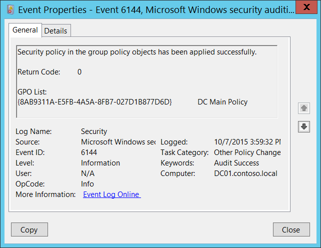

# 6144(S): Security policy in the group policy objects has been applied successfully.




***Subcategory:***&nbsp;[Audit Other Policy Change Events](audit-other-policy-change-events.md)

***Event Description:***

This event generates every time settings from the “Security Settings” section in the group policy object are applied successfully to a computer, without any errors. This event generates on the target computer itself.

It's a routine event that shows you the list of Group Policy Objects that include “Security Settings” policies, and that were applied to the computer.

This event generates every time Group Policy is applied to the computer.

> **Note**&nbsp;&nbsp;For recommendations, see [Security Monitoring Recommendations](#security-monitoring-recommendations) for this event.

<br clear="all">

***Event XML:***
```
- <Event xmlns="http://schemas.microsoft.com/win/2004/08/events/event">
- <System>
 <Provider Name="Microsoft-Windows-Security-Auditing" Guid="{54849625-5478-4994-A5BA-3E3B0328C30D}" /> 
 <EventID>6144</EventID> 
 <Version>0</Version> 
 <Level>0</Level> 
 <Task>13573</Task> 
 <Opcode>0</Opcode> 
 <Keywords>0x8020000000000000</Keywords> 
 <TimeCreated SystemTime="2015-10-07T22:59:32.280498500Z" /> 
 <EventRecordID>1055041</EventRecordID> 
 <Correlation /> 
 <Execution ProcessID="524" ThreadID="712" /> 
 <Channel>Security</Channel> 
 <Computer>DC01.contoso.local</Computer> 
 <Security /> 
 </System>
- <EventData>
 <Data Name="ErrorCode">0</Data> 
 <Data Name="GPOList">{8AB9311A-E5FB-4A5A-8FB7-027D1B877D6D} DC Main Policy</Data> 
 </EventData>
 </Event>

```

***Required Server Roles:*** None.

***Minimum OS Version:*** Windows Server 2008, Windows Vista.

***Event Versions:*** 0.

***Field Descriptions:***

**Return Code** \[Type = UInt32\]: always has “**0**” value for this event.

**GPO List** \[Type = UnicodeString\]: the list of Group Policy Objects that include “Security Settings” policies, and that were applied to the computer. The format of the list item is: “GROUP\_POLICY\_GUID GROUP\_POLICY\_NAME”.

You can find specific GROUP\_POLICY\_GUID using **Get-GPO** PowerShell cmdlet with “**–Name** GROUP\_POLICY\_NAME” parameter. Row “Id” is the GUID of the Group Policy:


> **Note**&nbsp;&nbsp;**GUID** is an acronym for 'Globally Unique Identifier'. It is a 128-bit integer number used to identify resources, activities or instances.

## Security Monitoring Recommendations

For 6144(S): Security policy in the group policy objects has been applied successfully.

-   If you have a pre-defined list of Group Policy Objects that contain Security Settings and must be applied to specific computers, then you can compare the list from this event with your list and if there's any difference, you must trigger an alert.

-   This event is mostly an informational event.

